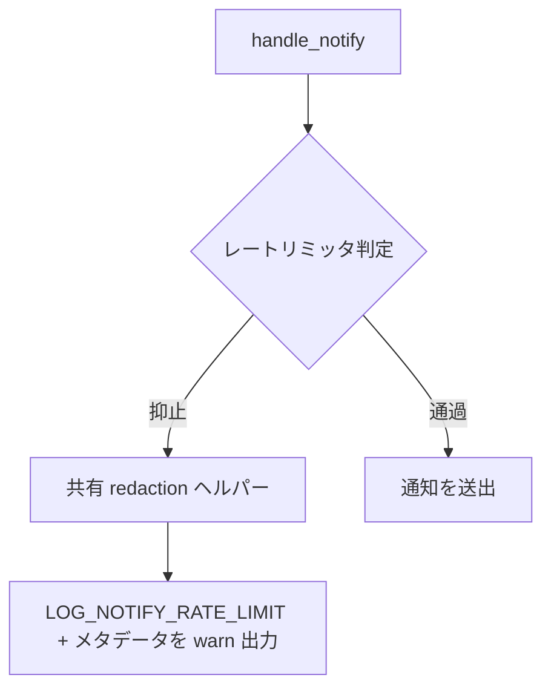

# osc9-notify-log-redaction - 要件定義書

## 1. 概要

### 1.1 背景

OSC 9 通知経路の 2 つのログ出力が、パース済みの通知テキストをそのまま文字列補間して
いる。

- `NativeCallbacks::handle_notify` のレートリミット分岐
  （`src-tauri/src/callbacks.rs:496`、現行
  `log::warn!("{LOG_NOTIFY_RATE_LIMIT}: '{title}' / '{body}'")`）
- `NotifyRustSink::send` の送出成功分岐
  （`src-tauri/src/callbacks.rs:175`、現行
  `log::debug!("notify-rust dispatched: {title}")`）

OSC 9 の title / body は攻撃者が影響を与えうる入力であり、これが
`~/.local/share/net.laser5.app.emterm/logs/emterm.log` に永続化されると、意図された
デスクトップ通知の寿命を超えて内容が残る。

### 1.2 目的

- 攻撃者が影響を与えうる OSC 9 通知テキスト（title / body）を emterm.log に
  永続化しないようにし、情報漏えい経路を塞ぐ（OBJ1）
- OSC 9 のレートリミット抑止と通知送出を、非センシティブなメタデータのみで
  emterm.log から診断可能な状態に保つ。「どの通知が抑止された / 送出された」は
  生テキストなしで答えられる状態を維持する（OBJ2）

### 1.3 スコープ

**対象**

- `NativeCallbacks::handle_notify` のレートリミット分岐のログ行（FR1）
- `NotifyRustSink::send` の送出成功分岐のログ行（FR5）
- 上記 2 箇所が共有する冗長化（redaction）ヘルパー（FR6）
- プロセス実行ごとに鍵を生成する keyed hash による診断 ID（FR3）
- 上記を固定する単体テスト

**対象外**

- 通知そのものの挙動（parse_osc9、レートリミッタのセマンティクス、
  pending_notifications、D-Bus / トースト payload）— NFR1
- notification-markup-fail-closed の SPEC が導入したエスケープ経路
  （`escape_for_send` / `body_markup_absence_confirmed` / `escape_body_markup`）— NFR2
- `NotifyRustSink::send` のエラー分岐（`src-tauri/src/callbacks.rs:176`）— FR7 により
  現行形のまま
- E2E テストの追加（A5）

## 2. ビジネス要件

### 2.1 ビジネス目標

| ID | 目標 |
|----|------|
| OBJ1 | 攻撃者が影響を与えうる OSC 9 通知テキスト（title / body）の `~/.local/share/net.laser5.app.emterm/logs/emterm.log` への永続化を止め、意図されたデスクトップ通知の寿命を超えて残る情報漏えい経路を塞ぐ |
| OBJ2 | OSC 9 のレートリミット抑止と通知送出を、非センシティブなメタデータのみで emterm.log から診断可能に保ち、「どの通知が抑止された / 送出された」を生テキストなしで答えられる状態を維持する |

### 2.2 対象ユーザー

| ユーザータイプ | 説明 |
|----------------|------|
| eMterm 利用者 | emterm.log が置かれるマシンの持ち主。OSC 9 通知テキストがログに残ることによる情報漏えいの影響を受ける側 |
| eMterm の調査者（開発者 / サポート） | emterm.log から通知の抑止・送出を診断する側。生テキストなしで事象を追える必要がある |

### 2.3 期待される効果

- OSC 9 通知経路が生成するログレコードに通知テキストの部分文字列が一切含まれなくなる
- レートリミット抑止は warn レベルで残り、リリースビルドでも観測可能なままとなる
- 同一実行内で同じ (title, body) の抑止が診断 ID により相関できる

## 3. ユースケース

### 3.1 ユースケース一覧

| ID | ユースケース名 | アクター | 優先度 |
|----|----------------|----------|--------|
| UC01 | レートリミットで抑止された通知の記録 | eMterm 通知経路 | 高 |
| UC02 | 送出に成功した通知の記録 | eMterm 通知経路 | 高 |
| UC03 | 抑止された通知をログから追跡する | eMterm の調査者 | 高 |

### 3.2 ユースケース詳細

#### UC01: レートリミットで抑止された通知の記録

**アクター**: eMterm 通知経路

**事前条件**:
- OSC 9 由来の (title, body) が `NativeCallbacks::handle_notify` に渡っている
- `NotificationRateLimiter` が同一ペアを 1 秒窓内の重複として抑止する

**基本フロー**:
1. レートリミット分岐に入る
2. 共有 redaction ヘルパー（FR6）が非センシティブなメタデータを組み立てる
3. `LOG_NOTIFY_RATE_LIMIT` マーカー、title 長、body 長、診断 ID からなるレコードを
   warn レベルで出力する

**事後条件**:
- 出力されたレコードに title / body の部分文字列が含まれない
- 抑止事象は warn レベルのため、リリースビルドのファイル記録フィルタを通過する

#### UC02: 送出に成功した通知の記録

**アクター**: eMterm 通知経路

**事前条件**:
- `NotifyRustSink::send` が通知の送出に成功している

**基本フロー**:
1. 送出成功分岐に入る
2. 共有 redaction ヘルパー（FR6）が非センシティブなメタデータを組み立てる
3. 長さと診断 ID からなるレコードを debug レベルで出力する

**事後条件**:
- 出力されたレコードに title の部分文字列が含まれない
- レベルは debug のまま変わらない

#### UC03: 抑止された通知をログから追跡する

**アクター**: eMterm の調査者

**事前条件**:
- emterm.log にレートリミット抑止のレコードが複数記録されている

**基本フロー**:
1. `LOG_NOTIFY_RATE_LIMIT` マーカーで grep する
2. 各レコードの診断 ID を突き合わせる
3. 同一実行内で同じ ID を持つレコードを、同じ (title, body) の抑止として相関させる

**事後条件**:
- どの通知が抑止されたかを、生テキストを見ずに区別できる

## 4. 機能要件

### 4.1 機能一覧

| ID | 機能名 | 説明 | ステータス | 優先度 |
|----|--------|------|-----------|--------|
| FR1 | レートリミット warn 行の冗長化 | 抑止ログから title / body の部分文字列を除去する | resolved | 高 |
| FR2 | 非センシティブなメタデータ集合 | 冗長化行が持ってよい情報を列挙で限定する | resolved | 高 |
| FR3 | keyed 診断 ID | (title, body) から keyed hash で短い診断 ID を導出する | resolved | 高 |
| FR4 | 抑止が追跡可能なまま保たれる | 抑止事象は warn レベルで残す | resolved | 高 |
| FR5 | 成功経路 debug 行の冗長化 | 送出成功ログにも同じポリシーを適用する | resolved | 高 |
| FR6 | 共有 redaction ヘルパー | 2 箇所が単一のヘルパーを使う | resolved | 高 |
| FR7 | 他の通知ログ箇所からテキストを漏らさない | エラー分岐は現行形を維持し、新たな漏えい箇所を作らない | resolved | 高 |

### 4.2 機能詳細

#### FR1: レートリミット warn 行の冗長化

**説明**: `NativeCallbacks::handle_notify` のレートリミット分岐
（`src-tauri/src/callbacks.rs:496`、現行
`log::warn!("{LOG_NOTIFY_RATE_LIMIT}: '{title}' / '{body}'")`）は、パースされた OSC 9 の
title または body の部分文字列を一切出力しない。安定した `LOG_NOTIFY_RATE_LIMIT`
マーカーと、非センシティブなメタデータのみを出力する。

**入力**:
- title: `String` - パース済み OSC 9 の title
- body: `String` - パース済み OSC 9 の body

**出力**:
- ログレコード: `String` - `LOG_NOTIFY_RATE_LIMIT` マーカー + 非センシティブなメタデータ

**処理フロー**:

**ビジネスルール**:
- title / body の部分文字列はいかなる形でも出力しない
- `LOG_NOTIFY_RATE_LIMIT` マーカーは出力に残す

#### FR2: 非センシティブなメタデータ集合

**説明**: 冗長化された行が持ってよいメタデータは次に限定される。
`LOG_NOTIFY_RATE_LIMIT` マーカー（定数値は不変）、title の長さ、body の長さ、
keyed 診断 ID（FR3）。生テキスト、接頭辞、接尾辞、トランケート、文字サンプル、
その他 title / body の内容から導かれるあらゆる描画は除外する。

**データ項目**:
| 項目 | 可否 | 説明 |
|------|------|------|
| `LOG_NOTIFY_RATE_LIMIT` マーカー | 許可 | 定数値は現行のまま |
| title の長さ | 許可 | 単位は A4 のとおり単一の単位で一貫させる |
| body の長さ | 許可 | 同上 |
| keyed 診断 ID | 許可 | FR3 |
| 生テキスト / 接頭辞 / 接尾辞 / トランケート / 文字サンプル | 禁止 | 内容由来の描画はすべて除外 |

**ビジネスルール**:
- 上記「許可」以外の内容由来の情報を追加しない

#### FR3: keyed 診断 ID

**説明**: (title, body) のペアから、プロセス実行ごとに生成される鍵を用いた keyed hash で
短い診断 ID を導出する。同一実行内では同じペアが同じ ID を生成し（1 つの通知の
繰り返し抑止がログ上で相関できる）、その ID から元テキストを復元することも、元テキスト
であることを確認することもできず、実行をまたいだ比較もできない。

**入力**:
- (title, body): `(String, String)` - 診断 ID の導出元
- 鍵: プロセス実行ごとに生成

**出力**:
- 診断 ID: 短い識別子

**ビジネスルール**:
- 同一実行内で同じペア → 同じ ID
- 異なるペア → 異なる ID
- 元テキストの復元・確認に使えない
- 実行をまたいで比較できない

#### FR4: 抑止が追跡可能なまま保たれる

**説明**: レートリミット事象は引き続き warn レベルで記録され、リリースビルドの
warn 以上のみをファイル記録するフィルタ（`src-tauri/src/logging.rs:191`）を通過する。
変更後も抑止は emterm.log 上で観測可能なままであり、本変更は事象を沈黙させない。

**ビジネスルール**:
- レートリミット行のレベルを warn から下げない

#### FR5: 成功経路 debug 行の冗長化

**説明**: `NotifyRustSink::send` の送出成功分岐
（`src-tauri/src/callbacks.rs:175`、現行 `log::debug!("notify-rust dispatched: {title}")`）は
FR1 と同じポリシーで冗長化する。補間されていた title を、非センシティブなメタデータ
（FR2 / FR3 に従う長さと keyed 診断 ID）に置き換える。行のレベルは debug のまま。

**ビジネスルール**:
- レベルは debug を維持する
- 適用するポリシーは FR1 と同一

#### FR6: 共有 redaction ヘルパー

**説明**: FR1 と FR5 は、2 つの独立した書式化文字列ではなく、
`src-tauri/src/callbacks.rs` 内の単一の redaction / 書式化ヘルパーを用いる。これにより
2 箇所が「何を非センシティブとみなすか」で乖離できないようにする。

**ビジネスルール**:
- 2 箇所で別々の書式を持たない

#### FR7: 他の通知ログ箇所からテキストを漏らさない

**説明**: `NotifyRustSink::send` のエラー分岐
（`src-tauri/src/callbacks.rs:176`、`log::warn!("notify-rust failed: {e}")`）は
notify-rust のエラー値のみを出力し、現行の形を維持する。本変更は OSC 9 の title / body を
ログレコードに補間する新たな箇所を作らない。

**ビジネスルール**:
- エラー分岐は現行形のまま
- 新規のログ出力箇所に title / body を補間しない

## 5. 非機能要件

### 5.1 パフォーマンス要件

- NFR5: 通知 1 件あたりのコストは無視できる範囲に留める。冗長化は OSC 9 通知イベント
  1 件につき 1 回実行され、その経路はすでに 2 つの `String` を確保している。

### 5.2 セキュリティ要件

- データ保護: 攻撃者が影響を与えうる OSC 9 通知テキストをログに永続化しない（FR1 / FR5）
- 出力の限定: ログに出せるメタデータを列挙で限定する（FR2）
- 一方向性: 診断 ID から元テキストを復元・確認できず、実行をまたいで比較できない（FR3）

### 5.3 可用性要件

該当なし。

### 5.4 保守性要件

- NFR3: ログ行はプロジェクトの `[LEVEL] <message>` 規約を維持し、
  `LOG_NOTIFY_RATE_LIMIT` 定数は現行値（`"LOG_NOTIFY_RATE_LIMIT"`）を保つ。既存の
  マーカー grep がそのまま一致し続ける。
- FR6 の共有ヘルパーにより、2 つのログ箇所の判断基準が乖離しない。

### 5.5 互換性要件

- NFR1: 通知の挙動は不変。parse_osc9 の出力、`NotificationRateLimiter` の重複排除
  セマンティクス（1 秒窓、(title, body) キー）、`pending_notifications` のバッファリング、
  `NotifyRustSink::send` が届ける D-Bus / トースト payload は現行値を維持する。変わるのは
  ログレコードの内容のみ。
- NFR2: notification-markup-fail-closed の SPEC が導入したエスケープ経路
  （`escape_for_send` / `body_markup_absence_confirmed` / `escape_body_markup`）は変更しない。
- NFR4: keyed ID のために新規のサードパーティ依存を追加しない。ハッシュは既に依存グラフに
  ある crate から取る（std で足りる）。
- NFR6: 変更は gui ゲート配下の callbacks モジュール内に留まり、
  `--no-default-features`（CLI のみ）ビルドの表面に影響しない。

## 6. UI/UX要件

該当なし。ユーザーに見える表面の変更はない（design ステップは skipped）。本 feature は
`src-tauri/src/callbacks.rs` の 2 つのログレコード文字列を変えるのみで、UI も WebView も
ユーザー向けテキストもデザイントークンも関与しない。

## 7. データ要件

### 7.1 データ項目

| エンティティ | 項目名 | 型 | 必須 | 説明 |
|--------------|--------|-----|------|------|
| 冗長化ログレコード | `LOG_NOTIFY_RATE_LIMIT` マーカー | 定数文字列 | ○（レートリミット行） | 現行値を維持（NFR3） |
| 冗長化ログレコード | title 長 | 数値 | ○ | 単位は単一に統一（A4） |
| 冗長化ログレコード | body 長 | 数値 | ○ | 単位は単一に統一（A4） |
| 冗長化ログレコード | 診断 ID | 短い識別子 | ○ | keyed hash 由来（FR3） |

### 7.2 データ保持期間

| データ種別 | 保持期間 |
|------------|----------|
| OSC 9 通知テキスト（title / body） | ログには永続化しない（OBJ1 / FR1 / FR5） |
| keyed hash の鍵 | プロセス実行中のみ（A2） |
| 冗長化ログレコード | emterm.log の既存のログ保持に従う |

## 8. 外部連携

### 8.1 連携システム

| システム名 | 連携方法 | データ |
|------------|----------|--------|
| emterm.log（`~/.local/share/net.laser5.app.emterm/logs/emterm.log`） | `crate::logging`（env_logger） | 冗長化済みログレコード |

### 8.2 API仕様要件

該当なし。外部 API 表面の追加・変更はない。

## 9. 制約条件

### 9.1 技術的制約

- 変更は gui フィーチャーゲート配下の callbacks モジュール内に留める（NFR6）
- keyed ID のための新規サードパーティ依存を追加しない（NFR4）
- `LOG_NOTIFY_RATE_LIMIT` の定数値は変更しない（NFR3）
- リリースビルドは warn 以上のみをファイルに記録する（`src-tauri/src/logging.rs:191`、FR4）

### 9.2 ビジネス上の制約

- 抑止事象そのものを沈黙させない（FR4）。診断可能性は OBJ2 の要件。

### 9.3 スケジュール制約

該当なし。

## 10. 想定される課題とリスク

### 10.1 技術的課題

| 課題 | 影響度 | 対応策 |
|------|--------|--------|
| 2 つのログ箇所が「何を非センシティブとみなすか」で乖離する | 中 | 単一の共有 redaction ヘルパーに集約する（FR6） |
| 2 箇所が見る文字列値が異なるため診断 ID が一致しない可能性 | 低 | 一致させないことを受容する。一致させるかは plan フェーズの実装選択（A3） |
| 長さの単位（バイト / 文字）の揺れ | 低 | 単一の単位を選び一貫して文書化する（A4） |

### 10.2 ビジネスリスク

| リスク | 発生確率 | 影響度 | 対応策 |
|--------|----------|--------|--------|
| 攻撃者が影響を与えうる通知テキストが emterm.log に永続化され、通知の寿命を超えて残る | 高 | 中 | ログ出力の冗長化（FR1 / FR5） |
| 冗長化により抑止事象が診断できなくなる | 中 | 中 | warn レベル維持 + メタデータと診断 ID の付与（FR2 / FR3 / FR4） |

## 11. 成功基準

### 11.1 受け入れ基準

- [ ] AC1 (FR1, FR2, FR5): OSC 9 通知経路（レートリミット分岐・送出成功分岐）が生成する
      ログレコードに、通知の title または body の部分文字列が一切含まれない
- [ ] AC2 (FR1, FR2, FR4): レートリミットのレコードは引き続き `LOG_NOTIFY_RATE_LIMIT`
      マーカーで warn レベルに事象を特定でき、title 長・body 長・診断 ID を持つ
- [ ] AC3 (FR3): 同一プロセス実行内で同じ (title, body) ペアの 2 回の抑止は同じ診断 ID を
      持ち、異なるペアは異なる ID を持つ
- [ ] AC4 (FR5): 成功経路の debug レコードはメタデータのみを debug レベルで持ち、
      redact-both 判断の根拠が SPEC に記録されている（タスクの「同じポリシーを適用するか、
      維持する理由を記録する」項目を満たす）
- [ ] AC5 (NFR1, NFR2):
      `CARGO_TARGET_DIR=src-tauri/target cargo test --manifest-path src-tauri/Cargo.toml --lib`
      が通る
- [ ] AC6 (NFR6):
      `CARGO_TARGET_DIR=src-tauri/target cargo check --manifest-path src-tauri/Cargo.toml --no-default-features`
      が通る

### 11.2 KPI

該当なし。

## 12. テストシナリオ

### 12.1 テスト観点

- [ ] セキュリティ (TS1 / unit / AC1): URL・トークン様の文字列・コマンドラインを含む
      title / body を与えたとき、redaction ヘルパーの返す文字列にそれらの部分文字列が
      一切含まれない
- [ ] 正常系 (TS2 / unit / AC2): 既知の入力ペアに対し、redaction ヘルパーの出力が
      title 長と body 長を含む
- [ ] 正常系 (TS3 / unit / AC3): 同じ (title, body) ペアでの 2 回の呼び出しで診断 ID が
      一致し、body だけが異なるペアでは異なる
- [ ] 回帰 (TS4 / unit / AC5・NFR1): 既存のレートリミッタ挙動テスト
      （`rate_limiter_dedupes_identical_pair_within_window`、
      `rate_limiter_allows_after_window_elapsed`、
      `rate_limiter_distinct_pairs_not_deduped`、`src-tauri/src/callbacks/tests.rs:541-569`）が
      無改変で通り、シンクへの配送が触れられていないことを示す
- [ ] 回帰 (TS5 / unit / AC5・NFR1): parse_osc9 のマイクロテスト
      （`src-tauri/src/callbacks/tests.rs:650-668`）が引き続き通り、title / body の導出が
      触れられていないことを示す
- [ ] 手動 (TS6 / manual / AC2・AC4): リリースビルドで 1 秒窓内に重複する OSC 9 を発生させ、
      emterm.log の行が抑止を示しつつテキストを含まないことを確認する

## 13. 用語定義

| 用語 | 定義 |
|------|------|
| OSC 9 | デスクトップ通知を要求する制御シーケンス。本件の title / body の供給元 |
| 冗長化（redaction） | ログレコードから機微な内容を除去し、非センシティブなメタデータに置き換えること |
| keyed hash | 鍵付きハッシュ。本件では鍵をプロセス実行ごとに生成する |
| 診断 ID | (title, body) から keyed hash で導出される短い識別子。同一実行内でのみ相関可能 |
| `LOG_NOTIFY_RATE_LIMIT` | レートリミット抑止行の安定マーカー定数。値は変更しない |

## 14. 確認事項

### 14.1 確認済み事項

- [x] 成功経路 debug 行の扱い (A1): batch-policies.yaml の `record_as_assumption` に従い
      記録。成功経路の debug 行は冗長化する（option `redact-both`）。batch モードにおいて
      ユーザーではなく Codex 相談により解決した。ユーザーの意向が異なる場合、FR5 が
      見直しの単一ポイントとなる。（出典: `answers[notify-log.success-path-debug-line]`）
- [x] 「keyed」の意味 (A2): プロセス実行ごとのランダム鍵（例: std の `RandomState` が
      SipHash をシードする形）を指し、永続化される秘密ではない。実行をまたいだ ID の
      相関は明示的に要件外であり、それが無いことを受容する。
- [x] 2 箇所が見る文字列値の差異 (A3): `handle_notify`（`callbacks.rs:487`）は生の
      パース済み title / body を保持し、`NotifyRustSink::send`（`callbacks.rs:148-175`）は
      `escape_for_send` が生成した body-markup エスケープ済みの形を保持しうる。したがって
      2 箇所で計算した ID が同一通知に対して一致する保証はない。これを受容する。一致させる
      こと（エスケープ前に ID を計算する）は plan フェーズの実装選択であり、要件ではない。
- [x] 長さの単位 (A4): 長さは単一の、一貫して文書化された単位（バイトまたは文字）で
      報告する。いずれでも FR2 を満たし、どちらを採るかは plan フェーズの詳細。
- [x] E2E カバレッジ (A5): E2E は追加しない。`resolved_input_paths.e2e` は空であり、
      この経路に対する E2E ハーネスがプロジェクトに解決されていない。検証は単体テストと
      手動確認による。

### 14.2 未確認・保留事項

なし。FR1-FR7 および NFR1-NFR6 はすべて `resolved`。

## 15. 参考資料

- 実装対象: `src-tauri/src/callbacks.rs`
  （`handle_notify` レートリミット分岐:496、`NotifyRustSink::send` 成功分岐:175 /
  エラー分岐:176、送出経路:148-175、title/body 取得:487）
- リリースビルドのログレベルフィルタ: `src-tauri/src/logging.rs:191`
- 既存テスト: `src-tauri/src/callbacks/tests.rs`（レートリミッタ:541-569、parse_osc9:650-668）
- エスケープ経路の前提仕様: `feature-docs/notification-markup-fail-closed/SPEC.md`
- ログ出力先: `~/.local/share/net.laser5.app.emterm/logs/emterm.log`
