# pending-notifications-drain - 要件定義書

## 1. 概要

### 1.1 背景

`NativeCallbackState::pending_notifications`（`src-tauri/src/callbacks.rs:391`、
`Vec<(String, String)>`）は `handle_notify` の emit 分岐（callbacks.rs:563-566）で
OSC 9 通知の生の `(title, body)` を push し続けるが、production コードにこれを
drain する consumer が存在しない。リポジトリ全体での識別子出現は
callbacks.rs:391（宣言）／callbacks.rs:565（push）／
`src-tauri/src/callbacks/tests.rs:135`・`:316`（テスト 2 箇所）の計 4 箇所のみで、
`NativeCallbackState::default()` の生成も `src-tauri/src/tabs/mod.rs:696` の 1 箇所
であるため、再初期化による暗黙のクリアも起きない。

さらに callbacks.rs:388-390 の doc コメントは
"Pending OSC 9 notifications, drained by `Tab::pump` … no D-Bus round-trip inside
`process_pty_data`" という契約を記述しており、実装（インライン同期の
`self.sink.send(&title, &body)`）と乖離している。

### 1.2 目的

| ID | 目的 |
|----|------|
| OBJ1 | `NativeCallbackState::pending_notifications` の単調増加を止め、端末出力（攻撃者影響下データ）由来の OSC 9 連続送出でプロセスメモリが無制限に増えない状態にする。 |
| OBJ2 | 生の通知 title / body がプロセス内に無期限保持されない状態にし、osc9-notify-log-redaction（PR #41）の脅威モデル（ログから消した文字列がコアダンプ／メモリスキャンで残る）との矛盾を解消する。 |
| OBJ3 | `src-tauri/src/callbacks.rs:388-390` の doc コメントが記述する契約（`Tab::pump` が drain する／コールバック内で D-Bus 往復しない）と実装の乖離を解消する。 |

### 1.3 スコープ

**対象**:

- `src-tauri/src/callbacks.rs`
- `src-tauri/src/callbacks/tests.rs`

**対象外**:

- ログ出力側の秘匿化（PR #41 osc9-notify-log-redaction で対応済み）
- 通知本体のマークアップエスケープ（PR #39 で対応済み）
- 兄弟フィールド（`osc_queue` / `bell_count` 等）の drain パターン変更
- `src-tauri/src/app/mod.rs` の同名ローカル変数（tab-activity 通知経路）
- Rust の `String` drop 時のメモリゼロクリア（zeroize 相当）の導入

## 2. ビジネス要件

### 2.1 ビジネス目標

1.2 の OBJ1 / OBJ2 / OBJ3 を達成する。

### 2.2 対象ユーザー

| ユーザータイプ | 説明 |
|----------------|------|
| eMterm 利用者 | OSC 9 経由の通知を D-Bus / トーストで受け取る。本変更の前後で受け取る内容・順序・件数は同一である（NFR1）。 |
| eMterm 保守者 | `src-tauri/src/callbacks.rs` を保守する。doc コメントと実装の乖離（OBJ3）の影響を受ける。 |

### 2.3 期待される効果

- OSC 9 の連続送出でプロセスメモリが無制限に増える状態が解消される（OBJ1）。
- 生の通知 title / body がプロセス内に無期限保持されなくなり、osc9-notify-log-redaction の脅威モデルとの矛盾が解消される（OBJ2）。
- 存在しない drain 契約を記述する doc コメントが除去され、実装との乖離が解消される（OBJ3）。

## 3. ユースケース

### 3.1 ユースケース一覧

| ID | ユースケース名 | アクター |
|----|----------------|----------|
| UC01 | OSC 9 通知の配送 | eMterm 利用者 |
| UC02 | OSC 133 受信時に通知を出さない | eMterm 利用者 |

### 3.2 ユースケース詳細

#### UC01: OSC 9 通知の配送

**アクター**: eMterm 利用者（端末上のアプリケーションが OSC 9 を出力する）

**事前条件**:

- 端末が OSC 9 `"<title>;<body>"` を受信する。

**基本フロー**:

1. `handle_notify` が OSC 9 の title / body を受け取る。
2. `NotificationRateLimiter`（1 秒窓・`(title, body)` キー）が送出を許可する。
3. `self.sink.send(&title, &body)` をインライン同期実行して配送する。

**代替フロー**:

- 1 秒窓内に同一の `(title, body)` が再送された場合、配送は抑止され、`LOG_NOTIFY_RATE_LIMIT` の warn ログ（`redact_notification` 経由の秘匿化済み出力、callbacks.rs:568-577）が出力される。
- OSC 9 に区切りが無い場合、直前の OSC 2 タイトルへフォールバックする（既存 `osc_9_no_separator_uses_fallback_title`、tests.rs:138-147）。

**事後条件**:

- 配送先・配送回数・配送タイミングは本変更前と同一である。
- 生の title / body を保持し続けるプロセス内バッファは存在しない。

**ユースケース図**:

#### UC02: OSC 133 受信時に通知を出さない

**アクター**: eMterm 利用者（端末上のアプリケーションが OSC 133 を出力する）

**事前条件**:

- 端末が OSC 133（`"A"` / `"D;42"`）を受信する。

**基本フロー**:

1. OSC 133 コールバックが呼ばれる。
2. `NativeCallbackState` は一切変更されない。

**事後条件**:

- 通知は 1 件も配送されない。

## 4. 機能要件

### 4.1 機能一覧

| ID | 機能名 | 説明 |
|----|--------|------|
| FR1 | handle_notify の push を削除する | `pending_notifications` への push を削除し、emit 分岐を `sink.send` のみにする |
| FR2 | pending_notifications フィールドを削除する | `NativeCallbackState` からフィールドを削除する |
| FR3 | 乖離した doc コメントを削除する | 存在しない drain 契約を記述する doc コメントを削除する |
| FR4 | 配送経路をインライン sink.send のまま維持する | 配送先・配送回数・配送タイミングを変更しない |
| FR5 | emit 観測テストを sink 受信ベースに書き換える | `osc_9_emits_notification` を `TestSink` の受信記録で検証する |
| FR6 | 非 emit 観測テストを sink 受信ベースに書き換える | `osc_133_callback_is_a_noop_for_native_state` を `TestSink` 未受信で検証する |
| FR7 | レートリミッタと抑止ログを不変に保つ | レートリミッタ・抑止ログ・既存 3 テストを変更しない |

### 4.2 機能詳細

#### FR1: handle_notify の push を削除する

**説明**: `src-tauri/src/callbacks.rs:563-566` の
`self.state.lock().pending_notifications.push((title.clone(), body.clone()))`
を削除する。emit 分岐に残るのは `self.sink.send(&title, &body)` のみとなる。

**対象箇所**: `src-tauri/src/callbacks.rs:563-566`

**受け入れ基準**: AC1

#### FR2: pending_notifications フィールドを削除する

**説明**: `src-tauri/src/callbacks.rs:391` の
`pub pending_notifications: Vec<(String, String)>` を `NativeCallbackState` から
削除する。上限付き Vec への置換や buffer-then-drain の実装（対処案 b / c）は採用しない。

**対象箇所**: `src-tauri/src/callbacks.rs:391`

**ビジネスルール**:

- 対処方針は「(a) バッファを廃止する」であり、(b) buffer-then-drain の実装、(c) 上限付き Vec + doc コメント修正は不採用。

**受け入れ基準**: AC1

#### FR3: 乖離した doc コメントを削除する

**説明**: フィールド削除に伴い `src-tauri/src/callbacks.rs:388-390` の doc コメント
（"Pending OSC 9 notifications, drained by `Tab::pump` … no D-Bus round-trip inside
`process_pty_data`"）も削除する。存在しない drain 契約を記述するコメントが残らないようにする。

**対象箇所**: `src-tauri/src/callbacks.rs:388-390`

**受け入れ基準**: AC1, AC3

#### FR4: 配送経路をインライン sink.send のまま維持する

**説明**: OSC 9 通知の実配送は `handle_notify` 内の `self.sink.send(&title, &body)`
によるインライン同期実行のまま維持し、配送先・配送回数・配送タイミングを変更しない。
`Tab::pump` / `Tab::process_outer_via_core` 側に新たな drain 経路を追加しない。

**処理フロー**:

```mermaid
flowchart TD
    A[OSC 9 受信] --> B[handle_notify]
    B --> C{NotificationRateLimiter<br/>1秒窓・title,body キー}
    C -->|許可| D[sink.send&#40;&title, &body&#41;<br/>インライン同期]
    C -->|抑止| E[LOG_NOTIFY_RATE_LIMIT warn<br/>redact_notification 経由]
    D --> F[終了]
    E --> F
```

**受け入れ基準**: AC5

#### FR5: emit 観測テストを sink 受信ベースに書き換える

**説明**: `src-tauri/src/callbacks/tests.rs:135` の
`assert_eq!(h.state.lock().pending_notifications.len(), 1)`（テスト
`osc_9_emits_notification` 内）を削除し、同テストが既に持つ `h.sink.calls()`
（`TestSink` の受信記録、tests.rs:16-27）に対するアサーションで emit を検証する形に統一する。

**対象箇所**: `src-tauri/src/callbacks/tests.rs:135`

**受け入れ基準**: AC1, AC4, AC5

#### FR6: 非 emit 観測テストを sink 受信ベースに書き換える

**説明**: `src-tauri/src/callbacks/tests.rs:316` の
`assert!(s.pending_notifications.is_empty())`（テスト
`osc_133_callback_is_a_noop_for_native_state` 内、OSC 133 が `NativeCallbackState` を
一切変更しないことの確認）を、`TestSink` が 1 件も受信していないこと
（`h.sink.calls().is_empty()` 相当）のアサーションへ置き換える。

**対象箇所**: `src-tauri/src/callbacks/tests.rs:316`

**受け入れ基準**: AC1, AC4, AC6

#### FR7: レートリミッタと抑止ログを不変に保つ

**説明**: `NotificationRateLimiter` の 1 秒窓・`(title, body)` キー、および抑止時の
`LOG_NOTIFY_RATE_LIMIT` warn ログ（`redact_notification` 経由の秘匿化済み出力、
callbacks.rs:568-577）は変更しない。既存の
`rate_limiter_dedupes_identical_pair_within_window` /
`rate_limiter_allows_after_window_elapsed` /
`rate_limiter_distinct_pairs_not_deduped`（tests.rs:540-569）は無改変で通り続ける。

**対象箇所**: `src-tauri/src/callbacks.rs:568-577`、`src-tauri/src/callbacks/tests.rs:540-569`

**受け入れ基準**: AC4, AC7

## 5. 非機能要件

### 5.1 NFR1 - 観測可能な挙動の不変性

利用者から観測可能な挙動（D-Bus / トーストへ届く通知の内容・順序・件数、dedupe 窓の
効き方、抑止時のログ行）は本変更の前後で同一とする。production コードに
`pending_notifications` の consumer が存在しないため（識別子出現は宣言・push・テスト
2 箇所の計 4 箇所のみ）、削除は挙動を変えない。

### 5.2 NFR2 - 代替バッファを導入しない（データ保護）

生の title / body を保持する別のプロセス内バッファ（上限付き Vec、リングバッファ、
ログ用キャッシュ等）を新設しない。OBJ2 を満たすため、配送後に生文字列を保持し続ける
構造を残さない。

### 5.3 NFR3 - 変更範囲の限定（保守性）

変更は `src-tauri/src/callbacks.rs` と `src-tauri/src/callbacks/tests.rs` に限定する。
`src-tauri/src/app/mod.rs:1008` の同名ローカル変数（`Vec<(String, ActivityKind)>`、
tab-activity 通知経路）および `NativeCallbackState` の兄弟フィールド
（`osc_queue` / `bell_count` / `pending_apc` / `pending_dcs` ほか）は触らない。
過去 feature の doc（osc9-notify-log-redaction / notification-summary-markup-escape の
SPEC・REQUIREMENTS）は書き換えない。

### 5.4 NFR4 - feature gate の健全性（互換性）

CLI-only ビルド（`--no-default-features`）のコンパイルを壊さない。`callbacks` は
GUI 専用モジュールだが、feature ゲート検査は既存手順で担保する。

### 5.5 NFR5 - テスト規約への準拠（保守性）

テストは `test/README.md` の規約に従い、対象コードと同居する `#[cfg(test)] mod tests`
に置き、内部状態ではなく観測可能な契約（`TestSink` の受信記録）へアサートする。
命名は既存の `<subject>_<scenario>_<expected>` を踏襲する。

### 5.6 その他の非機能区分

パフォーマンス（レスポンスタイム / スループット / 同時接続数）、可用性（稼働率 /
障害復旧時間）、監視については本 feature に要件はない。

## 6. UI/UX要件

該当なし。変更対象が Rust の内部状態フィールド・doc コメント・ユニットテストのみで、
UI 表面・デザイントークン・WebView のいずれにも触れないため、design ステップは
skip されている。採用した remove-buffer 方式は配送タイミングを変えないため、設計検討を
要する挙動変更も生じない。

## 7. データ要件

### 7.1 データモデル概要

対象はプロセス内状態のみで、永続データモデルは存在しない。

### 7.2 データ項目

| エンティティ | 項目名 | 型 | 変更 |
|--------------|--------|-----|------|
| `NativeCallbackState` | `pending_notifications` | `Vec<(String, String)>` | 削除する（FR2） |
| `NativeCallbackState` | `osc_queue` / `bell_count` / `pending_apc` / `pending_dcs` ほか | - | 変更しない（NFR3） |

### 7.3 データ保持期間

| データ種別 | 保持期間 |
|------------|----------|
| 通知の生 title / body | 配送（`sink.send`）まで。配送後に保持し続けるプロセス内バッファを設けない（NFR2） |

## 8. 外部連携

### 8.1 連携システム

| システム名 | 連携方法 | データ |
|------------|----------|--------|
| D-Bus / トースト通知 | `NotificationSink::send(&title, &body)` のインライン同期実行 | 通知の title / body |

### 8.2 API仕様要件

配送先・配送回数・配送タイミングを変更しない（FR4）。`Tab::pump` /
`Tab::process_outer_via_core` 側に新たな drain 経路を追加しない。

## 9. 制約条件

### 9.1 技術的制約

- 変更は `src-tauri/src/callbacks.rs` と `src-tauri/src/callbacks/tests.rs` に限定する（NFR3）。
- CLI-only ビルド（`--no-default-features`）のコンパイルを壊さない（NFR4）。
- テストは `test/README.md` の規約（同居 `#[cfg(test)] mod tests`、観測可能な契約へのアサート、`<subject>_<scenario>_<expected>` 命名）に従う（NFR5）。
- 生文字列を保持する代替バッファを新設しない（NFR2）。

### 9.2 ビジネス上の制約

- 対処方針は「(a) バッファを廃止する」で確定しており、(b) buffer-then-drain の実装、(c) 上限付き Vec + doc コメント修正は不採用。

### 9.3 スケジュール制約

該当なし。

## 10. 想定される課題とリスク

### 10.1 技術的課題

| 課題 | 対応策 |
|------|--------|
| 「`pending_notifications` に production の consumer が存在しない」という前提が誤っていた場合、削除が挙動を変える | 識別子出現が callbacks.rs:391 / :565 と tests.rs:135 / :316 の 4 箇所のみであること、`NativeCallbackState::default()` の生成が tabs/mod.rs:696 の 1 箇所であることを確認済み。AC1 で残存が無いことを検証する |
| 兄弟フィールドの buffer-then-drain パターンへの巻き込み | `osc_queue`（tabs/mod.rs:1259 の `std::mem::take`）・`bell_count`（tabs/output_pipeline.rs:282 の `std::mem::take`）は本 feature の対象外としてそのまま維持する（NFR3） |
| 過去 feature の SPEC（osc9-notify-log-redaction NFR1）が `pending_notifications` buffering を不変対象と宣言している | 当時のスコープ宣言であり本 feature がそれを上書きする。過去 feature の feature-docs は書き換えない（NFR3） |

### 10.2 ビジネスリスク

該当なし。

## 11. 成功基準

### 11.1 受け入れ基準

- [ ] AC1: `src-tauri/src/callbacks.rs` と `src-tauri/src/callbacks/tests.rs` に識別子 `pending_notifications` が 1 箇所も残っていない（`src-tauri/src/app/mod.rs` の同名ローカル変数は対象外）。［FR1, FR2, FR3, FR5, FR6, NFR3］
- [ ] AC2: OSC 9 を互いに異なる `(title, body)` で連続送出しても、その生文字列を保持し続けるプロセス内バッファが存在しない（配送後に参照が残らない）。［OBJ1, OBJ2, NFR2］
- [ ] AC3: 存在しない drain 契約を記述する doc コメントが `src-tauri/src/callbacks.rs` に残っていない。［OBJ3, FR3］
- [ ] AC4: `CARGO_TARGET_DIR=src-tauri/target cargo test --manifest-path src-tauri/Cargo.toml --lib` が通る。［FR5, FR6, FR7, NFR5］
- [ ] AC5: `osc_9_emits_notification` が、OSC 9 一件で `TestSink` が `("Build done", "all green")` を 1 件だけ受信することを検証している。［FR4, FR5］
- [ ] AC6: `osc_133_callback_is_a_noop_for_native_state` が、OSC 133 で `TestSink` が 1 件も受信しないことを検証している。［FR6］
- [ ] AC7: レートリミッタ 3 テスト（tests.rs:540-569）が無改変のまま通る。［FR7, NFR1］
- [ ] AC8: `CARGO_TARGET_DIR=src-tauri/target cargo check --manifest-path src-tauri/Cargo.toml --no-default-features` が通る。［NFR4］

### 11.2 KPI

該当なし。

## 12. テストシナリオ

### 12.1 テスト観点

- [ ] TS1（unit / `src-tauri/src/callbacks/tests.rs`）: OSC 9 `"Build done;all green"` 一件 → `TestSink.calls()` が 1 件、title = "Build done" / body = "all green"。［AC5］
- [ ] TS2（unit / `src-tauri/src/callbacks/tests.rs`）: OSC 2 でタイトル設定後に区切りなし OSC 9 → `TestSink` の受信 title が直前の OSC 2 タイトルにフォールバックする（既存 `osc_9_no_separator_uses_fallback_title`、tests.rs:138-147）。［AC5, NFR1］
- [ ] TS3（unit / `src-tauri/src/callbacks/tests.rs`）: OSC 133（`"A"` / `"D;42"`）送出 → `NativeCallbackState` の `title` / `osc_queue` が未変更、かつ `TestSink` の受信が 0 件。［AC6］
- [ ] TS4（unit / `src-tauri/src/callbacks/tests.rs`）: 同一 `(title, body)` の 2 連続 OSC 9 で `TestSink` 受信 1 件、注入クロックを 2 秒進めた再送で 2 件、異なる 3 ペアで 3 件（既存 3 テスト無改変）。［AC7］
- [ ] TS5（build / project root）: 既定 feature の `--lib` テストと `--no-default-features` の `cargo check` がいずれも成功する。［AC4, AC8］

既存の E2E テスト基盤は存在しない。

## 13. 用語定義

| 用語 | 定義 |
|------|------|
| OSC 9 | 通知（title / body）を伝える端末制御シーケンス。`handle_notify` が処理する |
| OSC 133 | シェル統合用の制御シーケンス（`"A"` / `"D;42"` など）。`NativeCallbackState` を変更しない |
| `NativeCallbackState` | 端末コールバックが参照するプロセス内状態。`tabs/mod.rs:696` で `default()` 生成される |
| `NotificationSink` | 通知の実配送先（D-Bus / トースト）へのインターフェース。`sink.send(&title, &body)` で配送する |
| `TestSink` | `NotificationSink` の受信を記録するテスト用実装（callbacks/tests.rs:6-27） |
| `Harness` | 注入クロックを備えたテスト用ハーネス（callbacks/tests.rs:31-65） |
| `NotificationRateLimiter` | 1 秒窓・`(title, body)` キーで通知を dedupe する機構 |
| buffer-then-drain | 状態に一旦溜め、別経路（`std::mem::take` 等）で取り出す実装パターン。`osc_queue` / `bell_count` が該当 |

## 14. 確認事項

### 14.1 確認済み事項

- [x] 対処方針: 「(a) バッファを廃止する」を採用する（バッチ回答 `requirement.remediation-approach` / source: batch-codex-consultation）。対処案 (b) buffer-then-drain の実装、(c) 上限付き Vec + doc コメント修正は不採用。［不可逆］
- [x] `pending_notifications` に production の consumer は存在しない（リポジトリ全体での識別子出現は callbacks.rs:391 / :565 と tests.rs:135 / :316 の 4 箇所のみ。`NativeCallbackState::default()` の生成は tabs/mod.rs:696 の 1 箇所で、再初期化による暗黙のクリアも存在しない）。よって削除は挙動を変えない。
- [x] 兄弟フィールドの buffer-then-drain パターン（`osc_queue` → tabs/mod.rs:1259 の `std::mem::take`、`bell_count` → tabs/output_pipeline.rs:282 の `std::mem::take`）は本 feature の対象外で、そのまま維持する。
- [x] osc9-notify-log-redaction の SPEC NFR1 が `pending_notifications` buffering を不変対象と宣言しているのは当時のスコープ宣言であり、本 feature がそれを上書きする。過去 feature の feature-docs は書き換えない。
- [x] `src-tauri/src/app/mod.rs:1008` / :1264 / :1367 の同名ローカル変数は型も経路も異なる（tab-activity 通知の 1 フレーム分ラッチ）ため、本 feature のスコープ外。

### 14.2 未確認・保留事項

なし（機能要件 FR1-FR7、非機能要件 NFR1-NFR5 はすべて確定済み）。

## 15. 参考資料

- `src-tauri/src/callbacks.rs`: 対象実装（フィールド宣言 :391、doc コメント :388-390、push :563-566、抑止ログ :568-577）
- `src-tauri/src/callbacks/tests.rs`: 対象テスト（`TestSink` :6-27、`Harness` :31-65、:135、:138-147、:316、レートリミッタ 3 テスト :540-569）
- `src-tauri/src/tabs/mod.rs`: `NativeCallbackState::default()` 生成箇所 :696、`osc_queue` の `std::mem::take` :1259
- `src-tauri/src/tabs/output_pipeline.rs`: `bell_count` の `std::mem::take` :282
- `src-tauri/src/app/mod.rs`: 同名ローカル変数（スコープ外）:1008 / :1264 / :1367
- `test/README.md`: テスト配置・命名規約
- osc9-notify-log-redaction（PR #41）: ログ秘匿化の脅威モデルと SPEC NFR1
- notification-summary-markup-escape（PR #39）: 通知本体のマークアップエスケープ
