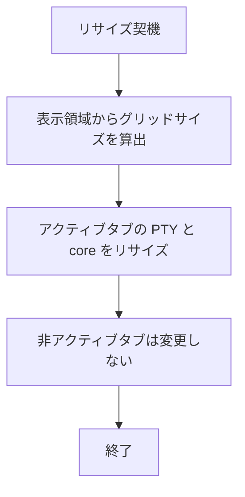
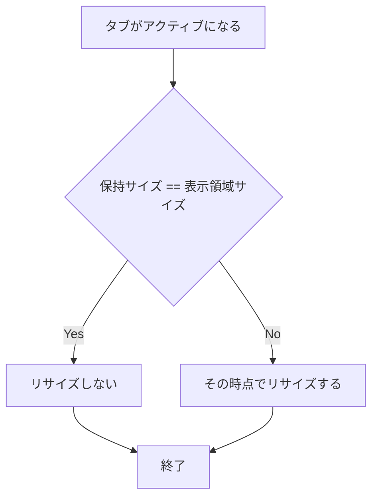

# per-tab-grid-size - 要件定義書

## 1. 概要

### 1.1 背景

タブ切替時に、非アクティブタブの PTY へ resize が波及する。この波及により、tmux をホストしているシェルへ XTWINOPS 応答の断片（例: `;51;171t816;1368t`）が画面に漏れる不具合が確認されている。原因は、アプリ全体で 1 つのグリッドサイズを保持し、それを全タブへ強制配布している実装（`App::set_grid_size` 内の `self.tabs` に対するループ、src-tauri/src/app.rs:4090-4122）にある。

### 1.2 目的

- タブ切替時に XTWINOPS 応答断片が tmux 配下のシェルへ漏れる、確認済みの不具合を解消する。
- グリッドサイズの決定を mux 固有 UI（mux ステータスバー、サイドバーの Persistent モード）から構造的に独立させ、現在および将来のセル領域を変化させる UI が同じ漏洩を再発させられないようにする。

### 1.3 スコープ

**対象**

- タブごとに独立したグリッドサイズを保持する内部構造への変更（`src-tauri/src/app.rs` / `src-tauri/src/tabs.rs`）。
- リサイズ適用範囲のアクティブタブへの限定、およびタブアクティブ化時のサイズ突き合わせ。
- mux タブにおけるペイン `Resize` 制御フレーム送出タイミングの整合。
- 幅変更時の reflow 無効化処理のタブ単位化。

**対象外**

- 非アクティブタブで動作する TUI（top / glances 等）の描画整合性の作り込み（必要なら後続タスク）。
- サイドバー UI 自体、および mux ステータスバーの撤去（後者は別タスク）。

## 2. ビジネス要件

### 2.1 ビジネス目標

- タブ切替に伴う XTWINOPS 応答断片の漏洩バグを解消する。
- グリッドサイズ決定を mux 固有 UI から構造的に独立させ、同種の不具合の再発経路を断つ。

### 2.2 対象ユーザー

| ユーザータイプ | 説明 |
|----------------|------|
| eMterm 利用者（複数タブ運用） | mux タブ・tmux タブ・通常タブを併用し、タブを切り替えながら作業する利用者 |
| eMterm 利用者（tmux 併用） | eMterm のタブ内で tmux を動作させている利用者。漏洩した応答断片が画面に現れる当事者 |

### 2.3 期待される効果

- タブ切替時に、tmux 配下のシェル画面へ `;R;Ct` 形式の断片が現れなくなる。
- mux ステータスバーやサイドバー Persistent モードの ON/OFF が、非アクティブタブの PTY サイズへ影響しなくなる。
- セル領域に影響する UI 要素の有無・状態に、リサイズの正しさが依存しなくなる。

## 3. ユースケース

### 3.1 ユースケース一覧

| ID | ユースケース名 | アクター | 優先度 |
|----|----------------|----------|--------|
| UC01 | タブを切り替える | eMterm 利用者 | 高 |
| UC02 | ウィンドウをリサイズする | eMterm 利用者 | 高 |
| UC03 | セル領域に影響する UI の表示状態を変更する | eMterm 利用者 | 高 |

### 3.2 ユースケース詳細

#### UC01: タブを切り替える

**アクター**: eMterm 利用者

**事前条件**:
- 複数のタブが開かれている（例: mux / tmux / 通常 の 3 タブ）。
- 各タブはそれぞれ自身のグリッドサイズを保持している。

**基本フロー**:
1. 利用者がタブを切り替える。
2. 切替先タブがアクティブになる。
3. 切替先タブの保持サイズと現在の表示領域を比較する。
4. 差異がある場合のみ、そのタブをその時点でリサイズする。

**代替フロー**:
- 保持サイズと表示領域が一致する場合、リサイズを発行しない。

**事後条件**:
- 非アクティブタブの PTY へ TIOCSWINSZ は送られず、core のリサイズも起きない。
- tmux 配下のシェルに XTWINOPS 応答断片が現れない。

#### UC02: ウィンドウをリサイズする

**アクター**: eMterm 利用者

**事前条件**:
- 複数のタブが開かれている。

**基本フロー**:
1. 利用者がウィンドウをリサイズする（またはセルサイズが変化する）。
2. アクティブタブの PTY と core のみがリサイズされる。

**代替フロー**:
- なし。

**事後条件**:
- 非アクティブタブのサイズは変化しない。

#### UC03: セル領域に影響する UI の表示状態を変更する

**アクター**: eMterm 利用者

**事前条件**:
- mux ステータスバー、またはサイドバーの Persistent モードが切替可能な状態にある。

**基本フロー**:
1. 利用者が mux ステータスバーまたはサイドバー Persistent モードを ON/OFF する。
2. セル領域が変化する。
3. アクティブタブのみがリサイズされる。

**代替フロー**:
- なし。

**事後条件**:
- 隠れているタブへリサイズが波及しない。

## 4. 機能要件

### 4.1 機能一覧

| ID | 機能名 | 説明 | 優先度 |
|----|--------|------|--------|
| FR1 | タブ単位のグリッドサイズ所有 | 各タブが自身の PTY / core グリッドサイズを独立に保持する | 高 |
| FR2 | リサイズはアクティブタブのみに適用 | ウィンドウリサイズ・セルサイズ変更・UI 表示状態変更をアクティブタブにのみ適用する | 高 |
| FR3 | タブアクティブ化時のサイズ突き合わせ | アクティブ化時に保持サイズと表示領域が異なる場合のみリサイズする | 高 |
| FR4 | mux ペイン Resize 制御フレームの整合 | `Resize` 制御フレームをタブ単位ルールに従って送出する | 高 |
| FR5 | wire ドメインクランプの維持 | `clamp_dims_to_wire_domain` を従来どおり両側で同一に適用する | 高 |
| FR6 | reflow 無効化のタブ単位化 | 幅変更に伴う無効化処理を実際にリサイズされたタブに限定する | 高 |

### 4.2 機能詳細

#### FR1: タブ単位のグリッドサイズ所有

**説明**: 各タブが自身の PTY / core グリッドサイズを独立に保持する。アプリ全体で 1 つのグリッドサイズを保持して全タブへ強制配布する方式（`App::set_grid_size` 内の `self.tabs` に対するループ、src-tauri/src/app.rs:4090-4122）を置き換える。

**入力**:
- グリッドサイズ: 列数 / 行数 - 表示領域から算出されたサイズ

**出力**:
- 各タブが保持するグリッドサイズ: 列数 / 行数 - タブごとに独立した値

**ビジネスルール**:
- アプリ全体で単一のグリッドサイズを全タブへ配布しない。

**エラーケース**:

| エラー | 条件 | 対応 |
|--------|------|------|
| （該当なし） | - | - |

#### FR2: リサイズはアクティブタブのみに適用

**説明**: ウィンドウリサイズ、セルサイズ変更、UI 表示状態の変更（mux ステータスバー / サイドバー Persistent の ON-OFF）は、アクティブタブの PTY と core のみをリサイズする。非アクティブタブの PTY は TIOCSWINSZ を受け取らず、core のリサイズも受けない。

**入力**:
- リサイズ契機: ウィンドウリサイズ / セルサイズ変更 / UI 表示状態変更

**出力**:
- アクティブタブの PTY・core のリサイズ

**処理フロー**:

**ビジネスルール**:
- 非アクティブタブへ TIOCSWINSZ を送らない。
- 非アクティブタブの core をリサイズしない。

#### FR3: タブアクティブ化時のサイズ突き合わせ

**説明**: タブがアクティブになった時点で、そのタブの保持グリッドサイズが現在の表示領域と異なる場合にリサイズする。一致する場合はリサイズを発行しない。

**入力**:
- アクティブ化されたタブの保持グリッドサイズ
- 現在の表示領域から算出されるグリッドサイズ

**出力**:
- 差異がある場合のみ発行されるリサイズ

**処理フロー**:

**ビジネスルール**:
- サイズが一致する場合はリサイズを発行しない。

#### FR4: mux ペイン Resize 制御フレームの整合

**説明**: mux タブでは、ペインごとの `Resize` 制御フレーム（src-tauri/src/tabs.rs:3701-3711）も同じタブ単位ルールに従う。フレームは、そのタブ自身がリサイズされたとき（アクティブ時のリサイズ、またはアクティブ化時の突き合わせによるリサイズ）にのみ送出され、daemon 側のペイン PTY を所有タブのサイズと一致させ続ける。

**入力**:
- リサイズ対象タブ（mux タブ）

**出力**:
- ペイン `Resize` 制御フレーム

**ビジネスルール**:
- 非アクティブな mux タブに対して `Resize` 制御フレームを送出しない。

#### FR5: wire ドメインクランプの維持

**説明**: `clamp_dims_to_wire_domain` は、アプリ側のサイズ記録と `Tab::resize`（src-tauri/src/tabs.rs:3637, src-tauri/src/app.rs:4104）の両方で従来どおり同一に適用される。これによりクライアントと daemon は wire の往復なしに受理サイズについて合意し続ける。

**入力**:
- グリッドサイズ: 列数 / 行数

**出力**:
- wire ドメインへクランプ済みのグリッドサイズ

**ビジネスルール**:
- アプリ側のサイズ記録と `Tab::resize` で同一のクランプを適用する。

#### FR6: reflow 無効化のタブ単位化

**説明**: 現在 `set_grid_size` 内で全体に対して行われている幅変更時の reflow 無効化（アプリの選択・pending anchor のクリア、および各タブの prompt / fold マークのクリア、src-tauri/src/app.rs:4114-4135）を、そのタブが実際にリサイズされた時点でタブ単位に適用する。リサイズされなかったタブはトラッカーを保持する。

**入力**:
- リサイズされたタブ
- 幅変更の有無

**出力**:
- 対象タブの選択 / pending anchor / prompt / fold マークのクリア

**ビジネスルール**:
- リサイズされなかったタブのトラッカーはクリアしない。

## 5. 非機能要件

### 5.1 パフォーマンス要件

（本要件では規定なし）

### 5.2 セキュリティ要件

（本要件では規定なし）

### 5.3 可用性要件

（本要件では規定なし）

### 5.4 保守性要件

- NFR1: mux 固有 UI に依存しない根本修正であること。正しさが、セル領域に影響する UI 要素の有無やその ON/OFF 状態に依存しないこと。
- NFR2: 既存テストスイートが通過すること、または正当な理由とともに更新されていること。特に `resize_clamps_to_the_wire_domain_before_resizing_the_core`（src-tauri/src/tabs.rs:6117）、`spawn_shell_clamps_the_initial_core_to_the_wire_domain`（tabs.rs:6146）、および `set_grid_size` のテスト群（src-tauri/src/app.rs:9600-9684）。

### 5.5 互換性要件

- NFR3: GUI 側のみの変更であり、CLI ビルド（`--no-default-features`）が引き続きコンパイル可能であること（`cargo check --no-default-features` が green）。

## 6. UI/UX要件

### 6.1 画面設計要件

本タスクは Rust ターミナルスタック内部（app.rs / tabs.rs）のリサイズ配線に対するバグ修正であり、ユーザー向けの視覚的表層や新規デザイントークンの関与はない（design ステップは skipped）。

### 6.2 画面遷移

（該当なし）

### 6.3 レスポンシブ対応

（該当なし）

## 7. データ要件

### 7.1 データモデル概要

（永続データモデルの変更なし）

### 7.2 データ項目

| エンティティ | 項目名 | 型 | 必須 | 説明 |
|--------------|--------|-----|------|------|
| Tab | グリッドサイズ | 列数 / 行数 | ○ | 各タブが独立に保持する PTY / core グリッドサイズ（FR1） |

### 7.3 データ保持期間

（該当なし）

## 8. 外部連携

### 8.1 連携システム

| システム名 | 連携方法 | データ |
|------------|----------|--------|
| mux daemon | ペイン `Resize` 制御フレーム（src-tauri/src/tabs.rs:3701-3711） | リサイズ対象タブのグリッドサイズ |

### 8.2 API仕様要件

- wire ドメインへのクランプはクライアント側と daemon 側で一致させ、wire の往復による確認を行わない（FR5）。

## 9. 制約条件

### 9.1 技術的制約

- CLI ビルド（`--no-default-features`）のコンパイル性を維持する（NFR3）。
- 正しさが mux 固有 UI の有無・状態に依存してはならない（NFR1）。

### 9.2 ビジネス上の制約

（該当なし）

### 9.3 スケジュール制約

（該当なし）

## 10. 想定される課題とリスク

### 10.1 技術的課題

| 課題 | 影響度 | 対応策 |
|------|--------|--------|
| 非アクティブタブで動作する TUI（top / glances）の描画整合性 | 中 | 本タスクのスコープ外。必要なら後続タスクで扱う |
| アプリレベルの `self.cell_size` 消費側（レンダラ / ヒットテスト / `window_host::grid_size`）の意味づけ | 中 | 「アクティブタブのグリッド」として読み替える。タブ単位保持でこの意味は保たれ、非アクティブタブはアクティブ化まで遅延しうる |

### 10.2 ビジネスリスク

| リスク | 発生確率 | 影響度 | 対応策 |
|--------|----------|--------|--------|
| 将来のセル領域変更 UI による漏洩の再発 | 中 | 高 | mux 固有 UI に依存しない根本修正とする（NFR1） |

## 11. 成功基準

### 11.1 受け入れ基準

- [ ] 各タブが自身のグリッドサイズを独立に保持する。
- [ ] タブ切替・ウィンドウリサイズ・UI 表示状態変更が、非アクティブタブの PTY サイズを変更しない。
- [ ] mux / tmux / 通常 の 3 タブ構成で、mux→tmux の切替時に tmux 画面へ XTWINOPS 応答断片が漏れない。
- [ ] mux ステータスバーまたはサイドバー Persistent モードの切替が、隠れているタブへリサイズを波及させない。
- [ ] 既存テスト（`resize_clamps_to_the_wire_domain_before_resizing_the_core` 等）が通過する、または正当な理由とともに更新されている。

### 11.2 KPI

（本要件では規定なし）

## 12. テストシナリオ

### 12.1 テスト観点

- [ ] 正常系（TS1, app.rs 単体）: 複数タブ状態でグリッドサイズを変更した後、アクティブタブの core 寸法のみが変化し、非アクティブタブの core は変更前の寸法を報告する。
- [ ] 正常系（TS2, app.rs 単体）: 保持サイズが現在の表示領域と異なるタブをアクティブ化するとその時点で正確にリサイズされ、サイズが一致するタブのアクティブ化ではリサイズが発行されない。
- [ ] 境界値（TS3, tabs.rs 単体）: 初回 spawn 時と以降のすべてのリサイズで wire ドメインクランプが維持される（既存テスト、必要に応じて更新）。
- [ ] 正常系（TS4, tabs.rs / app.rs 単体）: mux `Resize` 制御フレームがリサイズ対象タブに対してのみ発行され、非アクティブな mux タブには発行されない。
- [ ] 正常系（TS5, 単体）: 幅変更に伴う reflow 無効化（選択 / prompt / fold のクリア）が、実際にリサイズされたタブに対してのみ発火する。
- [ ] リグレッション（TS6）: `CARGO_TARGET_DIR=src-tauri/target cargo test --manifest-path src-tauri/Cargo.toml --lib` による `--lib` スイート全体（tabs.rs の replay テストが不安定な場合は `-- --test-threads=1` で再実行）。
- [ ] 手動（TS7, E2E 基盤なし）: 2026-08-03 のシナリオを再現する。サイドバー Persistent ON かつ mux ステータスバー ON、3 タブ（mux / tmux / 通常）でタブを切り替え、tmux シェルに `;R;Ct` 断片が現れないことを確認する。

## 13. 用語定義

| 用語 | 定義 |
|------|------|
| XTWINOPS | ウィンドウ操作用の制御シーケンス。その応答断片（例: `;51;171t816;1368t`）が本不具合で画面に漏れる |
| TIOCSWINSZ | PTY のウィンドウサイズを設定する ioctl |
| wire ドメインクランプ | `clamp_dims_to_wire_domain` による、クライアントと daemon が合意する寸法範囲への丸め込み |
| mux | eMterm 内蔵の多重化機構（ウィンドウ / タブ / ペイン） |
| reflow 無効化 | 幅変更時に選択 / pending anchor / prompt / fold マークをクリアする処理 |

## 14. 確認事項

### 14.1 確認済み事項

- [x] 不具合の再現性: タブ切替により、非アクティブタブの PTY への resize 波及に起因して XTWINOPS 応答断片（例: `;51;171t816;1368t`）が tmux ホストのシェルへ漏れることが確認済み。
- [x] 修正方針: mux 固有 UI（mux ステータスバー、サイドバー Persistent モード）に依存しない、グリッドサイズのタブ単位化による根本修正とする。
- [x] E2E 基盤: プロジェクトに E2E 基盤は存在しない（test/README.md）ため、3 タブの漏洩基準は手動で検証する。
- [x] Rust テストの所在: Rust テストは `--lib` 配下にある。
- [x] design ステップ: skipped。理由は「Rust ターミナルスタック内部（app.rs / tabs.rs）のリサイズ配線に対する純粋なバグ修正であり、ユーザー向けの視覚的表層も新規デザイントークンの関与もないため」。

### 14.2 未確認・保留事項

- [ ] （なし。全要件が resolved）

## 15. 参考資料

- SPEC.md: feature-docs/per-tab-grid-size/SPEC.md
- src-tauri/src/app.rs:4090-4122: 現行の `App::set_grid_size`（全タブへのサイズ配布ループ）
- src-tauri/src/app.rs:4114-4135: 現行の全体 reflow 無効化処理
- src-tauri/src/tabs.rs:3701-3711: mux ペイン `Resize` 制御フレーム送出
- src-tauri/src/tabs.rs:3637, src-tauri/src/app.rs:4104: `clamp_dims_to_wire_domain` の適用点
- src-tauri/src/tabs.rs:6117, tabs.rs:6146, src-tauri/src/app.rs:9600-9684: 既存テスト
- test/README.md: E2E 基盤が存在しないことの根拠
