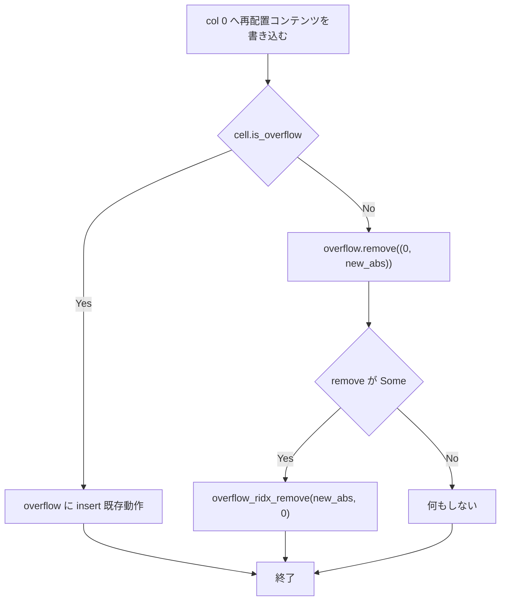

# relocate-wrap-overflow-cleanup - 要件定義書

## 1. 概要

### 1.1 背景

task0004 で導入された 2 つの ASCII ライター（`handle_print_ascii` と dispatch の
ASCII fast path）の `was_overflow` ゲートは、「overflow テーブルにエントリが存在する
のは、そのセルの `char_len == 0xFF` のときに限る」という不変条件に暗黙的に依存して
いる。しかし `relocate_widened_base_via_wrap` にはオーバーフローエントリの削除処理が
無く、この不変条件がコード上で成立していない。

term_core の print サブシステム内では `write_grapheme_to_grid`、
`try_retroactive_merge`、`widen_after_merge`、`blank_wide_pair_half`、
`set_cell_ascii` がいずれもテーブル参照による削除を行っており、マーカー依存に
なっているのは 2 つの ASCII ライターだけである。

### 1.2 目的

- `relocate_widened_base_via_wrap` の削除漏れを塞ぎ、不変条件をコード上で成立させる。
- 依存箇所（2 つの ASCII ライターのゲート）に不変条件を明示し、マーカーを消す経路を
  将来追加する開発者が「ASCII 上書きはもう後片付けをしない」と分かるようにする。
- task0004 が ASCII fast path のために獲得した per-byte のコスト削減を維持する
  （ring 全体を走査する `!self.overflow.is_empty()` 型の self-healing ゲートには
  戻さない）。
- term_core の print サブシステム内での契約の一貫性を回復する。

### 1.3 スコープ

対象は `crates/term_core` に限定する。

| ファイル | 変更内容 |
|----------|----------|
| `src/print_handler.rs` | 2 箇所の削除処理追加、`handle_print_ascii` のゲートコメント |
| `src/terminal_dispatch.rs` | fast path のゲートコメントのみ |
| `src/print_handler/tests.rs` | 回帰テスト追加 |

term_core の公開 API は変更しない。依存・開発依存の追加も行わない。

## 2. ビジネス要件

### 2.1 ビジネス目標

- `relocate_widened_base_via_wrap` のオーバーフローエントリ削除漏れを塞ぎ、2 つの
  ASCII ライターの `was_overflow` ゲートが暗黙に依存する不変条件
  「(col, abs) にエントリが存在するのは、そのセルの `char_len == 0xFF` のときに限る」
  をコード上で成立させる。
- その不変条件を依存箇所に明示し、マーカーを消す経路を追加する将来の開発者に、
  ASCII 上書きがもう後片付けをしないことを伝える。
- task0004 が ASCII fast path のために獲得した per-byte のコスト削減を維持する
  （ring 全体走査の `!self.overflow.is_empty()` ゲートに退行させない）。
- term_core の print サブシステム内の契約の一貫性を回復する。
  `write_grapheme_to_grid`、`try_retroactive_merge`、`widen_after_merge`、
  `blank_wide_pair_half`、`set_cell_ascii` はいずれもテーブル参照で削除しており、
  マーカー依存になったのは 2 つの ASCII ライターだけである。

### 2.2 対象ユーザー

| ユーザータイプ | 説明 |
|----------------|------|
| term_core の実装者 | print サブシステムに手を入れる開発者。ゲート箇所の記述から不変条件と削除義務を読み取る |

### 2.3 期待される効果

- マーカーの無いエントリが overflow テーブルに残らなくなる。
- 保持されるメモリ量の上限が改善する（欠陥は cols × ring 行数 × 256B に上限を持つ
  メモリ保持のみで、描画・スクロールバック・reflow・スナップショットへの影響は無い）。
- 不変条件が依存箇所に明記され、将来の変更で同じ欠陥が再発しにくくなる。

## 3. ユースケース

### 3.1 ユースケース一覧

| ID | ユースケース名 | アクター | 優先度 |
|----|----------------|----------|--------|
| UC01 | VS16 による最終カラム基底セルの拡幅と wrap 経由の再配置 | term_core（内部処理） | 高 |
| UC02 | ASCII ライターによるオーバーフロー束縛セルの上書き | term_core（内部処理） | 高 |

### 3.2 ユースケース詳細

#### UC01: VS16 による最終カラム基底セルの拡幅と wrap 経由の再配置

**アクター**: term_core（内部処理）

**事前条件**:
- auto-wrap が有効である
- 最終カラムに基底セルが存在する
- `line_feed` の降下先の行の col 0 / col 1 にオーバーフロー束縛のコンテンツが存在する

**基本フロー**:
1. VS16 が最終カラムの基底セルを拡幅する
2. `relocate_widened_base_via_wrap` が呼ばれる
3. `line_feed` がスクロールせずに既存行へ降下する
4. 新しい行の col 0 に再配置後の基底を書き込む
5. col 1 にスペーサーを書き込む
6. マーカーが消えたセルについて、overflow テーブルのエントリを削除する
7. `overflow.remove` が `Some` を返した場合は `overflow_ridx` も更新する

**代替フロー**:
- 再配置されたコンテンツがインラインに収まらない場合: 既存の insert 分岐をそのまま
  通り、エントリは保持される
- `line_feed` がスクロールする場合（拡幅対象の基底が最終行にある場合）: スクロール
  して入ってくる行にもマーカーの無いエントリが残らないこと、eviction 経路を乱さない
  こと
- `cell_index(1, new_row)` が `None` を返す（col 1 が存在しない）場合: スペーサー側の
  削除をパニックせずにスキップする

**事後条件**:
- マーカーの無い overflow エントリが残らない
- `overflow_ridx` にその行の最後のカラムを削除した場合、行キー自体が削除される

#### UC02: ASCII ライターによるオーバーフロー束縛セルの上書き

**アクター**: term_core（内部処理）

**事前条件**:
- 上書き対象のセルがオーバーフロー束縛である

**基本フロー**:
1. `handle_print_ascii` または dispatch の ASCII fast path が書き込み前に
   `was_overflow` を読む
2. 書き込みによって `char_len` がクリアされる
3. `was_overflow` が真であれば、そのセル自身のエントリをテーブルと逆引きから削除する

**事後条件**:
- そのセルのエントリがテーブルと逆引きの双方から消えている（本変更の前後で挙動は同一）

## 4. 機能要件

### 4.1 機能一覧

| ID | 機能名 | 説明 | 優先度 |
|----|--------|------|--------|
| FR1 | 再配置された基底の書き込みで stale なエントリを削除する | col 0 の書き込みでマーカーが消える場合にエントリを削除 | 高 |
| FR2 | 再配置されたスペーサーの書き込みで stale なエントリを削除する | col 1 のスペーサー書き込みで無条件に削除 | 高 |
| FR3 | 逆引きインデックスをテーブルと整合させる | `overflow_ridx_remove` を伴わせる | 高 |
| FR4 | 不変条件を 2 つの ASCII ライターのゲート箇所に記述する | 依存する不変条件と、それが生む義務を明記 | 高 |
| FR5 | ASCII ゲートをマーカーベースのまま維持する | self-healing 形式へ戻さない | 高 |
| FR6 | 非スクロール `line_feed` ケースの回帰テスト | 実トリガー経由の単体テスト | 高 |
| FR7 | 観測可能な挙動を変えない | グリッド・カーソル・wrap・reflow 等は不変 | 高 |
| FR8 | 既存スイートをグリーンに保つ | term_core / src-tauri / CLI-only check | 高 |

### 4.2 機能詳細

#### FR1: 再配置された基底の書き込みで stale なエントリを削除する

**説明**: `relocate_widened_base_via_wrap`
（`crates/term_core/src/print_handler.rs`、新しい行の col 0 書き込み、468-480 行）
において、再配置されたコンテンツがインラインに収まり `cell.set_char` が
オーバーフローマーカーをクリアする場合、`(0, new_abs)` にある既存の overflow
テーブルエントリを削除する。形は `write_grapheme_to_grid`（print_handler.rs:163-170）
が用いる `if cell.is_overflow() { insert } else { remove }` と同一とする。
コンテンツがインラインに収まらない場合は、既存の insert 分岐をそのまま維持する。

**処理フロー**:

**ビジネスルール**:
- 削除の形は `write_grapheme_to_grid` と同一とする。
- インラインに収まらない場合の insert 分岐は変更しない。

#### FR2: 再配置されたスペーサーの書き込みで stale なエントリを削除する

**説明**: 同じ関数の col 1 スペーサー書き込み（print_handler.rs:484-493）において、
`(1, new_abs)` の overflow テーブルエントリを削除する。これは
`write_grapheme_to_grid` のプレースホルダ分岐（print_handler.rs:198-203）および
`widen_after_merge`（print_handler.rs:405-408）を反映したものである。スペーサー
書き込みは常にマーカーをクリアする（`char_len = 0`）ため、このセルについて削除は
無条件に行う。

**ビジネスルール**:
- スペーサー側の削除は条件分岐を持たない。

#### FR3: 逆引きインデックスをテーブルと整合させる

**説明**: FR1/FR2 が追加するすべての削除は、`overflow.remove` が `Some` を返した
場合に `overflow_ridx_remove(&mut self.overflow_ridx, abs, col)` を通して
`overflow_ridx` を更新する。これは既存の削除箇所と同一の扱いである。行の最後の
カラムを削除した後に `overflow_ridx` の行エントリが残ることは無い。

**エラーケース**:
| エラー | 条件 | 対応 |
|--------|------|------|
| キーにエントリが無い | `overflow.remove` が `None` を返す | `overflow_ridx_remove` を呼ばない（既存の削除箇所と同じ） |

#### FR4: 不変条件を 2 つの ASCII ライターのゲート箇所に記述する

**説明**: `handle_print_ascii`
（`crates/term_core/src/print_handler.rs:250-256`）の `if was_overflow` ブロックと、
dispatch の ASCII fast path
（`crates/term_core/src/terminal_dispatch.rs:155-165`）の同等ブロックのそれぞれに、
依存している不変条件「overflow テーブルのエントリが `(col, abs)` に存在するのは、
そのセルの `char_len == 0xFF` である間に限る」と、それが生む義務「セルの
オーバーフローマーカーをクリアする書き込みは、そのセル自身のテーブルエントリの
削除に責任を負う。ASCII 上書きはマーカーを観測しなかったエントリをもはや
掃除しないため」を記述する。

#### FR5: ASCII ゲートをマーカーベースのまま維持する

**説明**: どちらの ASCII ライターのゲートも、ring 全体を見る self-healing 形式
`!self.overflow.is_empty()` へは戻さない。目的により選択されたアプローチは (a)
（不変条件をコード上で成立させる）であり、(b)（self-healing ゲート＋NFR1 のコスト
論拠の記録）は、実装中に (a) が実現不能と判明した場合のフォールバックとしてのみ
保持する。

#### FR6: 非スクロール `line_feed` ケースの回帰テスト

**説明**: 実トリガー（auto-wrap 有効下で VS16 により拡幅された最終カラムの基底セル）
を通して `relocate_widened_base_via_wrap` を駆動し、`line_feed` がスクロールせずに
既存行へ降下する状況を作る単体テストを追加する。その行の col 0 と col 1 には
あらかじめオーバーフロー束縛のコンテンツを置く。再配置後、いずれのカラムについても
overflow テーブルエントリ（および `overflow_ridx` エントリ）が残っていないこと、
かつ両セルが `is_overflow() == false` を報告することを検証する。

#### FR7: 観測可能な挙動を変えない

**説明**: グリッド内容、セル幅、カーソル位置、wrap フラグ、スクロールバック、reflow
出力、スナップショットは、いかなる入力に対しても本修正で変化しない。削除される
エントリはもともと到達不能だった（`get_cell_char`、`cell_content_at`、reflow、
ring eviction、snapshot のすべての読み手が `cell.is_overflow()` でゲートされている）。
既存の再配置テスト（例:
`test_retroactive_widen_at_last_column_wraps_with_autowrap`、
`test_relocate_widened_base_via_wrap_spacer_creation_blanks_existing_pair_spacer`）は
無修正のまま通り続ける。

#### FR8: 既存スイートをグリーンに保つ

**説明**: 変更後、term_core の `--lib` スイートと src-tauri の `--lib` スイートの
両方が通り、CLI-only の `cargo check --no-default-features` も成功する。

## 5. 非機能要件

### 5.1 パフォーマンス要件（NFR1）

ASCII の共通ケースにコストを追加しない。FR1/FR2 の削除は
`relocate_widened_base_via_wrap` の中にあり、この関数は auto-wrap 有効下での
最終カラム基底セルの VS16 拡幅からのみ到達する。per-byte の ASCII 経路には
決して乗らない。追加されるハッシュ操作は最大 2 回で、1 回の再配置につき 1 度だけ
発生する。両 ASCII ライターの `was_overflow` マーカー読み取りは現在の位置
（書き込みが `char_len` をクリアする前）に留める。書き込み後に置いた読み取りは
常に `false` を観測するためである。

### 5.2 セキュリティ要件

本タスクの要件に該当なし。

### 5.3 可用性要件（NFR3: 堅牢性）

削除処理は次のいずれの場合もパニックせず、範囲外アクセスも起こさない。

- 対象行にスクロールする `line_feed` で到達した場合
- `cols` が小さく col 1 が存在しない場合（`cell_index(1, new_row)` が `None` を返す）
- キーにエントリが無い場合（`remove` が `None` を返し、逆引き更新をスキップする）

### 5.4 保守性要件

- **NFR2（スコープ）**: 変更は `crates/term_core` に限定する。
  `src/print_handler.rs`（2 箇所の削除と `handle_print_ascii` のゲートコメント）、
  `src/terminal_dispatch.rs`（fast path のゲートコメントのみ）、
  `src/print_handler/tests.rs`。term_core の公開 API は不変で、依存・開発依存の
  追加は行わない。
- **NFR4（テスト規約）**: 新規テストは test/README.md に従う。対象コードの隣に
  インラインの `#[cfg(test)] mod tests {}`（ここでは既存の
  `crates/term_core/src/print_handler/tests.rs`）、テストごとに明示的に構築した
  `TerminalCore`、入力は `handle_print` / `process_pty_data` 経由、ファイルローカルの
  `test_<subject>_<scenario>_<expected>` 命名。新しいテストフレームワークや
  開発依存は追加しない。
- **NFR5（ドキュメントの局所性）**: FR4 が要求する不変条件の記述は、それに依存する
  2 箇所（両方の `if was_overflow` ブロック）に置く。feature ドキュメントの中だけに
  置くことはしない。どちらのライターの読み手も、外部参照なしに義務を読み取れる
  ようにするためである。

### 5.5 互換性要件

term_core の公開 API は変更しない（NFR2）。

## 6. UI/UX要件

該当なし。本変更にはユーザーから見える面が無い（UI・操作フロー・新規 API のいずれも
無い）。

## 7. データ要件

### 7.1 データモデル概要

本変更が扱う内部データ構造は次の 2 つ。

| 構造 | 役割 |
|------|------|
| `overflow` テーブル | `(col, abs)` をキーに、セルに収まらないコンテンツを保持する |
| `overflow_ridx` | 行から列への逆引きインデックス |

### 7.2 データ項目

| エンティティ | 項目名 | 説明 |
|--------------|--------|------|
| セル | `char_len` | `0xFF` のときそのセルはオーバーフロー束縛（`is_overflow()`） |
| overflow テーブル | キー `(col, abs)` | 対応するセルがオーバーフロー束縛の間だけ存在してよい |

### 7.3 データ保持期間

該当なし（欠陥は最大 cols × ring 行数 × 256B のメモリ保持であり、本変更はこれを
解消する）。

## 8. 外部連携

該当なし。

## 9. 制約条件

### 9.1 技術的制約

- 変更は `crates/term_core` の 3 ファイルに限定する（NFR2）。
- term_core の公開 API を変更しない。依存・開発依存を追加しない（NFR2）。
- ASCII ゲートを `!self.overflow.is_empty()` の self-healing 形式へ戻さない（FR5）。
- `was_overflow` の読み取り位置を書き込み後へ移さない（NFR1）。

### 9.2 ビジネス上の制約

- 本 feature のベースには PR #40（ascii-fast-path-wide-pair-cleanup）がマージ済みで
  あることを前提とする。
- `feature-docs/ascii-fast-path-wide-pair-cleanup/SPEC.md` の修正（NFR2 のスコープ
  記述、File Structure / Dependencies における
  `blank_orphaned_neighbor_before_overwrite` の記載位置）は本 feature の範囲外。

### 9.3 スケジュール制約

該当なし。

## 10. 想定される課題とリスク

### 10.1 技術的課題

| 課題 | 影響度 | 対応策 |
|------|--------|--------|
| アプローチ (a) が実装中に実現不能と判明する | 中 | フォールバックとして (b)（両 ASCII ゲートを self-healing 形式へ戻し、NFR1 のコストをどう賄うかを記録する）を採る（AC5） |
| 不変条件に観測可能な射影が無く、通常のテスト方針で検証できない | 中 | `overflow` / `overflow_ridx` を直接（クレート内 `pub(crate)` アクセス）、または `TerminalSnapshot.overflow` 経由で検証する（A5） |

### 10.2 ビジネスリスク

該当なし。

## 11. 成功基準

### 11.1 受け入れ基準

- [ ] **AC1**: アプローチ (a) が実装されている。
      `relocate_widened_base_via_wrap` が、再配置された基底の書き込みと
      スペーサーの書き込みの両方で overflow エントリを削除し、その形は
      `write_grapheme_to_grid` と同一である。これにより「エントリが存在する ⟹
      そのセルは `char_len == 0xFF`」がコード上で成立する。（FR1, FR2, FR3, FR5）
- [ ] **AC2**: 両 ASCII ライターの `if was_overflow` ブロックが、依存する不変条件と
      「マーカーをクリアする書き込みがエントリ削除を担う」義務を記述している。
      （FR4, NFR5）
- [ ] **AC3**: `line_feed` がスクロールせずに既存行へ降下し、その行の col 0 / col 1 が
      オーバーフロー束縛だったケースを単体テストが覆い、マーカーの無いエントリが
      残らないことを証明している。（FR6）
- [ ] **AC4**: 既存の term_core テストと src-tauri テストが通り続け、
      `cargo check --no-default-features` も成功する。（FR7, FR8）
- [ ] **AC5**: (a) が実装中に実現不能と判明した場合は代わりに (b) を採る。両 ASCII
      ゲートを self-healing 形式へ戻し、NFR1 のコストをどう賄うかを記録に残す。
      この分岐はフォールバックであって計画ではない。（FR5）

### 11.2 KPI

該当なし。

## 12. テストシナリオ

### 12.1 テスト観点

**単体テスト**

- [ ] **TS1（正常系）**: オーバーフロー束縛の既存行への再配置で stale なエントリが
      残らない。row 1 の col 0 と col 1 に 16 バイト超のコンテンツ（基底＋長い結合
      マーク列。`test_retroactive_merge_long_combining_run_overflows_correctly` が
      構築する形）を持ち、row 0 が最終カラムまで埋まった `TerminalCore` に対し、
      VS16 が最終カラムの基底を拡幅して wrap 経由で row 1 へ再配置する（スクロール
      無し）と、`(0, abs(row1))` も `(1, abs(row1))` も overflow テーブルに残らず、
      どちらのセルも `is_overflow()` を報告せず、`overflow_ridx` にもそれらの
      カラムのエントリが無い。（FR1, FR2, FR3, FR6）
- [ ] **TS2（正常系）**: 再配置後のコンテンツ自体がオーバーフローの場合はエントリを
      保持する。16 バイトを超えるコンテンツを持つ基底が再配置されると、
      `(0, new_abs)` のエントリが存在して再配置後のコンテンツと一致し、セルは
      `is_overflow()` を報告する。（FR1）
- [ ] **TS3（回帰）**: 目に見える再配置の挙動が変わらない。
      `test_retroactive_widen_at_last_column_wraps_with_autowrap` と
      `test_relocate_widened_base_via_wrap_spacer_creation_blanks_existing_pair_spacer`
      のアサーション（セル文字、幅、カーソルの col/row、wrap フラグ、
      `get_line_wrapped`）が無修正で成立する。（FR7）
- [ ] **TS4（回帰）**: ASCII ライターが自セルの後片付けを続ける。
      `handle_print_ascii` 経由と dispatch fast path 経由の両方でオーバーフロー
      束縛セルを ASCII で上書きすると、テーブルと逆引きの双方からそのセルの
      エントリが消えている（変更前の挙動と同一）。（FR4, FR5）

**境界値・異常系（エッジケース）**

- [ ] **EC1**: `line_feed` がスクロールする再配置（拡幅された基底が最終行にある）。
      スクロールインした行にもマーカーの無いエントリが残らず、eviction 経路が
      乱されない。（NFR3）
- [ ] **EC2**: `cell_index(1, new_row)` が `None` を返す（col 1 が無い）。スペーサー側の
      削除がパニックせずスキップされる。（NFR3）
- [ ] **EC3**: 削除キーにエントリが無い。`overflow.remove` が `None` を返し、
      `overflow_ridx_remove` は呼ばれない（既存のすべての削除箇所と同じ）。
      （FR3, NFR3）
- [ ] **EC4**: `overflow_ridx` から行の最後のカラムを削除すると、行キー自体が消える
      （`overflow_ridx_remove` が cell.rs:164-168 で既に実装している挙動）。（FR3）

**スイートレベル**

- [ ] **TS5**: term_core `--lib`、src-tauri `--lib`、CLI-only の
      `cargo check --no-default-features` がすべて通る。（FR8）

**統合テスト / E2E テスト**

該当なし。

**パフォーマンステスト**

該当なし（NFR1 は経路上の到達条件によって満たされる。追加コストは 1 回の再配置に
つき最大 2 回のハッシュ操作で、per-byte 経路には乗らない）。

## 13. 用語定義

| 用語 | 定義 |
|------|------|
| overflow テーブル | `(col, abs)` をキーに、セルに収まらないコンテンツを保持する内部テーブル |
| `overflow_ridx` | overflow テーブルの行→列の逆引きインデックス |
| オーバーフローマーカー | セルの `char_len == 0xFF`。`is_overflow()` が真を返す状態 |
| 不変条件 | 「overflow テーブルにエントリが `(col, abs)` に存在するのは、そのセルの `char_len == 0xFF` である間に限る」 |
| アプローチ (a) | 不変条件をコード上で成立させる（本 feature で選択） |
| アプローチ (b) | 両 ASCII ゲートを self-healing 形式に戻し、NFR1 のコスト論拠を記録する（フォールバック） |
| self-healing ゲート | `!self.overflow.is_empty()` による ring 全体走査型のゲート |

## 14. 確認事項

### 14.1 確認済み事項

- [x] **A1（確度: 高）**: アプローチ (a) が選択された方式であり、(b) は文書化された
      フォールバックに留まる。
      根拠: タスクの必須目的が「不変条件をコード上で成立させ、それを文書化する」と
      述べていること、背景が task0004 のマーカーゲートを NFR1 の性能予算を回復する
      正しい変更と位置づけていること、feature スラッグが `…-cleanup` であること。
      レビュー提案 9907b4671d9f9e50 は (a) を先に挙げ、(b) を「確立しないことを
      選ぶ場合」としている。
- [x] **A2（確度: 高）**: PR #40（ascii-fast-path-wide-pair-cleanup）が本 feature の
      ベースにマージ済みであり、`relocate_widened_base_via_wrap`、
      `handle_print_ascii` の `was_overflow` ゲート、dispatch fast path の
      `was_overflow` ゲートが引用した形で存在する。
      根拠: 統合 worktree で確認済み。print_handler.rs:234/250 と
      terminal_dispatch.rs:124/155 が task0004 のゲートを持つ。タスクの制約セクションが
      当該マージを前提条件として明記している。
- [x] **A3（確度: 中）**: `feature-docs/ascii-fast-path-wide-pair-cleanup/SPEC.md` の
      修正（NFR2 のスコープ記述、File Structure / Dependencies における
      `blank_orphaned_neighbor_before_overwrite` の記載位置の誤り）は本 feature の
      一部ではない。本 feature は finding 3a78522db0da4ea7 が依拠する根本原因
      （壊れた等価性の前提）を解消するが、タスクの受け入れ基準にドキュメント整合の
      項目は無い。
      根拠: task_description の受け入れ基準リスト、round2.yaml:106-110（ドキュメント
      整合は提案の一部であって本タスクの DoD ではない）。
- [x] **A4（確度: 高）**: 本欠陥はメモリ保持のみで、上限は cols × ring 行数 × 256B。
      すべての読み手が `cell.is_overflow()` でゲートされているため、描画・
      スクロールバック・reflow・スナップショットへの影響は無い。
      根拠: 確認済み。`get_cell_char`（terminal_cells.rs:111-126）と
      `cell_content_at`（print_handler.rs:285-295）はいずれも `is_overflow()` で
      分岐する。タスクと round2.yaml も同じことを述べている。
- [x] **A5（確度: 中）**: FR6 のテストは `overflow` テーブル / `overflow_ridx` を
      直接（クレート内 `pub(crate)` アクセス）、または `TerminalSnapshot.overflow`
      経由で検証する。この不変条件は構造上、観測可能な射影を持たないため、
      test/README.md の「observable contract」指針からの逸脱を受け入れる。
      根拠: terminal_core.rs:123-124（`pub(crate) overflow` / `overflow_ridx`）、
      snapshot.rs:76-77（`pub overflow`）、test/README.md の "Test Structure"。

### 14.2 未確認・保留事項

なし。すべての要件が `resolved` である。

## 15. 参考資料

- `crates/term_core/src/print_handler.rs`: `relocate_widened_base_via_wrap`
  (468-480, 484-493)、`write_grapheme_to_grid` (163-170, 198-203)、
  `widen_after_merge` (405-408)、`handle_print_ascii` (234, 250-256)、
  `cell_content_at` (285-295)
- `crates/term_core/src/terminal_dispatch.rs`: ASCII fast path (124, 155-165)
- `crates/term_core/src/cell.rs`: `overflow_ridx_remove` (164-168)
- `crates/term_core/src/terminal_core.rs`: `pub(crate) overflow` / `overflow_ridx`
  (123-124)
- `crates/term_core/src/snapshot.rs`: `pub overflow` (76-77)
- `crates/term_core/src/terminal_cells.rs`: `get_cell_char` (111-126)
- `crates/term_core/src/print_handler/tests.rs`: 既存の再配置テスト
- `test/README.md`: テスト構成の規約
- `feature-docs/ascii-fast-path-wide-pair-cleanup/`: 直前の同一サブシステムの feature
  （task0004）
- レビュー提案 9907b4671d9f9e50、finding 3a78522db0da4ea7、round2.yaml:106-110
