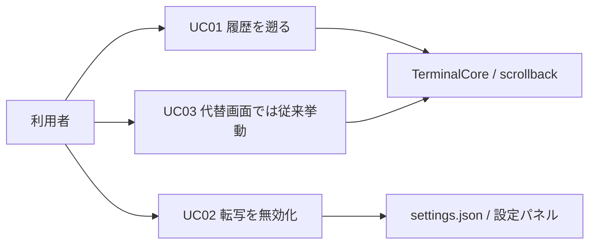
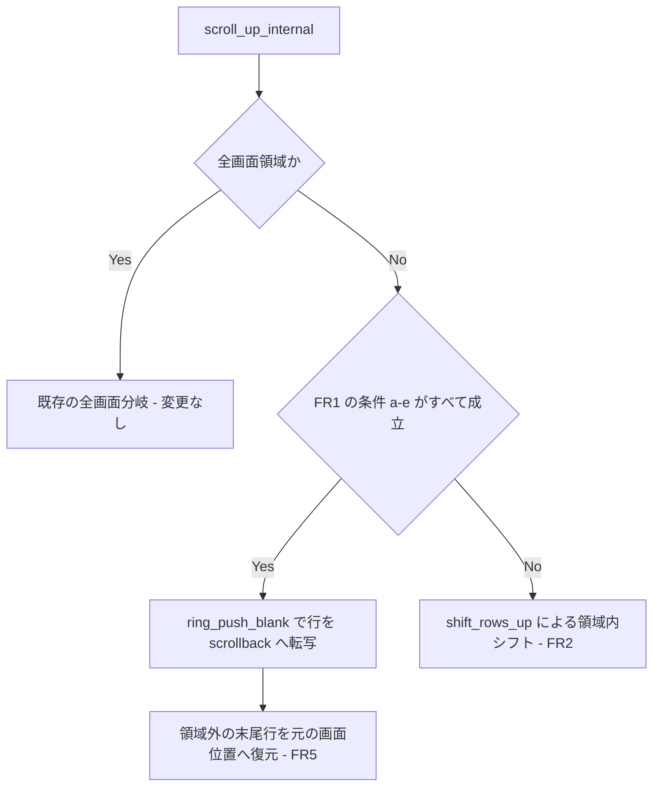

# scroll-region-scrollback - 要件定義書

## 1. 概要

### 1.1 背景

Codex TUI (v0.153.4) は会話 UI を MAIN スクリーン上に描画し、DECSTBM のスクロール領域と絶対カーソル移動を組み合わせて更新している。eMterm の現在の実装は xterm 準拠のスクロール領域処理 (領域から出た行は破棄される) のため、Shift+PageUp・マウスホイール・スクロールバーのいずれからも過去の会話ターンに到達できない。

Ghostty 1.3.0 (PR #9907 / issue #9905) は同じ入力列に対して、スクロール領域の上マージンが画面最上行である場合に限り、領域から出る行を scrollback へ転写する。

### 1.2 目的

- Codex TUI の会話履歴を既存の scrollback 操作から辿れるようにする。
- 同一入力列に対して Ghostty 1.3.0 の挙動と一致させ、Codex TUI のセッションが時系列の会話として読めるようにする。
- 既存 TUI の挙動を変えない (Claude Code の代替画面 + alternate scroll、vim、less において行の重複・順序入れ替わり・scrollback 汚染を発生させない)。
- 意図的に xterm 非準拠となる挙動であるため、GUI からユーザーが元に戻せる状態を保つ。

### 1.3 スコープ

**対象**

- `crates/term_core` のスクロール領域スクロール処理 (`TerminalCore::scroll_up_internal`) と、そこから使われる `ring_push_blank` 経路。
- 新しい設定キー `scroll_region_scrollback_enabled` と、その 5 つのミラー (settings.json スキーマ、ネイティブ側ミラー、raw オーバーレイのマージ、TypeScript `AppSettings`、設定パネルのトグルと i18n ラベル)。
- タブ生成時のシード (`Tab::build`) と、設定保存時の既存タブへの即時反映 (`App::apply_settings`)。

**対象外**

- mux デーモンのペイン。`MuxPane` (src-tauri/src/mux/session/pane/mod.rs:66) は `TerminalCore` を保持せず、デーモンは生バイトの scrollback を保持してクライアントがスナップショット replay で core を再構築するため、設定の伝搬は不要 (前提 a5)。
- off-thread のスナップショット replay core と swap 経路 (前提 a6、EC-7 に既知の制限として記録)。
- DECSLRM / DECLRMM の実装 (FR6 は将来実装に対する制約としてのみ記述)。
- E2E 基盤の新設 (前提 a7)。

## 2. ビジネス要件

### 2.1 ビジネス目標

| ID | 目標 |
|----|------|
| BO1 | Codex TUI (v0.153.4) が MAIN スクリーン上で DECSTBM スクロール領域 + 絶対カーソル移動により会話 UI を描画しているため、現行の xterm 準拠の領域スクロール (領域から出た行は破棄) では Shift+PageUp・マウスホイール・スクロールバーのいずれからも過去の会話ターンへ到達できない。この履歴に到達できるようにする。 |
| BO2 | 同じ入力列に対して Ghostty 1.3.0 (PR #9907 / issue #9905) の挙動とバイト単位で一致させる。上マージンが画面最上行であるスクロール領域から出る行を scrollback へ転写し、同じ Codex TUI セッションが時系列の会話として読めるようにする。 |
| BO3 | 既存 TUI の挙動を一切変えない。Claude Code (代替画面 + alternate scroll)、vim、less において行の重複・順序の入れ替わり・scrollback の汚染が発生しないこと。 |
| BO4 | 意図的に xterm 非準拠な挙動であるため、ユーザーが GUI から元に戻せる状態を保つ。 |

### 2.2 対象ユーザー

| ユーザータイプ | 説明 |
|----------------|------|
| Codex TUI 利用者 | eMterm 上で Codex TUI (v0.153.4) を使い、過去の会話ターンを scrollback で遡りたい利用者 |
| 既存 TUI 利用者 | Claude Code・vim・less など既存の TUI を eMterm 上で使っており、挙動が変わらないことを期待する利用者 |
| 設定で無効化する利用者 | xterm 非準拠の転写によって問題が出た際に、設定パネルから機能を切る利用者 |

### 2.3 期待される効果

- MAIN スクリーンで領域スクロールする TUI の流れ去った行が、既存の scrollback 操作 (Shift+PageUp、ホイール、スクロールバー) から到達可能になる。新しいジェスチャーやキーバインドは増えない。
- Ghostty 1.3.0 と同一の入力列に対して同一の結果が得られる。
- 全画面 (代替画面) アプリケーションが画面を占有している間は何も変わらず、scrollback 入力の抑止も現状どおり維持される。

## 3. ユースケース

### 3.1 ユースケース一覧

| ID | ユースケース名 | アクター | 状態 |
|----|----------------|----------|------|
| UC01 | 領域スクロールする TUI の履歴を scrollback で遡る | Codex TUI 利用者 | 対象 |
| UC02 | 設定パネルから転写を無効化する | 設定で無効化する利用者 | 対象 |
| UC03 | 代替画面アプリケーション使用中は従来どおりの挙動を得る | 既存 TUI 利用者 | 対象 |

### 3.2 ユースケース詳細

#### UC01: 領域スクロールする TUI の履歴を scrollback で遡る

**アクター**: Codex TUI 利用者

**事前条件**:
- `scroll_region_scrollback_enabled` が有効 (既定値 `true`)
- `scrollback_lines > 0` (`scrollback_capacity > 0`)
- 代替画面が非アクティブ

**基本フロー**:
1. 利用者が eMterm のローカルタブで Codex TUI (v0.153.4) を起動する。
2. Codex TUI が `ESC[1;Nr` 相当の DECSTBM で上マージン = 画面最上行のスクロール領域を設定する。
3. 会話が進み、領域下端で LF / IND / NEL / SU が発生して領域がスクロールする。
4. 領域上端から出る行が scrollback へ転写される (FR1)。
5. 利用者が Shift+PageUp・マウスホイール・スクロールバーのいずれかで scrollback を遡る。
6. 過去の会話ターンが時系列の順で表示される。

**代替フロー**:
- スクロール領域の上マージンが画面最上行でない場合、転写は行われず従来どおりの領域内シフトになる (FR2)。
- scrollback が満杯の場合、既存の `ring_push_blank` 経路で最古の scrollback 行が追い出され `scrollback_evicted_total` が増加する (EC-3)。
- 表示位置が固定されている場合 (`ScrollPosition::OffsetFromLive`)、領域スクロールが per-pump の scrollback デルタに寄与し、全画面スクロールと同じ補正が働く (EC-4)。

**事後条件**:
- 転写された行が通常の scrollback 行として保持され、`scrollback_count()` / `get_scrollback_length()` に反映されている (FR14)。

#### UC02: 設定パネルから転写を無効化する

**アクター**: 設定で無効化する利用者

**事前条件**:
- 設定パネルが開ける状態にある

**基本フロー**:
1. 利用者が設定パネルの ターミナル → 動作 (Behavior) セクションを開く。
2. Alternate Scroll (DECSET 1007) のトグルの隣にある新しいトグルを OFF にする (FR10)。
3. 設定が保存される。
4. `App::apply_settings` が既存の全タブの core に値を適用する (FR12)。

**代替フロー**:
- 保存後に新しいタブを開いた場合、`Tab::build` が設定値で core をシードする (FR11)。

**事後条件**:
- 開いている全タブで領域スクロールが従来どおりの領域内シフトに戻り、scrollback 行は作られない (FR2、NFR4)。タブの再起動・PTY の再生成・scrollback の破棄は発生しない。

#### UC03: 代替画面アプリケーション使用中は従来どおりの挙動を得る

**アクター**: 既存 TUI 利用者

**事前条件**:
- `MODE_ALT_SCREEN` が設定されている (DECSET 47 / 1047 / 1049)

**基本フロー**:
1. 利用者が Claude Code など代替画面を使うアプリケーションを起動する。
2. アプリケーションがスクロール領域を設定してスクロールする。
3. 明示的なモードゲートにより転写は行われない (FR8)。

**事後条件**:
- 代替画面の内容が scrollback に一切入らず、代替画面から戻ると従来の MAIN スクリーン表示が復元される。

**ユースケース図**:

## 4. 機能要件

### 4.1 機能一覧

| ID | 機能名 | 説明 | 状態 |
|----|--------|------|------|
| FR1 | Ghostty の転写条件を領域スクロール分岐に適用 | 5 つの条件すべてが成立するときのみ、領域上端から出る行を scrollback へ転写する | resolved |
| FR2 | 現行の領域内シフトへのフォールバック | 条件が 1 つでも崩れた場合は現状とバイト単位で同一の挙動 | resolved |
| FR3 | すべての `scroll_up_internal` 入口をカバー | LF / IND / NEL / SU すべてに同一条件を適用 | resolved |
| FR4 | カウントのクランプ | 転写行数は領域高さでクランプ済みの `count` に一致させる | resolved |
| FR5 | 下マージンより下の行は画面上で動かさない | 領域外の末尾行を元の画面位置に復元する | resolved |
| FR6 | DECSLRM 未実装でも左右マージン条項を明記 | 将来の DECSLRM 実装に対する前方制約 | resolved |
| FR7 | 除外: 下方向スクロールと行挿入/削除は転写しない | SD / RI / IL / DL では scrollback 行を作らない | resolved |
| FR8 | 代替画面は明示的なモードゲートで除外 | `MODE_ALT_SCREEN` 中は現状どおりの挙動 | resolved |
| FR9 | 設定: settings.json のキー | `scroll_region_scrollback_enabled` を `app_settings::Settings` に追加 (既定 `true`) | resolved |
| FR10 | 設定: 設定パネルのトグルと 4 つのミラー | ターミナル動作セクションにトグルを追加し 5 系統へ配線 | resolved |
| FR11 | タブ生成時のシード | `Tab::build` で新規 core に設定値をシード | resolved |
| FR12 | 設定保存時に既存タブへ即時反映 | `App::apply_settings` から全タブの core に適用 | resolved |
| FR13 | 転写経路でのレンダリング記帳の維持 | dirty 行は `top..=bottom` のみ、全画面用の最適化は出さない | resolved |
| FR14 | 固定表示ビュー向けの scrollback 長の整合 | 転写行を既存の全消費者から 1 行として数える | resolved |

### 4.2 機能詳細

#### FR1: Ghostty の転写条件を領域スクロール分岐に適用

**説明**: `TerminalCore::scroll_up_internal` (crates/term_core/src/ring_buffer.rs:330-368) の非全画面分岐において、領域上端から出る `count` 行を scrollback へ転写するのは、次のすべてが成立する場合に限る。

- (a) `scroll_region_top == 0`
- (b) 左マージンも右マージンも設定されていない (`left == 0`、`right == cols - 1`) — FR6 参照
- (c) 代替画面が非アクティブ (`get_mode(MODE_ALT_SCREEN)` が false、terminal_core/types.rs:29)
- (d) core が scrollback を保持している (`scrollback_capacity > 0`)
- (e) 設定 `scroll_region_scrollback_enabled` が有効

下マージンは明示的に無制約である — `bottom < rows - 1` でも転写する。条件 (a) は「領域から出る行がビューポート最上行そのものである」ことを意味し、既存の `ring_push_blank` による追い出し経路 (ring_buffer.rs:121-225) がその圧縮形式を変えずに転写を担う。

**処理フロー**:

**ビジネスルール**:
- 条件 (a)-(e) は AND であり、1 つでも崩れれば FR2 のフォールバックとなる。
- 下マージンの位置は転写可否に影響しない。

#### FR2: 現行の領域内シフトへのフォールバック

**説明**: FR1 の条項がいずれか成立しない場合、挙動は現状とバイト単位で同一とする。`shift_rows_up(top, bottom, count)` が領域内で delete-line 相当の in-place シフトを行い、scrollback 行は作られない。これは Ghostty 自身のフォールバック (G2) であり、設定が無効のとき・代替画面がアクティブなとき・`scrollback_capacity == 0` のときに求められる挙動でもある。

#### FR3: すべての `scroll_up_internal` 入口をカバー

**説明**: FR1 は `scroll_up_internal` のすべての呼び出し元に一律で適用する。

- LF 経路 (`TerminalCore::line_feed`、terminal_core.rs:874-887。C0 LF ハンドラ、print-wrap 経路、terminal_dispatch.rs の ASCII 高速経路から到達)
- `ESC D` (IND) と `ESC E` (NEL) — `esc_index` / `esc_next_line` (esc_handler.rs:37-49)
- `CSI S` (SU) — `handle_scroll_up` (csi_scroll.rs:8-11)

Ghostty も `index()` と `scrollUp()` の双方に同一条件を適用している (G3) ため、条件は個々の呼び出し元ではなく `scroll_up_internal` の内部に置く。

#### FR4: カウントのクランプ

**説明**: 転写行数は ring_buffer.rs:334 で既にクランプ済みの `count.min(bottom - top + 1)` に一致する (Ghostty G5)。領域高さより大きいカウントの SU は最大でも領域高さ分しか転写せず、行は古い順に push されるため scrollback の順序は画面上の並びと一致する。

#### FR5: 下マージンより下の行は画面上で動かさない

**説明**: `top == 0` かつ `bottom < rows - 1` の場合 (Ghostty G7)、操作後は次を満たす。

- 出て行った行 0 は scrollback にある
- 画面行 1..bottom は 1 行分上にシフトしている
- 下マージン行 `bottom` は空行である (`cursor.bg` による BCE 埋め。現行の `ring_push_blank` と `shift_rows_up` の双方に一致)
- 行 `bottom+1 ..= rows-1` は操作前とまったく同じ内容・属性を、まったく同じ画面位置に保持している

`ring_push_blank` は `ring_head` を回転させて新しいビューポート最下行を空にするため、領域外の末尾行は操作の一部として元の画面位置へ復元する必要がある。

#### FR6: DECSLRM 未実装でも左右マージン条項を明記

**説明**: eMterm は DECSLRM / DECLRMM を実装していないため、FR1 の条項 (b) は今日の時点では自明に真である (G8)。それでも仕様上は規範として記述し、将来 DECSLRM を実装する際に「水平マージンが設定されている間は転写を抑止する」制約が既にかかっている状態にする。

#### FR7: 除外: 下方向スクロールと行挿入/削除は転写しない

**説明**: 次の操作では scrollback 行を一切作らない。

| 操作 | 経路 |
|------|------|
| SD / `CSI T` | `handle_scroll_down` -> `scroll_down_internal` -> `shift_rows_down` (csi_scroll.rs:14-16、ring_buffer.rs:371-376) |
| RI / `ESC M` | `esc_reverse_index` -> `scroll_down_internal` (esc_handler.rs:52-58) |
| IL / `CSI L` | `handle_insert_lines` -> `shift_rows_down` (csi_edit.rs:8-17) |
| DL / `CSI M` | `handle_delete_lines` -> `shift_rows_up` (csi_edit.rs:20-29) |

Ghostty の `reverseIndex()` / `scrollDown()` および `deleteLines()` / `insertLines()` も同一の挙動である (G4)。csi_edit.rs の直接の `shift_rows_up` / `shift_rows_down` 呼び出し箇所は変更しない。

#### FR8: 代替画面は明示的なモードゲートで除外

**説明**: `MODE_ALT_SCREEN` が設定されている間 (DECSET 47 / 1047 / 1049、csi_modes.rs:50-84)、領域分岐は現状どおりに振る舞う (FR2)。このゲートは省略できない。eMterm には代替画面専用の core もバッファも存在せず、代替画面は同じ ring buffer と同じ scrollback deque を共有しており、`process_pty_data_fully` が返すバッファ切替のモードアクションはライブポンプ側で破棄されている (src-tauri/src/tabs/mod.rs:887)。

#### FR9: 設定: settings.json のキー

**説明**: bool の `scroll_region_scrollback_enabled` を `app_settings::Settings` (crates/app_settings/src/settings.rs) に追加する。配線は既存の `alternate_scroll_enabled` の前例に厳密に従う。

- `#[serde(default = "default_scroll_region_scrollback_enabled", deserialize_with = "deserialize_null_scroll_region_scrollback_enabled")]` を既存の `deserialize_null_with!` マクロ一覧 (settings.rs:29-37, 104, 394-397) 経由で付与
- 構造体の `Default` 実装に対応するエントリを追加

**既定値は `true`** (Ghostty はこの挙動に設定を持たず無条件で適用しており (G6)、本機能の目標は設定なしでの Ghostty パリティであるため)。

**入力**:
- `scroll_region_scrollback_enabled`: bool - settings.json のキー。欠落時と `null` 時は既定値 `true`。

#### FR10: 設定: 設定パネルのトグルと 4 つのミラー

**説明**: このキーを設定パネルのターミナル動作 (Behavior) サブセクションのトグルとして露出する。`alternate_scroll_enabled` を端から端まで踏襲する。

1. ネイティブ側ミラーのフィールドと既定値 — src-tauri/src/settings/mod.rs (:140、:294 参照)
2. オプショナルなオーバーレイのマージ — src-tauri/src/settings/raw.rs (:89、:498-500 参照)
3. TypeScript の `AppSettings` ミラー — src-tauri/web-shared/settings/types.ts (:53 参照)
4. alternate scroll トグルに隣接する `renderToggle(...)` エントリ — src-tauri/web-shared/settings/sections/terminal-behavior-section.ts (:136-147 参照)。`ctx.saveSetting("scroll_region_scrollback_enabled", v)` を呼ぶ
5. `settings.terminal.*` 配下のラベルキーと説明キー — src-tauri/web-shared/i18n/locales/en.json と ja.json の**両方** (:100-101 参照)

#### FR11: タブ生成時のシード

**説明**: `Tab::build` (src-tauri/src/tabs/mod.rs:671-681) が `TerminalCore::new` の直後に、`TerminalCore` の新しい公開セッター経由で設定値を新規 core にシードする。位置とスタイルは既存の `core.set_cursor_blink(settings.cursor_blink)` / `core.set_cursor_style(...)` と同じとする。core 側フィールドの既定値は `true` であり、シードされていない core も Ghostty 互換に振る舞う。

#### FR12: 設定保存時に既存タブへ即時反映

**説明**: `App::apply_settings` (src-tauri/src/app/font_settings.rs:529、per-tab ループは :603-627) が、既に `set_cursor_blink` / `set_cursor_style` を呼んでいる同じ `tab.core.lock()` ブロック内 (:621-625) で、新しい値を既存の全タブの core に適用する。タブの再起動・PTY の再生成・scrollback の破棄は一切行わない。これは `cursor_blink` / `fold_enabled` のライブ反映の前例に従うものであり、`scrollback_lines` の生成時のみ反映の前例 (既存 scrollback を破棄するがゆえに生成時のみとなっている) には従わない。

#### FR13: 転写経路でのレンダリング記帳の維持

**説明**: 転写を行う領域経路では、画面内容が変化した行 (`top..=bottom`) のみを dirty としてマークし、`count == 1` の全画面分岐が使うキャンバスシフト最適化 (`ScrollEvent` / `shift_dirty_down_by_one`、ring_buffer.rs:341-360) は**出さない**。この最適化はキャンバス全体をずらすものであり、画面全体がスクロールした場合にのみ妥当である (消費者は src-tauri/src/render/terminal_grid_pass/builder.rs:131)。全画面分岐自体は変更しない。

#### FR14: 固定表示ビュー向けの scrollback 長の整合

**説明**: 転写された行は、既存のすべての消費者から scrollback 1 行として数えられる。

- `scrollback_count()` / `get_scrollback_length()`
- 容量到達時の `scrollback_evicted_total`
- `App::pump_all` が `ScrollPosition::OffsetFromLive` の追従補正に渡す per-pump の scrollback デルタ (src-tauri/src/app/mod.rs:1422-1434、:1620-1628)

領域スクロールはこれまでデルタ 0 だった箇所で非 0 のデルタを生むようになる。追従ルール自体は変更しない。

**エラーケース**: 該当なし — 本機能はエラー応答を持たない。異常系は FR2 のフォールバック経路として規定している。

**バリデーション**: 該当なし — 新しい設定キーは bool 1 件で、既存の null 許容 serde ヘルパーが `{true,false}` 以外の値を排除する (5.2 参照)。

## 5. 非機能要件

### 5.0 非機能要件一覧

| ID | 要件名 |
|----|--------|
| NFR1 | 既存 scrollback 機構を変更しない |
| NFR2 | 出力ホットパスを劣化させない |
| NFR3 | プラットフォーム間の等価性 |
| NFR4 | 既定値 ON かつユーザーが元に戻せる |
| NFR5 | フォーマットとスタイルの規約 |

#### NFR1: 既存 scrollback 機構を変更しない

`ring_push_blank` の圧縮形式 (`cell_to_slim` による SlimCell intern、`styles` / `chars` の参照カウント、`scrollback_wrapped`、ring_buffer.rs:145-199 のオーバーフロー副表クリア)、`scrollback_bypass` のスナップショット replay 契約、`OffsetFromLive` の追従ルールは、いずれもそのまま使用し再設計しない。

#### NFR2: 出力ホットパスを劣化させない

追加される条件は、既に通っている `scroll_up_internal` の領域分岐上での少数の整数/bool 比較である。全画面分岐、ASCII 高速経路、`process_pty_data` のバルクスクロール skip-ahead (terminal_dispatch.rs:35-89。`scroll_region_top == 0 && scroll_region_bottom == rows-1` を要求するため本機能の影響を受けない) に、バイトあたりの処理を増やしてはならない。非転写経路でのアロケーションを導入しない。

#### NFR3: プラットフォーム間の等価性

Linux と Windows で同一に振る舞う。`#[cfg(unix)]` / `#[cfg(windows)]` を新たに導入しない。`crates/app_settings` は GUI ビルドと `--no-default-features` の CLI ビルドの双方でビルドされるため、新しいキーが `cargo check --no-default-features` を壊してはならない。

#### NFR4: 既定値 ON かつユーザーが元に戻せる

出荷時の既定値は設定なしで Ghostty を再現する (G6)。意図的に xterm 非準拠な転写で問題に当たったユーザーは、設定パネルから無効化し、その効果を既に開いているタブで即座に確認できる (FR12)。

#### NFR5: フォーマットとスタイルの規約

Rust は `make fmt` 経由の rustfmt (style_edition 2024)、TypeScript は Biome。クレート全体のフォーマットは走らせず、触れたファイルのみをフォーマットする。

### 5.1 パフォーマンス要件

NFR2 が規定する内容が本機能のパフォーマンス要件のすべてである。レスポンスタイム・スループット・同時接続数の数値目標は該当なし (ネットワークサービスではなく、ターミナルコアの分岐追加であるため)。

### 5.2 セキュリティ要件

- 認証・認可: 該当なし (ローカルのターミナルエミュレータ内部処理であり、認証主体が存在しない)。
- 新しいパース面: 追加されない。新しいエスケープシーケンスも新しい外部入力も増えず、既にパース済みの SU / IND / NEL / LF が「これまで破棄していた行」をどう扱うかだけが変わる。
- 入力検証: 新しい設定キーは既存の null 許容 serde ヘルパーを通す素の bool であり、不正・悪意ある settings.json でも `{true,false}` 以外の値にはならない。
- データ保護: これまで消えていたターミナル内容がメモリ内の scrollback リングに残るようになる。保持は既存の `scrollback_lines` 容量と同じインプロセス寿命で引き続き制限され、ディスクへの新規永続化も IPC への新規露出もない。

### 5.3 可用性要件

該当なし — 常駐サービスではなくデスクトップアプリケーション内部の処理であり、稼働率・障害復旧時間の目標を持たない。

### 5.4 保守性要件

- ログ出力: 本機能では新規のログ出力を追加しない (分析に該当する要件がない)。
- 監視: 該当なし。
- ドキュメント: NFR5 のフォーマット規約に従う。

### 5.5 互換性要件

- プラットフォーム: NFR3 のとおり Linux / Windows で同一挙動。
- ビルド構成: `--no-default-features` (CLI のみ) ビルドが新しい `app_settings` フィールドを含んでコンパイルできること。
- ターミナル互換性: 本機能は意図的に xterm 非準拠であり、Ghostty 1.3.0 とのパリティを基準とする (BO2、NFR4)。
- ブラウザサポート / API バージョン: 該当なし。

## 6. UI/UX要件

### 6.1 画面設計要件

- 既定の体験はユーザー操作なしで変わる。MAIN スクリーンで領域スクロールする TUI の流れ去った行が、既存の scrollback 操作 (Shift+PageUp、ホイール、スクロールバー) から到達可能になる。新しいジェスチャーやキーバインドは追加しない。
- オプトアウトは最も近い既存のオプトアウトと同じ場所に置く — 設定 → ターミナル → 動作、Alternate Scroll (DECSET 1007) トグルのすぐ隣。保存した瞬間に既に開いているタブへ反映される。
- 全画面 (代替画面) アプリケーションが画面を占有している間は何も変わらない。scrollback 入力の抑止も現状どおり維持される。

新規の視覚要素・レイアウト・デザイントークンは発生しない。UI 面は既存サブセクションへの bool トグル 1 件の追加のみであり、隣接する Alternate Scroll トグルを描画している既存の `renderToggle` 呼び出しの複製で足りるため、design ステップはスキップする (create-spec.design-step ゲートの回答 `skip_design`)。

### 6.2 画面遷移

該当なし — 画面遷移は発生しない (既存設定サブセクション内のトグル 1 件の追加のみ)。

### 6.3 レスポンシブ対応

該当なし — 既存の設定パネルのレイアウト内にトグル 1 件を追加するのみで、レスポンシブ要件は変わらない。

## 7. データ要件

### 7.1 データモデル概要

永続データモデル (DB / エンティティ関係) は該当なし。本機能が追加する永続データは settings.json のキー 1 件のみである。

### 7.2 データ項目

| エンティティ | 項目名 | 型 | 必須 | 説明 |
|--------------|--------|-----|------|------|
| settings.json (`app_settings::Settings`) | `scroll_region_scrollback_enabled` | bool | × (既定 `true`) | 上マージンが画面最上行のスクロール領域から出る行を scrollback へ転写するか (FR9) |
| ネイティブ側ミラー (src-tauri/src/settings/mod.rs) | `scroll_region_scrollback_enabled` | bool | × | FR10 (1) |
| TypeScript `AppSettings` (src-tauri/web-shared/settings/types.ts) | `scroll_region_scrollback_enabled` | boolean | × | FR10 (3) |
| `TerminalCore` | 新規フィールド + 公開セッター | bool | × (core 側既定 `true`) | FR11 / FR12 のシードとライブ反映先 |

### 7.3 データ保持期間

| データ種別 | 保持期間 |
|------------|----------|
| 転写された scrollback 行 | 既存の `scrollback_lines` 容量に制限されたインプロセスの寿命。ディスクへの新規永続化なし |
| `scroll_region_scrollback_enabled` | settings.json の寿命に従う (既存の設定と同じ) |

## 8. 外部連携

### 8.1 連携システム

該当なし — 外部システムとの連携は発生しない。

### 8.2 API仕様要件

該当なし — ネットワーク API を追加しない。

## 9. 制約条件

### 9.1 技術的制約

- 本番コードの変更は crates/term_core/src/ring_buffer.rs (`scroll_up_internal` の領域分岐と `ring_push_blank` の利用) に加え、`TerminalCore` のフィールド/セッターと FR9-FR12 の設定配線に限定する。csi_scroll.rs は、新規テストを既存の領域スクロールテストの隣に置く場合にのみ触る (前提 a8)。
- eMterm には代替画面専用の core もバッファも存在しないため、代替画面の除外は明示的な `get_mode(MODE_ALT_SCREEN)` チェックとして実装する (前提 a4、FR8)。
- eMterm は DECSLRM / DECLRMM を実装していないため、左右マージン条項は今日は自明に真である (前提 a3、FR6)。
- `crates/app_settings` は CLI のみのビルドにも含まれるため、新しいキーが `--no-default-features` ビルドを壊してはならない (NFR3)。
- 既存の scrollback 機構 (圧縮形式、`scrollback_bypass`、`OffsetFromLive`) は再設計しない (NFR1)。

### 9.2 ビジネス上の制約

- 意図的に xterm 非準拠の挙動を既定 ON で出荷するため、GUI からの無効化手段が同時に必要である (BO4、NFR4)。
- 既存 TUI (Claude Code / vim / less) の挙動を変えないことが出荷条件である (BO3)。

### 9.3 スケジュール制約

該当なし — 分析にスケジュール上の制約は含まれていない。

### 9.4 宣言された変更集合

このフィーチャー固有のパスは手動で列挙せず、create-plan で `workflow.yaml` の各タスクの `files` から導出する (`references/phases/create-plan-phase.md`)。

**デフォルトメンバー** (SPEC作成者が明示的に除外しない限り、常に宣言に含まれる):
- `feature-docs/scroll-region-scrollback/**`
- `test-docs/scroll-region-scrollback/**`

`feature-docs/scroll-region-scrollback/**` に含まれるもの: `REQUIREMENTS.md`、`SPEC.md`、`IMPLEMENTATION.md`、`workflow.yaml`、`phase-state/`、`tasks/`、`reviews/roundN.yaml`、`VERIFICATION.md`、`retrospect.yaml`、およびデザインステップが生成するデザイン成果物。生成主体は各フェーズドキュメントおよび `references/phase-state.md` を参照。

`test-docs/scroll-region-scrollback/**` に含まれるもの: `{T}.tests.yaml`。生成主体は `implement-phase.md` を参照。

**意味論**:
- デフォルトのメンバーは、SPEC作成者が明示的に除外しない限り宣言に含まれる。
- この宣言はスーパーセット (superset) の主張であり、実際の変更集合は宣言に含まれる (CONTAINED IN) 必要がある。

## 10. 想定される課題とリスク

### 10.1 技術的課題

| 課題 | 影響度 | 対応策 |
|------|--------|--------|
| `ring_push_blank` は `ring_head` を回転させて新しいビューポート最下行を空にするため、下マージンより下の行が画面上でずれる | 高 | 領域外の末尾行を操作の一部として元の画面位置へ復元する (FR5、AC-2) |
| 代替画面が同じ ring buffer と scrollback deque を共有しており、放置すると代替画面の内容が scrollback に混入する | 高 | 明示的な `MODE_ALT_SCREEN` ゲートを置く (FR8、AC-4、AC-14) |
| 全画面用の `ScrollEvent` / dirty シフト最適化を領域経路に持ち込むとキャンバス全体がずれる | 中 | 転写経路では当該最適化を出さず dirty 行を `top..=bottom` に限定する (FR13、AC-9) |
| 領域スクロールが per-pump の scrollback デルタに寄与するようになり、固定表示ビューの補正経路に新しい入力が入る | 中 | 転写行を既存の全消費者から 1 行として数え、追従ルール自体は変更しない (FR14、EC-4) |
| off-thread のスナップショット replay core には設定シードが渡らず、`apply_offthread_swap` もこのフィールドを移植しない | 低 | core 側既定値 `true` により既定ユーザーには不可視。設定を無効化したユーザーは次の `apply_settings` まで swap 後の core で転写が再開しうる。本機能のスコープ外とし既知の制限として記録する (EC-7、前提 a6) |

### 10.2 ビジネスリスク

| リスク | 発生確率 | 影響度 | 対応策 |
|--------|----------|--------|--------|
| 意図的な xterm 非準拠の挙動が既定 ON で出荷され、想定外の TUI で問題が出る | 中 | 中 | 設定パネルからの無効化と既存タブへの即時反映を提供する (FR10、FR12、NFR4) |
| 絶対カーソル位置で再描画する TUI (Codex TUI の形) では、後で書き換えられる行がその時点のスナップショットとして転写される | 中 | 低 | Ghostty パリティ上の意図された結果であり欠陥ではない (EC-5) |
| 既存 TUI (vim / less) での行重複・順序入れ替わり | 低 | 高 | 実機確認で検証する (AC-15、TS-10) |

### 10.3 エッジケース

| ID | 内容 |
|----|------|
| EC-1 | `top == 0 && bottom == rows - 1`: これは既存の全画面分岐であり領域分岐ではない。挙動は変わらない (既に転写している) |
| EC-2 | `scrollback_capacity == 0`: scrollback 行を作ってはならず、表示結果は変更前の in-place シフトと一致しなければならない (FR1 条項 d) |
| EC-3 | 容量到達時の転写: 既存の `ring_push_blank` 経路で最古の scrollback 行が追い出され `scrollback_evicted_total` が増える。新しい追い出し記帳は追加しない |
| EC-4 | 固定表示ビュー (`ScrollPosition::OffsetFromLive`): 領域スクロールも per-pump の scrollback デルタに寄与するようになり、全画面スクロールと同じ補正が働く。オフセット上限では固定ビューがずれるが、これは既に受容済みの挙動 (src-tauri/src/app/mod.rs:1620-1628) |
| EC-5 | 絶対カーソル位置で再描画する TUI (Codex TUI の形) は、後で画面上で書き換える行を転写しうる。転写されたコピーはその時点のスナップショットであり、意図された Ghostty パリティの結果であって欠陥ではない |
| EC-6 | `ring_wrapped` フラグ: 転写される行は既存の wrap フラグをそのまま `scrollback_wrapped` に持ち込む。領域行は通常 wrap の継続ではなく、リサイズ時の reflow は他の scrollback 行と同様に扱う |
| EC-7 | off-thread スナップショット replay core (src-tauri/src/tabs/replay.rs) は設定シードなしでワーカーが構築し、`apply_offthread_swap` はコールバックを移植するがこのフィールドは移植しない。core 側既定が `true` のため既定ユーザーには不可視だが、設定を**無効化した**ユーザーは次の `apply_settings` まで swap 後の core で転写が再開しうる。本機能のスコープ外 (前提 a6) とし、既知の制限として記録する |
| EC-8 | `process_pty_data` のバルクスクロール skip-ahead (terminal_dispatch.rs:35-89) は全画面領域が条件のため、新しい分岐と相互作用しない |
| EC-9 | 領域がアクティブな状態で届くリサイズは既存の resize/reflow 経路をそのまま通る。転写された行はそこでは通常の scrollback 行である |

## 11. 成功基準

### 11.1 受け入れ基準

- [ ] AC-1 (自動、--lib バイト列): `scrollback_lines > 0` の全幅 core に `ESC[1;5r` (上マージン = 画面最上行、下マージンは最終行より上) を与え、続けて領域下端で領域が N 回スクロールするだけの `\n` を流したとき、新しい scrollback 行がちょうど N 行あり、その内容は連続する旧行 0 の内容と時系列順で一致する。
- [ ] AC-2 (自動): AC-1 のシナリオで、下マージンより下の画面行がスクロール前後で同じ位置に同じ文字を保持しており、下マージン行が空である (G7 / FR5)。
- [ ] AC-3 (自動): 上マージンが画面最上行で**ない**領域 (例 `ESC[3;10r`) では、同じ LF 列で scrollback 行が 0 件増加し、変更前の in-place シフト結果と完全に一致する (FR2)。
- [ ] AC-4 (自動): `ESC[?1049h` の後は、上マージン 0 の領域 + LF 列で scrollback 行が 0 件増加する。`ESC[?1049l` の後は同じ列で再び転写される (FR8)。
- [ ] AC-5 (自動): 上マージン 0 の領域内での `CSI L` (IL) と `CSI M` (DL) は scrollback 行を 0 件しか増やさない (FR7)。
- [ ] AC-6 (自動): 上マージン 0 の領域内での `CSI S` (SU) は転写し、領域高さより大きい SU カウントはちょうど領域高さ分だけ転写する (FR3、FR4)。
- [ ] AC-7 (自動): 領域上端での `CSI T` (SD) と `ESC M` (RI) は scrollback 行を 0 件しか増やさない (FR7)。
- [ ] AC-8 (自動): 設定が無効のとき、上記のすべてのシナリオが変更前の scrollback 内容と画面内容を完全に再現する (FR2、NFR4)。
- [ ] AC-9 (自動): 全画面スクロール経路が変わっていない — scrollback 内容、`scrollback_evicted_total`、`count == 1` の ScrollEvent / dirty 行最適化が従来どおりに振る舞う (FR13)。
- [ ] AC-10 (自動): `scrollback_lines == 0` (`scrollback_capacity == 0`) かつ上マージン 0 の領域では、変更前の画面結果となり scrollback は増えない (FR1 条項 d)。
- [ ] AC-11 (自動、設定): キーが既定 `true` で settings.json をラウンドトリップし、明示的な `null` は null 許容デシリアライザで `true` にフォールバックし、ネイティブ側ミラーと raw オーバーレイのマージがこれを運び、TypeScript `AppSettings` ミラーが `bun run typecheck` を通り、パネルのトグルが描画され保存される。
- [ ] AC-12 (自動、ライブ反映): `apply_settings_updates_cursor_style_and_blink_on_every_tab` (src-tauri/src/app/tests/font_settings.rs:231) と同じスタイルの `App::apply_settings` テストが、新しい値が新規タブだけでなく**既存の全タブ**の core に届くことを検証する (FR12)。
- [ ] AC-13 (手動、実機): eMterm 上の Codex TUI v0.153.4 で、複数ターンの会話の後、Shift+PageUp・マウスホイール・スクロールバーのそれぞれが過去のターンに到達でき、履歴が時系列順で読め、ターンの重複や混在がない。
- [ ] AC-14 (手動、実機): Claude Code (代替画面 + alternate scroll、DECSET 1007) が従来どおりに振る舞う — ホイールは引き続きアプリ自身のスクロールを駆動し、代替画面の内容は scrollback に一切入らず、代替画面を抜けると従来の MAIN スクリーン表示が復元される。
- [ ] AC-15 (手動、実機): vim と less (いずれも領域を使う) で、スクロール中および後に行の重複・順序入れ替わり・可視画面の破損がなく、scrollback の内容が変更前ビルドと一致する。

### 11.2 KPI

該当なし — 分析に数値 KPI は含まれていない。受け入れ基準 AC-1〜AC-15 が成功判定の全体である。

## 12. テストシナリオ

### 12.1 テスト観点

- [ ] 正常系: 上マージン = 画面最上行の領域 + LF / SU で転写が発生し、内容と順序が時系列で一致する (TS-1、TS-3)
- [ ] 異常系/対象外操作: 非 0 上マージン、代替画面、IL/DL、SD/RI、設定無効、`scrollback_lines == 0` のいずれでも scrollback が増えず変更前の画面状態になる (TS-2)
- [ ] 境界値: 領域高さを超える SU カウントのクランプ、下マージンが最終行のとき (全画面分岐)、`scrollback_capacity == 0` (TS-2、TS-3)
- [ ] セキュリティ: 新しいパース面を増やさず、設定値が `{true,false}` に閉じることの確認 (TS-4)
- [ ] パフォーマンス: 全画面分岐・ASCII 高速経路・バルクスクロール skip-ahead が変更されていないこと (NFR2、TS-3)
- [ ] 設定配線: Rust 側のラウンドトリップ、TypeScript ミラー、パネルトグル、ライブ反映、CLI ビルド (TS-4、TS-5、TS-6、TS-7)
- [ ] 実機確認: Codex TUI、Claude Code、vim/less (TS-8、TS-9、TS-10)

### 12.2 テストシナリオ一覧

| ID | 種別 | レベル | 内容 | カバー |
|----|------|--------|------|--------|
| TS-1 | unit | crates/term_core --lib | DECSTBM (上マージン = 画面最上行、下マージンは最終行より上) + 領域下端での LF: scrollback の内容と順序、下マージンより下の行が位置的に不変であること、下マージン行が空であることを検証 | AC-1、AC-2 |
| TS-2 | unit | crates/term_core --lib | バイト列で駆動する否定ケース: 非 0 上マージン、代替画面切替 (`ESC[?1049h` / `l`)、IL/DL、SD/RI、設定無効、`scrollback_lines == 0`。いずれも scrollback 増加 0 と変更前の画面状態を検証 | AC-3〜AC-5、AC-7、AC-8、AC-10 |
| TS-3 | unit | crates/term_core --lib | 上マージン 0 の領域内での SU が転写すること、過大なカウントが領域高さにクランプされること、全画面 SU の挙動と ScrollEvent 最適化が不変であること | AC-6、AC-9 |
| TS-4 | unit | crates/app_settings --lib | Settings の serde ラウンドトリップ: 既定 `true`、明示 `false` のラウンドトリップ、`null` → 既定 (crates/app_settings/src/settings/tests.rs のスタイル) | AC-11 (Rust 側) |
| TS-5 | unit | src-tauri --lib | `App::apply_settings` の既存全タブ core へのライブ反映と、`Tab::build` の生成時シード | AC-12、FR11 |
| TS-6 | unit | bun test | src-tauri/web-shared/settings/sections/terminal-behavior-section.test.ts: 新トグルが Behavior サブセクションに描画され、正しいキーで `ctx.saveSetting` を呼ぶこと。各設定セクションテストの `AppSettings` フィクスチャにフィールドを追加 | AC-11 (TypeScript 側) |
| TS-7 | static | typecheck / feature-gate check | TypeScript ミラーのコンパイル (`tsc --noEmit`) と、新フィールドを含む CLI のみビルドのコンパイル (`cargo check --no-default-features`) | NFR3 |
| TS-8 | manual | 実機 (リリースビルド) | Codex TUI v0.153.4 で Shift+PageUp / ホイール / スクロールバーが過去の会話ターンに時系列順で到達する | AC-13 |
| TS-9 | manual | 実機 (リリースビルド) | Claude Code の代替画面 + alternate scroll の挙動が不変で、代替画面の内容が scrollback に入らない | AC-14 |
| TS-10 | manual | 実機 (リリースビルド) | vim / less で領域スクロール中および後に行の重複・順序入れ替わり・可視破損がない | AC-15 |

### 12.3 テスト実行コマンド

| ID | コマンド |
|----|----------|
| TS-1 / TS-2 / TS-3 | `CARGO_TARGET_DIR=src-tauri/target cargo test --manifest-path crates/term_core/Cargo.toml --lib` |
| TS-4 | `CARGO_TARGET_DIR=src-tauri/target cargo test --manifest-path crates/app_settings/Cargo.toml --lib` |
| TS-5 | `CARGO_TARGET_DIR=src-tauri/target cargo test --manifest-path src-tauri/Cargo.toml --lib` |
| TS-6 | `bun test` |
| TS-7 | `bun run typecheck` |
| TS-8 / TS-9 / TS-10 | 手動 (実機のリリースビルド) |

## 13. 用語定義

| 用語 | 定義 |
|------|------|
| DECSTBM | `CSI Pt;Pb r`。スクロール領域の上下マージンを設定するシーケンス |
| DECSLRM / DECLRMM | 左右マージンを設定するシーケンス。eMterm では未実装 (G8、FR6) |
| SU / `CSI S` | Scroll Up。指定行数だけ上方向にスクロールする |
| SD / `CSI T` | Scroll Down。指定行数だけ下方向にスクロールする |
| IND / `ESC D` | Index。カーソルを 1 行下げ、必要なら領域をスクロールする |
| NEL / `ESC E` | Next Line。行頭に移動しつつ IND と同じスクロールを行う |
| RI / `ESC M` | Reverse Index。カーソルを 1 行上げ、必要なら下方向にスクロールする |
| IL / `CSI L` | Insert Line。領域内に行を挿入する |
| DL / `CSI M` | Delete Line。領域内の行を削除する |
| 転写 (transcription) | 領域から出る行を破棄せず scrollback へ書き出すこと |
| scrollback | 画面外に流れた行を保持するインメモリのリング |
| 代替画面 (alternate screen) | DECSET 47 / 1047 / 1049 で切り替わる画面。eMterm では MAIN と同じ ring buffer / scrollback deque を共有する |
| BCE | Background Color Erase。消去時にカーソルの背景色で埋める挙動 |
| 全画面分岐 | `top == 0 && bottom == rows - 1` のときに通る既存のスクロール経路 (EC-1) |

## 14. 確認事項

### 14.1 確認済み事項

- [x] mux のスコープ: GUI ローカルタブのみを対象とし、mux ペインは SPEC でスコープ外と明記する (`local_tabs_only`)
- [x] 設定の提供面: settings.json のキーに加えて設定パネル (ターミナル動作セクション) のトグルも用意する (`json_and_panel_toggle`)
- [x] 反映タイミング: 設定保存時に既存タブの `TerminalCore` にも即時反映する (cursor_blink / fold_enabled と同じ扱い) (`live_apply_all_tabs`)
- [x] TUI 退行の検証手段: 代表シーケンスを `process_pty_data` に流す --lib テストで内容と順序を固定し、実機確認で補う (`manual_plus_unit_byte_stream`)
- [x] design ステップ: スキップする (`skip_design`)

### 14.2 前提事項 (要件分析で確定)

| ID | 前提 | 可逆 | 根拠 |
|----|------|------|------|
| a1 | 設定キー名は `scroll_region_scrollback_enabled` (Rust と settings.json では snake_case、TypeScript `AppSettings` ミラーでも同一のキー文字列。`alternate_scroll_enabled` の前例に一致) | 可逆 | 名前を固定する入力が供給されていないが、1 つ定めることで下流ドキュメントの一貫性が保たれる。未出荷キーの改名は 5 つのミラーにまたがる機械的な編集で済む |
| a2 | 既定値は `true` (有効) | 可逆 | オーケストレータ供給の Ghostty 事実 G6: Ghostty は無条件に適用しており、本機能の目標は設定なしの Ghostty パリティ |
| a3 | eMterm は DECSLRM / DECLRMM を実装していないため、FR1 の左右マージン条項は今日は自明に真であり、前方制約としてのみ仕様に載る | 可逆 | オーケストレータ供給の事実 G8。crates/term_core/src/csi_*.rs に DECSLRM ハンドラが存在しない |
| a4 | 代替画面の除外は明示的な `get_mode(MODE_ALT_SCREEN)` チェックで実装する。eMterm は両画面で 1 つの core と 1 つの scrollback deque を保持しているため | 可逆 | コードで固定: csi_modes.rs:50-84 が `MODE_ALT_SCREEN` を設定しバッファ切替アクションを返すが、ライブポンプが破棄している (tabs/mod.rs:887)。唯一の消費者は app/mod.rs:1414-1421 |
| a5 | mux デーモンのペインは本機能の影響を受けず設定伝搬も不要。`MuxPane` (src-tauri/src/mux/session/pane/mod.rs:66) は `TerminalCore` を保持せず、デーモンは生バイトの scrollback を保ちクライアントがスナップショット replay で core を再構築する | 可逆 | 回答済みのスコープ決定 `local_tabs_only`。src-tauri/src/mux/ 配下に本番の `TerminalCore::new` が存在しないことでも裏付けられる |
| a6 | off-thread スナップショット replay core と swap 経路はスコープ外。core 側の既定 ON により、シードなしでも Ghostty 互換に保たれる (EC-7 参照) | 可逆 | 回答済みのスコープ決定 `local_tabs_only` と a2 の既定値 |
| a7 | 退行の証跡は `process_pty_data` を通すバイト列 --lib ユニットテストと 3 件の実機確認であり、E2E 基盤は新設しない | 可逆 | 回答済みの決定 `manual_plus_unit_byte_stream`。test/README.md が本プロジェクトに E2E 基盤が一切ないことを記録している |
| a8 | 本番コードの変更は crates/term_core/src/ring_buffer.rs (`scroll_up_internal` の領域分岐と `ring_push_blank` の利用) と、`TerminalCore` のフィールド/セッター、FR9-FR12 の設定配線に限定する。csi_scroll.rs は新規テストを既存の領域スクロールテストの隣に置く場合にのみ触る | 可逆 | ring_buffer.rs と csi_scroll.rs を対象ファイルとして挙げたタスク記述上の制約を、`scroll_up_internal` の実位置 (ring_buffer.rs:330) および回答済み決定が要求する設定面の所在と突き合わせた結果 |

### 14.3 未確認・保留事項

- なし (要件分析時点で `status: tbd` の要件は存在しない)。EC-7 の off-thread swap 経路は未解決の質問ではなく、スコープ外の既知の制限として記録されている。

## 15. 参考資料

- Ghostty 1.3.0 の挙動 (オーケストレータ供給の参照事実 G1-G8): ghostty-org/ghostty `src/terminal/Terminal.zig` の `index()` / `scrollUp()`、PR #9907、issue #9905
- `crates/term_core/src/ring_buffer.rs`: `scroll_up_internal` (:330-368)、`ring_push_blank` (:121-225)、`shift_rows_down` (:371-376)
- `crates/term_core/src/terminal_core.rs`: `line_feed` (:874-887)
- `crates/term_core/src/esc_handler.rs`: `esc_index` / `esc_next_line` (:37-49)、`esc_reverse_index` (:52-58)
- `crates/term_core/src/csi_scroll.rs`: `handle_scroll_up` (:8-11)、`handle_scroll_down` (:14-16)
- `crates/term_core/src/csi_edit.rs`: `handle_insert_lines` (:8-17)、`handle_delete_lines` (:20-29)
- `crates/term_core/src/csi_modes.rs`: `MODE_ALT_SCREEN` の設定 (:50-84)
- `crates/term_core/src/terminal_dispatch.rs`: バルクスクロール skip-ahead (:35-89)
- `crates/app_settings/src/settings.rs`: `deserialize_null_with!` マクロ一覧 (:29-37, 104, 394-397)
- `src-tauri/src/settings/mod.rs` (:140, :294)、`src-tauri/src/settings/raw.rs` (:89, :498-500)
- `src-tauri/web-shared/settings/types.ts` (:53)、`src-tauri/web-shared/settings/sections/terminal-behavior-section.ts` (:136-147)
- `src-tauri/web-shared/i18n/locales/en.json` / `ja.json` (:100-101)
- `src-tauri/src/tabs/mod.rs`: `Tab::build` (:671-681)、ライブポンプでのモードアクション破棄 (:887)
- `src-tauri/src/app/font_settings.rs`: `App::apply_settings` (:529)、per-tab ループ (:603-627, :621-625)
- `src-tauri/src/app/mod.rs`: scrollback デルタと追従補正 (:1422-1434, :1620-1628)、代替画面モードアクションの消費 (:1414-1421)
- `src-tauri/src/render/terminal_grid_pass/builder.rs`: ScrollEvent の消費 (:131)
- `src-tauri/src/tabs/replay.rs`: off-thread スナップショット replay (EC-7)
- `src-tauri/src/app/tests/font_settings.rs`: `apply_settings_updates_cursor_style_and_blink_on_every_tab` (:231)
