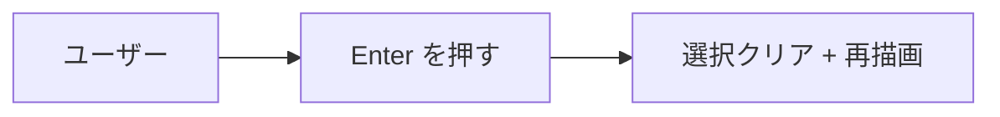
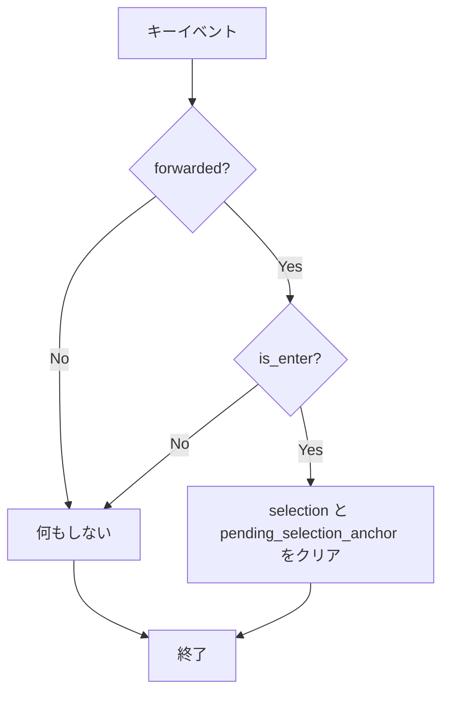
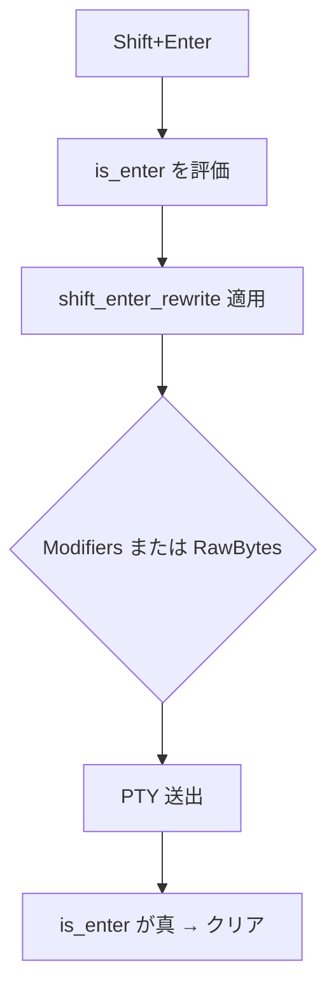
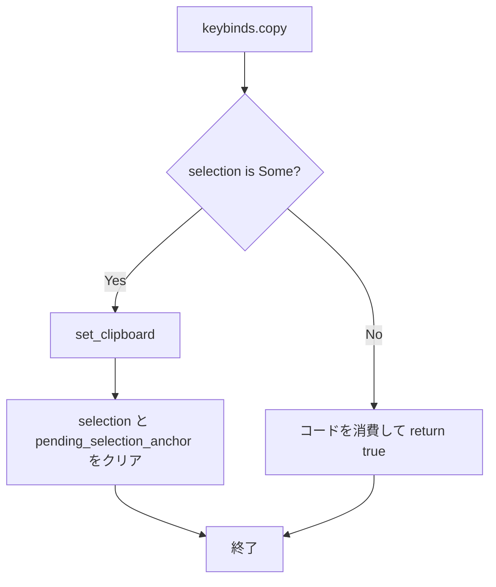
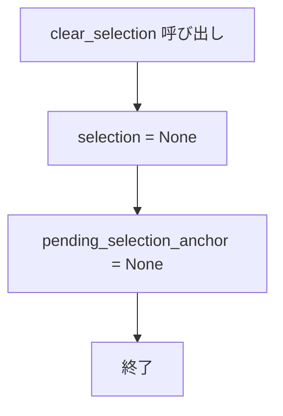
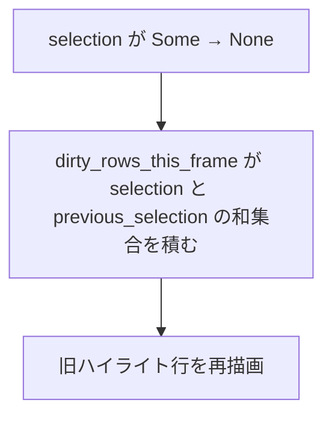

# selection-clear-on-enter-copy - 要件定義書

## 1. 概要

### 1.1 背景

TUI (Claude Code 等) が行を書き換えると、マウス選択のハイライトが画面上に取り残される。既存の選択解除条件は 6 つ (左ボタン押下 / タブ切替 / 列数変化リサイズ / alt-screen 出入り / フレームリセット / スクロールバック追い出し) あるが、いずれもキー入力を起点としないため、この状況を解消できない。

### 1.2 目的

キー入力起点のトリガーで取り残されたハイライトを解消する。既存の 6 つの選択解除条件に「Enter の PTY 送出」と「keybinds.copy でのコピー」の 2 つを追加する。

### 1.3 スコープ

**対象**:

- PTY へ Enter を送出したときの選択クリア
- keybinds.copy (既定 Ctrl+Shift+C) で実際にコピーしたときの選択クリア
- selection と pending_selection_anchor を対で落とす App ヘルパの新設
- 上記を検証するユニットテスト

**スコープ外**:

- Enter 以外の PTY 送出キー (印字キー・カーソルキー等) でのクリア
- 既存 6 箇所のインライン記述の書き換え
- PRIMARY 選択 / 中クリック貼り付けの挙動変更
- デザインステップ (新規 UI 面・レイアウト・デザイントークンの追加や変更が無く、変更はキー入力処理の分岐 2 箇所とアプリ内選択状態のみのため skip)

## 2. ビジネス要件

### 2.1 ビジネス目標

- TUI (Claude Code 等) の行書き換えで取り残されるマウス選択ハイライトを、キー入力起点のトリガーで解消する。
- 既存の 6 つの選択解除条件に「Enter の PTY 送出」と「keybinds.copy でのコピー」を追加する。
- 「選択して読みながら打つ」用途を壊さないよう、トリガーを Enter とコピーの 2 つに限定する。

### 2.2 対象ユーザー

| ユーザータイプ | 説明 |
|----------------|------|
| TUI を使う eMterm ユーザー | Claude Code 等の行を書き換える TUI を eMterm 上で動かし、マウス選択を併用するユーザー |

### 2.3 期待される効果

- 行書き換えで取り残されたハイライトが、Enter またはコピー操作で消える。
- 「選択して読みながら打つ」用途は、トリガーが Enter とコピーの 2 つに限定されるため維持される。

## 3. ユースケース

### 3.1 ユースケース一覧

| ID | ユースケース名 | アクター | 優先度 |
|----|----------------|----------|--------|
| UC01 | Enter 送出で選択を解除する | TUI を使う eMterm ユーザー | 高 |
| UC02 | コピー操作で選択を解除する | TUI を使う eMterm ユーザー | 高 |

### 3.2 ユースケース詳細

#### UC01: Enter 送出で選択を解除する

**アクター**: TUI を使う eMterm ユーザー

**事前条件**:

- マウス選択が存在し、ハイライトが表示されている。

**基本フロー**:

1. ユーザーが Enter (または Shift+Enter) を押す。
2. キーイベントが PTY へ送出される (`forwarded == true`)。
3. selection と pending_selection_anchor がクリアされる。
4. 次フレームでハイライトが消える。

**代替フロー**:

- IME の変換確定 Enter: 既存の早期 return によりクリア地点へ到達せず、選択は保持される。
- Enter 以外の PTY 送出キー (印字キー・カーソルキー等): `is_enter` が偽のためクリアされない。

**事後条件**:

- selection と pending_selection_anchor がともに None。

**ユースケース図**:

#### UC02: コピー操作で選択を解除する

**アクター**: TUI を使う eMterm ユーザー

**事前条件**:

- マウス選択が存在する。

**基本フロー**:

1. ユーザーが keybinds.copy (既定 Ctrl+Shift+C) を押す。
2. 選択範囲のテキストがクリップボードへ書き込まれる。
3. selection と pending_selection_anchor がクリアされる。
4. 次フレームでハイライトが消える。

**代替フロー**:

- 選択が無い状態: 従来どおりコードを消費するだけで、クリップボードにも選択状態にも副作用を持たない。

**事後条件**:

- クリップボードに選択テキストが入り、selection と pending_selection_anchor がともに None。

## 4. 機能要件

### 4.1 機能一覧

| ID | 機能名 | 説明 | 優先度 |
|----|--------|------|--------|
| FR1 | Enter 送出時の選択クリア | PTY へ Enter を送出したときに選択状態をクリアする | 高 |
| FR2 | Shift+Enter でのクリア | shift_enter_behavior の全モードの Shift+Enter でもクリアする | 高 |
| FR3 | コピー時のクリア | keybinds.copy で実際にコピーしたときにクリアする | 高 |
| FR4 | 選択なしコピーの現状維持 | 選択が無い keybinds.copy は従来どおり振る舞う | 高 |
| FR5 | 対でのクリア | selection と pending_selection_anchor を必ず対で None にする | 高 |
| FR6 | 再描画 | クリア後のフレームでハイライトが実際に消える | 高 |

### 4.2 機能詳細

#### FR1: Enter 送出時の選択クリア

**説明**: PTY へ Enter を送出したとき、selection と pending_selection_anchor をクリアする。実装位置は `src-tauri/src/window_host/event_loop.rs:497` の `if forwarded` 分岐の内側で、同ファイル 448 行の既存ローカル `is_enter` (`matches!(event.logical_key, WinitKey::Named(NamedKey::Enter))`) を条件に加える。Enter 以外の PTY 送出キー (通常の印字キー・カーソルキー等) ではクリアしない。

**入力**:

- `forwarded`: bool - キーイベントが PTY へ送出されたか
- `is_enter`: bool - logical_key が `Named(Enter)` か

**出力**:

- selection: `Option<Selection>` - クリア時は None
- pending_selection_anchor: `Option<..>` - クリア時は None

**処理フロー**:

**ビジネスルール**:

- クリアのトリガーは Enter のときだけとし、PTY 送出キー全件ではクリアしない。

**バリデーション**: N/A — ユーザー入力値の検証を伴わない、キーイベントの分岐処理のため。

**エラーケース**: N/A — 失敗経路を持たない状態クリア処理のため。

#### FR2: Shift+Enter でのクリア

**説明**: shift_enter_behavior の全モード (None / AltEnter / KittyCsiU / Lf) の Shift+Enter でもクリアする。`is_enter` は shift_enter_rewrite 適用前に評価されるため、RawBytes 経路を含め全モードで真になる。

**入力**:

- `shift_enter_behavior`: None / AltEnter / KittyCsiU / Lf

**出力**:

- FR1 と同じクリア結果

**処理フロー**:

**ビジネスルール**:

- `is_enter` の評価は shift_enter_rewrite の適用前に行う。

**バリデーション**: N/A — FR1 と同じ理由。

**エラーケース**: N/A — FR1 と同じ理由。

#### FR3: コピー時のクリア

**説明**: keybinds.copy (既定 Ctrl+Shift+C) で実際にコピーしたとき、`src-tauri/src/window_host/key_routing.rs:101` の `if let Some(sel) = app.selection` の内側、`host.set_clipboard(&text)` の直後にクリアする。

**入力**:

- `app.selection`: `Option<Selection>`

**出力**:

- クリップボード: 選択テキスト
- selection / pending_selection_anchor: None

**処理フロー**:

**ビジネスルール**:

- クリアは `host.set_clipboard(&text)` の直後、`if let Some(sel)` の内側に置く。

**バリデーション**: N/A — FR1 と同じ理由。

**エラーケース**: N/A — FR1 と同じ理由。

#### FR4: 選択なしコピーの現状維持

**説明**: 選択が無い状態の keybinds.copy は従来どおり `return true` でコードを消費するだけで、クリップボードにも選択状態にも副作用を持たない。

**入力**:

- `app.selection`: None

**出力**:

- 変化なし (`return true` のみ)

**処理フロー**: FR3 の処理フロー図の No 分岐に同じ。

**ビジネスルール**:

- 選択が無い場合はクリップボードへ書き込まない。

**バリデーション**: N/A — FR1 と同じ理由。

**エラーケース**: N/A — FR1 と同じ理由。

#### FR5: 対でのクリア

**説明**: クリアは selection と pending_selection_anchor を必ず対で None にする。既存 6 箇所と同じ対の扱いを、共有ヘルパ経由で守る。

**入力**:

- selection / pending_selection_anchor の現在値

**出力**:

- selection: None、pending_selection_anchor: None

**処理フロー**:

**ビジネスルール**:

- 片方だけを落とす経路を新設しない。

**バリデーション**: N/A — FR1 と同じ理由。

**エラーケース**: N/A — FR1 と同じ理由。

#### FR6: 再描画

**説明**: クリア後のフレームでハイライトが実際に消える (再描画が走る)。

**入力**:

- クリア直前の selection

**出力**:

- 旧ハイライト行がダーティ行に含まれ、再描画される

**処理フロー**:

**ビジネスルール**:

- 既存の `dirty_rows_this_frame` の挙動を利用する。

**バリデーション**: N/A — FR1 と同じ理由。

**エラーケース**: N/A — FR1 と同じ理由。

## 5. 非機能要件

### 5.1 パフォーマンス要件

- NFR5: 既存の描画スキップ最適化 (should_skip_frame / ダーティ行) を後退させない。
- レスポンスタイム / スループット / 同時接続数: N/A — サーバー処理を持たないローカル描画機能のため、これらの数値目標を定義しない。

### 5.2 セキュリティ要件

- SC1: クリップボード / PRIMARY の内容には一切書き込まない。既存の bracketed-paste サニタイズ経路には触れない。
- 認証 / 認可 / データ保護 / 入力検証: N/A — 認証・認可の境界や外部入力の検証を伴わない、アプリ内状態のクリア処理のため。

### 5.3 可用性要件

N/A — 常駐サービスではないデスクトップアプリのローカル処理であり、稼働率・障害復旧時間の目標を持たない。

### 5.4 保守性要件

- NFR6: クリア判定のロジックは、既存 `shift_enter_rewrite` と同様に副作用の無い純粋関数として切り出し、単体で検証可能にする。
- ログ出力 / 監視: N/A — 障害調査対象となる失敗経路を持たないため、追加のログ・監視要件を定義しない。
- ドキュメント: 本要件定義書と SPEC.md。

### 5.5 互換性要件

- NFR1: 既存 6 つのクリア条件 (左ボタン押下 / タブ切替 / 列数変化リサイズ / alt-screen 出入り / フレームリセット / スクロールバック追い出し) の挙動を変えない。
- NFR2: IME 変換確定 Enter と修飾キー単独押下ではクリアしない。いずれも既存の早期 return / `winit_key_to_bytes` が None を返す構造により、追加のガード無しで満たされる。
- NFR3: PRIMARY 選択と中クリック貼り付けの挙動を変えない。
- NFR4: 変更は GUI feature 配下のみ。`--no-default-features` (CLI-only) ビルドに影響しない。
- ブラウザサポート / API バージョン: N/A — ブラウザや公開 API を持たないネイティブ端末の内部処理のため。

## 6. UI/UX要件

### 6.1 画面設計要件

- Enter 送出時およびコピー時に、マウス選択のハイライト表示が消える。
- 上記 2 トリガー以外ではハイライトを保持し、「選択して読みながら打つ」用途を壊さない。

### 6.2 画面遷移

N/A — 画面遷移を伴わず、単一のターミナル表示内の選択状態のみが変化するため。

### 6.3 レスポンシブ対応

N/A — ネイティブウィンドウの端末描画であり、レスポンシブレイアウトの対象を持たないため。

## 7. データ要件

### 7.1 データモデル概要

N/A — 永続化されるエンティティを持たず、対象はアプリ内のランタイム状態 2 つのみのため。

### 7.2 データ項目

| エンティティ | 項目名 | 型 | 必須 | 説明 |
|--------------|--------|-----|------|------|
| App | selection | Option | × | マウス選択範囲。クリア時 None |
| App | pending_selection_anchor | Option | × | 選択開始アンカー。クリア時 None |

### 7.3 データ保持期間

N/A — 永続化しないプロセス内状態のため、保持期間の定義を持たない。

## 8. 外部連携

### 8.1 連携システム

N/A — 外部システムとの連携を追加しないため。

### 8.2 API仕様要件

N/A — 外部公開 API を追加も変更もしないため。

## 9. 制約条件

### 9.1 技術的制約

- `is_enter` は `src-tauri/src/window_host/event_loop.rs:448` の既存ローカルを使用し、shift_enter_rewrite 適用前に評価される。
- コピー側のクリアは `src-tauri/src/window_host/key_routing.rs:101` の `if let Some(sel) = app.selection` の内側に置く。
- `key_routing` の `handle_special_chord` は具象型 `&mut WindowHost` を取り実ウィンドウを要するため、ユニットテストから直接呼べない。event_loop の当該分岐も winit イベントループ内にあり、呼び出し位置そのものはテストから駆動できない。
- 変更は GUI feature 配下のみで、`--no-default-features` ビルドに影響しない。
- E2E テスト基盤は存在しない (`test/README.md`: "E2E Tests: None at the moment")。
- テストは `--lib` 配下に置く (`--bin emterm` では 0 件)。

### 9.2 ビジネス上の制約

- トリガーは Enter とコピーの 2 つに限定する。PTY 送出キー全件ではクリアしない。

### 9.3 スケジュール制約

N/A — 期限の指定が無いため。

### 9.4 宣言された変更集合

このフィーチャー固有のパスは手動で列挙せず、create-plan で `workflow.yaml` の各タスクの `files` から導出する (`references/phases/create-plan-phase.md`)。

**デフォルトメンバー** (SPEC 作成者が明示的に除外しない限り、常に宣言に含まれる):

- `feature-docs/selection-clear-on-enter-copy/**`
- `test-docs/selection-clear-on-enter-copy/**`

`feature-docs/selection-clear-on-enter-copy/**` に含まれるもの: `REQUIREMENTS.md`、`SPEC.md`、`IMPLEMENTATION.md`、`workflow.yaml`、`phase-state/`、`tasks/`、`reviews/roundN.yaml`、`VERIFICATION.md`、`retrospect.yaml`、およびデザインステップが生成するデザイン成果物。生成主体は各フェーズドキュメントおよび `references/phase-state.md` を参照。

`test-docs/selection-clear-on-enter-copy/**` に含まれるもの: `{T}.tests.yaml` (パス形式: `test-docs/selection-clear-on-enter-copy/{T}.tests.yaml`)。生成主体は `implement-phase.md` を参照。

**意味論**:

- デフォルトのメンバーは、SPEC 作成者が明示的に除外しない限り宣言に含まれる。除外は意図的な絞り込みであり、記載漏れによる省略ではない。
- この宣言はスーパーセット (superset) の主張であり、実際の変更集合は宣言に含まれる (CONTAINED IN) 必要がある。実際には生成されないパスが宣言されていても違反にはならない。

## 10. 想定される課題とリスク

### 10.1 技術的課題

| 課題 | 影響度 | 対応策 |
|------|--------|--------|
| EC1: 左ボタン押下中に Enter を打つと pending_selection_anchor が落ち、解放時の fold クリック判定 (`pointer_routing.rs:355` の `pending.is_some()`) が成立せず、fold トグルが 1 回不発になる | 低 | ASM5 として許容する |
| EC4: fold_layout が有効なフレームでは `dirty_rows_this_frame` が全行を返すため、クリア時の再描画コストがビューポート全体になる | 低 | 既存挙動のため対応しない |
| 呼び出し位置そのものをユニットテストから駆動できない | 中 | `include_str!` によるソース走査アサーション (TS5 / TS6 / TS8) で構造を固定する |

### 10.2 ビジネスリスク

N/A — 外部への影響やリリース判断に関わるリスクが要件分析で挙がっていないため。

## 11. 成功基準

### 11.1 受け入れ基準

- [ ] AC1: Enter を PTY に送ったときに選択がクリアされる。
- [ ] AC2: Shift+Enter でもクリアされる (shift_enter_behavior 全モード)。
- [ ] AC3: keybinds.copy でコピーしたときにクリアされる。
- [ ] AC4: 選択が無い keybinds.copy はコードを消費するだけで何も起きない。
- [ ] AC5: IME の変換確定 Enter では選択がクリアされない。
- [ ] AC6: 修飾キー単独の押下では選択がクリアされない。
- [ ] AC7: クリア時に selection と pending_selection_anchor の両方が落ちる。
- [ ] AC8: クリア後にハイライトが実際に消える (再描画が走る)。
- [ ] AC9: 設定済みの PRIMARY は影響を受けず、中クリック貼り付けが従来どおり動く。
- [ ] AC10: Enter 以外の PTY 送出キー (印字キー・カーソルキー等) では選択がクリアされない。
- [ ] AC11: 上記を検証するユニットテストがある。

### 11.2 KPI

N/A — 数値指標による測定を伴わない、挙動の追加のため。

## 12. テストシナリオ

### 12.1 テスト観点

- [ ] 正常系 (TS1): クリア判定を純粋関数 (例: `should_clear_selection_on_forward(is_enter, forwarded) -> bool`) として `src-tauri/src/window_host/input_translate.rs` に切り出し、既存 `shift_enter_rewrite` 系テスト (`src-tauri/src/window_host/tests.rs:1748-1907`) と同じ様式で真理値表を網羅する。forwarded=true かつ is_enter=true のみ真、forwarded=true / is_enter=false は偽、forwarded=false は偽。 (AC1 / AC2 / AC10)
- [ ] 正常系 (TS2): shift_enter_behavior の 4 モードそれぞれについて `shift_enter_rewrite` の結果 (Modifiers / RawBytes) に関わらず is_enter が真のままであることを、既存テストの隣に追加して固定する。 (AC2)
- [ ] 正常系 (TS3): selection / pending_selection_anchor を対で落とす App ヘルパ (例: `App::clear_selection()`) を新設し、`src-tauri/src/app/tests.rs` の既存ビルダで組んだ App に対し、両方が Some の状態から呼んで両方が None になることを直接検証する。 (AC7)
- [ ] 境界値 (TS4): selection が None の App で同ヘルパを呼んでも状態が変化せず、クリップボード側へ何も渡らないことを検証する。 (AC4)
- [ ] 正常系 (TS5): `include_str!` によるソース走査アサーションを `src-tauri/src/window_host/tests.rs` に追加し、(a) event_loop.rs の `if forwarded` ブロック内に is_enter 条件付きのクリア呼び出しがあること、(b) key_routing.rs の copy 分岐で `host.set_clipboard(&text)` の直後にクリア呼び出しがあり、それが `if let Some(sel)` の内側であること、を固定する。既存の pointer_routing.rs 走査テスト (`tests.rs:1488/1536/1581/1629`) と同じ様式にする。 (AC1 / AC3 / AC7)
- [ ] 異常系 (TS6): IME consume 経路と修飾キー単独押下がクリア地点へ到達しないこと (早期 return / `winit_key_to_bytes` の None) を、同じソース走査アサーションで構造として固定する。 (AC5 / AC6)
- [ ] 正常系 (TS7): `dirty_rows_this_frame` が selection と previous_selection の和集合をダーティ行に積む既存挙動を利用し、selection を Some から None にした次フレームで旧ハイライト行がダーティ行に含まれることを App レベルで検証する。 (AC8)
- [ ] セキュリティ (TS8): PRIMARY 設定経路 (pointer 解放時の set_primary) と中クリック貼り付け経路 (get_primary) が今回の変更で触られていないことを確認する。 (AC9)
- [ ] 手動確認 (TS9): リリースビルドで、選択を作ってから Enter / Shift+Enter / Ctrl+Shift+C を押した際にハイライトが消えること、印字キー入力では消えないことを実機確認する。実行はユーザーの明示指示時のみ。 (AC1 / AC2 / AC3 / AC10)
- [ ] パフォーマンス: N/A — 負荷試験の対象となる処理を追加しないため。NFR5 (描画スキップ最適化を後退させない) は TS7 のダーティ行検証で担保する。

### 12.2 エッジケース

| ID | 内容 |
|----|------|
| EC1 | 左ボタン押下中 (pending_selection_anchor が Some) に Enter を打つと、アンカーが落ちて解放時の fold クリック判定 (`pointer_routing.rs:355` の `pending.is_some()`) が成立せず、fold トグルが 1 回不発になる。 |
| EC2 | mux 接続タブでも Enter は PtyInput フレーム経路で forwarded == true になり、同じ扱いになる。 |
| EC3 | スクロールバック表示中の Enter は同じ分岐の既存 `scroll_to_live()` でライブ末尾へスナップするため、クリアと同一フレームで視点も動く。 |
| EC4 | fold_layout が有効なフレームでは dirty_rows_this_frame が全行を返すため、クリア時の再描画コストはビューポート全体になる (既存挙動)。 |
| EC5 | 貼り付けに含まれる改行 (bracketed paste / 中クリック) はこの分岐を通らずクリアされない。 |
| EC6 | 選択はあるが解決結果が空文字のコピー — `if let Some(sel)` 内側に置くためクリアは走る。 |
| EC7 | テンキー Enter / Ctrl+Enter / Alt+Enter はいずれも logical_key が Named(Enter) となり、Enter 限定 (ASM1) でもクリア対象になる。 |
| EC8 | 印字キーやカーソルキーは forwarded == true でもクリアしない。ASM1 により is_enter が偽で弾かれる。 |

## 13. 用語定義

| 用語 | 定義 |
|------|------|
| selection | マウス操作で確定した選択範囲を保持する App のランタイム状態 |
| pending_selection_anchor | 選択開始時のアンカーを保持する App のランタイム状態 |
| forwarded | キーイベントが PTY へ送出されたことを示す `event_loop.rs` のローカルフラグ |
| is_enter | `matches!(event.logical_key, WinitKey::Named(NamedKey::Enter))` の評価結果 (`event_loop.rs:448`) |
| shift_enter_behavior | Shift+Enter の送出形式を決める設定。None / AltEnter / KittyCsiU / Lf の 4 モード |
| shift_enter_rewrite | shift_enter_behavior に応じて送出バイト列を書き換える既存の純粋関数 |
| keybinds.copy | コピー操作のキーバインド設定 (既定 Ctrl+Shift+C) |
| PRIMARY | X11 の PRIMARY セレクション。中クリック貼り付けの供給元 |
| alt-screen | 代替画面バッファ |
| fold | 出力の折りたたみ表示機能 |

## 14. 確認事項

### 14.1 確認済み事項

- [x] ASM1 (`requirement.enter-clear-trigger-scope`): クリアのトリガーは Enter (logical_key == Named(Enter)) のときだけとし、`forwarded` 分岐の内側で is_enter を条件にする。PTY 送出キー全件ではクリアしない。チケットの「制約・前提」節 (PTY 送出キー全件でクリア) と「スコープ外」節 (Enter 以外ではクリアしない) が矛盾していた。後者を採用して解消した。Codex 相談 (batch) の結論を採用。条件式 1 行の変更で反転できる。
- [x] ASM2 (`testing.clear-site-unit-test-shape`): クリア判定を純粋関数に切り出して単体テストし、App 状態遷移も直接テストし、さらに Enter 側とコピー側のクリア呼び出し位置を `include_str!` のソース走査アサーションで固定する (3 つ全部)。
- [x] ASM3 (`design-step.recommendation`): design ステップは skip する (analyst の推奨をそのまま採用)。
- [x] ASM4: selection と pending_selection_anchor を対で落とす App ヘルパを新設し、新規 2 箇所はそれを呼ぶ。既存 6 箇所のインライン記述はこの機能では書き換えない。
- [x] ASM5: EC1 (左ボタン押下中に Enter を打つと pending_selection_anchor が落ち、解放時の fold クリック判定が 1 回不発になる) は許容する。
- [x] ASM6: 既存 6 つのクリア条件、PRIMARY / 中クリック貼り付けの挙動、`--no-default-features` ビルドの成立は不変条件として保持する。

### 14.2 未確認・保留事項

- 未確認・保留事項はない。全要件が `status: resolved`。

## 15. 参考資料

- SPEC.md: `feature-docs/selection-clear-on-enter-copy/SPEC.md`
- `src-tauri/src/window_host/event_loop.rs`: Enter 送出分岐 (448 行の `is_enter`、497 行の `if forwarded`)
- `src-tauri/src/window_host/key_routing.rs`: コピー分岐 (101 行の `if let Some(sel) = app.selection`)
- `src-tauri/src/window_host/input_translate.rs`: `shift_enter_rewrite` などの純粋関数
- `src-tauri/src/window_host/tests.rs`: 既存の `shift_enter_rewrite` 系テスト (1748-1907)、pointer_routing.rs ソース走査テスト (1488 / 1536 / 1581 / 1629)
- `src-tauri/src/app/tests.rs`: App のテストビルダ
- `src-tauri/src/window_host/pointer_routing.rs`: fold クリック判定 (355 行)
- `test/README.md`: E2E テスト基盤の有無
