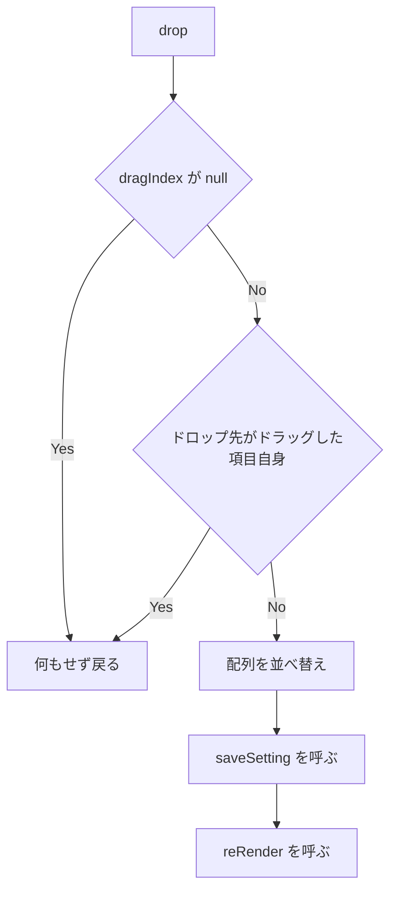

# settings-profile-drag-reorder - 要件定義書

## 1. 概要

### 1.1 背景
Linux 環境で、設定画面のプロファイル一覧の項目をドラッグして並べ替えることができない。

原因は次の想定による（14.2 の A1）: `setupDragReorder`（`src-tauri/web-shared/settings/sections/profiles-section.ts`）と `setupSshDragReorder`（`src-tauri/web-shared/settings/sections/ssh-section.ts`）の dragstart ハンドラーは `effectAllowed` だけを設定し、`setData` を呼ばない。WebKitGTK はデータを持たない DataTransfer のドラッグを開始しないため、Linux では dragover と drop が発火しない。

### 1.2 目的
- Linux で、設定画面のプロファイル一覧の項目をドラッグで並べ替えられ、新しい順序が保存される。
- Linux で、設定画面の SSH 接続一覧の項目をドラッグで並べ替えられ、新しい順序が保存される。
- 各一覧に、ドラッグデータを設定しない dragstart ハンドラーを検出する回帰テストがある。

### 1.3 スコープ
**対象**:
- プロファイル一覧の dragstart ハンドラー（`setupDragReorder`）
- SSH 接続一覧の dragstart ハンドラー（`setupSshDragReorder`）
- 両一覧の回帰テスト（bun test）

**対象外**:
- Rust/wry 側（webview_host、settings_launcher）の変更
- ドラッグ並べ替えの共通ヘルパーの切り出し
- drop ハンドラーでの dataTransfer データの読み取り
- text/plain のドラッグデータの追加
- ドラッグ中の見た目や dragging クラス
- 他の一覧のドラッグ動作（例: 読み取り専用の .ssh/config ホスト一覧）

## 2. ビジネス要件

### 2.1 ビジネス目標
- Linux で、プロファイル一覧と SSH 接続一覧の項目をドラッグで並べ替えられ、新しい順序が保存される。
- 各一覧の dragstart ハンドラーがドラッグデータを設定しなくなったとき、回帰テストで検出できる。

### 2.2 対象ユーザー
| ユーザータイプ | 説明 |
|----------------|------|
| Linux ユーザー | Linux 環境で eMterm の設定画面を使うユーザー |

### 2.3 期待される効果
- Linux でプロファイル一覧の順序をドラッグで入れ替えられる。
- Linux で SSH 接続一覧の順序をドラッグで入れ替えられる。

## 3. ユースケース

### 3.1 ユースケース一覧
| ID | ユースケース名 | アクター | 優先度 |
|----|----------------|----------|--------|
| UC01 | プロファイル一覧をドラッグで並べ替える | Linux ユーザー | 高 |
| UC02 | SSH 接続一覧をドラッグで並べ替える | Linux ユーザー | 高 |

### 3.2 ユースケース詳細

#### UC01: プロファイル一覧をドラッグで並べ替える

**アクター**: Linux ユーザー

**事前条件**:
- Linux 環境で eMterm を起動している。
- 設定画面でプロファイル一覧を表示している。

**基本フロー**:
1. ユーザーがプロファイルの項目をドラッグする。
2. ユーザーが別の項目の位置でドロップする。
3. ドラッグした項目がドロップ先の位置に移動する。

**代替フロー**:
- ドラッグした項目自身にドロップした場合、順序は変わらず保存も行われない。

**事後条件**:
- プロファイルの新しい順序が保存され、設定画面を開き直しても保たれている。

#### UC02: SSH 接続一覧をドラッグで並べ替える

**アクター**: Linux ユーザー

**事前条件**:
- Linux 環境で eMterm を起動している。
- 設定画面で SSH 接続一覧を表示している。

**基本フロー**:
1. ユーザーが SSH 接続の項目をドラッグする。
2. ユーザーが別の項目の位置でドロップする。
3. ドラッグした項目がドロップ先の位置に移動する。

**代替フロー**:
- ドラッグした項目自身にドロップした場合、順序は変わらず保存も行われない。

**事後条件**:
- SSH 接続の新しい順序が保存され、設定画面を開き直しても保たれている。

## 4. 機能要件

### 4.1 機能一覧
| ID | 機能名 | 説明 | 優先度 |
|----|--------|------|--------|
| FR1 | プロファイル一覧の dragstart でドラッグデータを設定する | `setupDragReorder` の dragstart で `application/x-emterm-profile-index` を設定する | 高 |
| FR2 | SSH 接続一覧の dragstart でドラッグデータを設定する | `setupSshDragReorder` の dragstart で `application/x-emterm-ssh-index` を設定する | 高 |
| FR3 | text/plain のドラッグデータを設定しない | 各一覧の独自 MIME 型以外を設定しない | 高 |
| FR4 | drop ハンドラーはメモリ上の dragIndex を使い続ける | drop の現行ロジックを維持する | 高 |
| FR5 | 各一覧をそれぞれのファイルで修正し、共通ヘルパーを作らない | 修正は各関数内で個別に行う | 中 |
| FR6 | 一覧ごとの回帰テスト | bun test で両一覧を個別に検証する | 高 |

### 4.2 機能詳細

#### FR1: プロファイル一覧の dragstart でドラッグデータを設定する

**説明**: `setupDragReorder`（`src-tauri/web-shared/settings/sections/profiles-section.ts`）の dragstart ハンドラーは、ドラッグした項目の `data-index` の値を使って `e.dataTransfer.setData("application/x-emterm-profile-index", String(index))` を呼ぶ。`e.dataTransfer.effectAllowed = "move"` の設定は維持する。

**入力**:
- `data-index`: 文字列 - ドラッグした項目のインデックス

**出力**:
- `dataTransfer` の `application/x-emterm-profile-index`: 文字列 - `String(index)`
- `dataTransfer.effectAllowed`: 文字列 - `"move"`

#### FR2: SSH 接続一覧の dragstart でドラッグデータを設定する

**説明**: `setupSshDragReorder`（`src-tauri/web-shared/settings/sections/ssh-section.ts`）の dragstart ハンドラーは、ドラッグした項目の `data-index` の値を使って `e.dataTransfer.setData("application/x-emterm-ssh-index", String(index))` を呼ぶ。`e.dataTransfer.effectAllowed = "move"` の設定は維持する。

**入力**:
- `data-index`: 文字列 - ドラッグした項目のインデックス

**出力**:
- `dataTransfer` の `application/x-emterm-ssh-index`: 文字列 - `String(index)`
- `dataTransfer.effectAllowed`: 文字列 - `"move"`

#### FR3: text/plain のドラッグデータを設定しない

**説明**: どちらの dragstart ハンドラーも、text/plain のエントリー（および自一覧の独自 MIME 型以外の型）を設定しない。

#### FR4: drop ハンドラーはメモリ上の dragIndex を使い続ける

**説明**: 両一覧の drop ハンドラーは現行ロジックを維持する。メモリ上の `dragIndex` を使い、`dragIndex` が null のときは何もせず戻り、`e.dataTransfer` からデータを読まない。並べ替え、`saveSetting`（`"profiles"` / `"ssh_connections"`）、`reRender` の動作は現状どおり。

**処理フロー**:

**ビジネスルール**:
- drop ハンドラーは `e.dataTransfer` からデータを読まない。

#### FR5: 各一覧をそれぞれのファイルで修正し、共通ヘルパーを作らない

**説明**: 修正は `setupDragReorder` と `setupSshDragReorder` の中でそれぞれ個別に行う。ドラッグ並べ替えの共通ヘルパーは切り出さない。

#### FR6: 一覧ごとの回帰テスト

**説明**: bun test で両一覧を個別に検証する。各一覧について次を確認する。
- (a) 項目の dragstart で、一覧の独自 MIME 型に項目のインデックスが設定され、`effectAllowed` が `"move"` になる。
- (b) dragstart → drop の流れで配列が並べ替わり、並べ替え後の配列で `saveSetting` が呼ばれ、`reRender` が呼ばれる。

## 5. 非機能要件

### 5.1 パフォーマンス要件
- 該当なし

### 5.2 セキュリティ要件
- 該当なし

### 5.3 可用性要件
- 該当なし

### 5.4 保守性要件
- NFR1: 変更は `src-tauri/web-shared/settings/sections/` 配下の TypeScript（と新規テストファイル）に限る。Rust/wry 側（`src-tauri/src/webview_host/linux.rs`、`settings_launcher.rs`）は変更しない。
- NFR3: `bun test`、`bun run typecheck`、`bun run build:settings` がすべて成功する。
- NFR4: 回帰テストは既存の bun test + happy-dom の preload（`test-setup.ts`）で動き、実際の WebKitGTK を必要としない。

### 5.5 互換性要件
- NFR2: Windows（WebView2）でのドラッグ並べ替えは現状どおり動作する。

## 6. UI/UX要件

### 6.1 画面設計要件
画面のレイアウト・見た目・操作の設計変更はない（デザインステップは省略: dragstart ハンドラーのロジックのみの修正）。

### 6.2 画面遷移
該当なし

### 6.3 レスポンシブ対応
該当なし

## 7. データ要件

### 7.1 データモデル概要
新しいデータモデルはない。並べ替えの対象は既存の `currentSettings.profiles` と `currentSettings.ssh_connections`。

### 7.2 データ項目
| エンティティ | 項目名 | 型 | 必須 | 説明 |
|--------------|--------|-----|------|------|
| ドラッグデータ（プロファイル一覧） | `application/x-emterm-profile-index` | 文字列 | ○ | ドラッグした項目のインデックス |
| ドラッグデータ（SSH 接続一覧） | `application/x-emterm-ssh-index` | 文字列 | ○ | ドラッグした項目のインデックス |

### 7.3 データ保持期間
該当なし

## 8. 外部連携

### 8.1 連携システム
該当なし

### 8.2 API仕様要件
該当なし

## 9. 制約条件

### 9.1 技術的制約
- 変更は `src-tauri/web-shared/settings/sections/` 配下の TypeScript と新規テストファイルに限る（NFR1）。
- 回帰テストは実際の WebKitGTK を使わず、bun test + happy-dom で動かす（NFR4）。

### 9.2 ビジネス上の制約
- 該当なし

### 9.3 スケジュール制約
- 該当なし

### 9.4 宣言された変更集合

このフィーチャー固有のパスは手動で列挙せず、create-plan で `workflow.yaml` の各タスクの `files` から導出する（`references/phases/create-plan-phase.md`）。

**デフォルトメンバー**（SPEC作成者が明示的に除外しない限り、常に宣言に含まれる）:
- `feature-docs/settings-profile-drag-reorder/**`
- `test-docs/settings-profile-drag-reorder/**`

`feature-docs/settings-profile-drag-reorder/**` に含まれるもの: `REQUIREMENTS.md`、`SPEC.md`、`IMPLEMENTATION.md`、`workflow.yaml`、`phase-state/`、`tasks/`、`reviews/roundN.yaml`、`VERIFICATION.md`、`retrospect.yaml`、およびデザインステップが生成するデザイン成果物。生成主体は各フェーズドキュメントおよび `references/phase-state.md` を参照（引用のみ、ルールは再掲しない）。

`test-docs/settings-profile-drag-reorder/**` に含まれるもの: `{T}.tests.yaml`（パス形式: `test-docs/settings-profile-drag-reorder/{T}.tests.yaml`）。生成主体は `implement-phase.md` を参照（引用のみ、ルールは再掲しない）。

**意味論**:
- デフォルトのメンバーは、SPEC作成者が明示的に除外しない限り宣言に含まれる。除外は意図的な絞り込みであり、記載漏れによる省略ではない。
- この宣言はスーパーセット（superset）の主張であり、実際の変更集合は宣言に含まれる（CONTAINED IN）必要がある。実際には生成されないパスが宣言されていても違反にはならない。implementタスクを1つも生成しないフィーチャーは `test-docs/{feature}/` ディレクトリを生成しないが、宣言された `test-docs/{feature}/**` は依然として正しい。

## 10. 想定される課題とリスク

### 10.1 技術的課題
| 課題 | 影響度 | 対応策 |
|------|--------|--------|
| 独自 MIME 型だけを持つドラッグが、対象の WebKitGTK バージョンで実際に開始されるかは未検証（A3） | 高 | AC-8 の Linux での手動確認で確かめる |
| SSH 接続一覧の不具合は Linux で再現確認していない（A4） | 中 | AC-8 の手動確認で SSH 接続一覧も確かめる |
| `test-setup.ts` は DragEvent / DataTransfer を globalThis に公開していない（A5） | 低 | テストは happy-dom の Window から取得するか、dispatch する Event にスタブの dataTransfer を付ける |
| `renderSshSection` は `ssh_command_path` が空でないときだけ `invoke("load_ssh_config_hosts")` を呼ぶ（A6） | 低 | SSH のテストでは `ssh_command_path` を `""` にして Tauri IPC 呼び出しを避ける |

### 10.2 ビジネスリスク
| リスク | 発生確率 | 影響度 | 対応策 |
|--------|----------|--------|--------|
| 該当なし | - | - | - |

## 11. 成功基準

### 11.1 受け入れ基準
- [ ] AC-1: プロファイル一覧の `data-index` が i の項目に dragstart を dispatch すると、dataTransfer に `"application/x-emterm-profile-index"` = `String(i)` が入り、`effectAllowed` が `"move"` になる。（FR1）
- [ ] AC-2: SSH 接続一覧の `data-index` が i の項目に dragstart を dispatch すると、dataTransfer に `"application/x-emterm-ssh-index"` = `String(i)` が入り、`effectAllowed` が `"move"` になる。（FR2）
- [ ] AC-3: どちらの一覧でも、dragstart 後の dataTransfer に text/plain のエントリーがない。（FR3）
- [ ] AC-4: プロファイル項目 i の dragstart に続いて項目 j（i != j）に drop すると、`currentSettings.profiles` でプロファイルが i から j に移動し、`saveSetting("profiles", 並べ替え後の配列)` が 1 回呼ばれ、`reRender` が呼ばれる。（FR4, FR6）
- [ ] AC-5: SSH 項目 i の dragstart に続いて項目 j（i != j）に drop すると、`currentSettings.ssh_connections` で接続が i から j に移動し、`saveSetting("ssh_connections", 並べ替え後の配列)` が 1 回呼ばれ、`reRender` が呼ばれる。（FR4, FR6）
- [ ] AC-6: どちらの一覧でも、先行する dragstart のない drop（dragIndex が null）と、ドラッグした項目自身への drop では `saveSetting` が呼ばれない。（FR4）
- [ ] AC-7: `bun test`、`bun run typecheck`、`bun run build:settings` が成功する。（NFR3）
- [ ] AC-8: Linux（WebKitGTK）での手動確認: 設定画面でプロファイル項目を別の位置にドラッグすると一覧が並べ替わり、設定画面を開き直しても新しい順序が残っている。SSH 接続一覧でも同じ。（FR1, FR2, FR4）

### 11.2 KPI
| 指標 | 目標値 | 測定方法 |
|------|--------|----------|
| 該当なし | - | - |

## 12. テストシナリオ

### 12.1 テスト観点
- [ ] 正常系（TS-1 / unit, AC-1, AC-3）: プロファイル 3 件で Profiles セクションを描画し、インデックス 1 の項目に DataTransfer 付きで dragstart を dispatch する。`getData("application/x-emterm-profile-index") === "1"`、`effectAllowed === "move"`、text/plain のエントリーがないことを確認する。
- [ ] 正常系（TS-2 / unit, AC-2, AC-3）: 接続 3 件・`ssh_command_path` を空にして SSH セクションを描画し、インデックス 1 の項目に dragstart を dispatch する。`getData("application/x-emterm-ssh-index") === "1"`、`effectAllowed === "move"`、text/plain のエントリーがないことを確認する。
- [ ] 正常系（TS-3 / unit, AC-4）: Profiles でインデックス 0 に dragstart、インデックス 2 に drop する。順序が [B, C, A] になり、その配列で `saveSetting("profiles", ...)` が 1 回呼ばれ、`reRender` が呼ばれることを確認する。
- [ ] 正常系（TS-4 / unit, AC-5）: SSH でインデックス 0 に dragstart、インデックス 2 に drop する。順序が [B, C, A] になり、その配列で `saveSetting("ssh_connections", ...)` が 1 回呼ばれ、`reRender` が呼ばれることを確認する。
- [ ] 異常系（TS-5 / unit, AC-6）: 両一覧で、dragstart なしの drop と、ドラッグした項目自身への drop のどちらでも `saveSetting` が呼ばれないことを確認する。
- [ ] コマンド（TS-6 / command, AC-7）: `bun test`、`bun run typecheck`、`bun run build:settings` を実行する。
- [ ] 手動（TS-7 / manual, AC-8）: Linux で設定 > プロファイルを開き、項目を新しい位置にドラッグする。順序が変わり、設定画面を開き直しても保たれていることを確認する。設定 > SSH 接続でも同様に行う。
- [ ] 境界値: 該当なし
- [ ] セキュリティ: 該当なし
- [ ] パフォーマンス: 該当なし

## 13. 用語定義

| 用語 | 定義 |
|------|------|
| dragIndex | drop ハンドラーが参照する、ドラッグ中の項目のインデックスを保持するメモリ上の変数 |
| 独自 MIME 型 | プロファイル一覧の `application/x-emterm-profile-index`、SSH 接続一覧の `application/x-emterm-ssh-index` |

## 14. 確認事項

### 14.1 確認済み事項

- [x] SSH 接続一覧の扱い（requirement.scope.ssh-list）: SSH 接続一覧も対象に含め、プロファイル一覧とは別ファイルで個別に修正し、テストも一覧ごとに用意する（FR2, FR5, FR6）。
- [x] setData のペイロード（requirement.fr1.setdata-payload）: 各一覧の独自 MIME 型に項目のインデックスを設定し、text/plain は設定しない。drop ハンドラーは dataTransfer を読まず、メモリ上の dragIndex を使い続ける（FR1, FR2, FR3, FR4）。

### 14.2 未確認・保留事項
- [ ] A1: 原因は、両 dragstart ハンドラーが `effectAllowed` だけを設定し `setData` を呼ばないこと（profiles-section.ts:190-200、ssh-section.ts:365-375）。WebKitGTK はデータを持たない DataTransfer のドラッグを開始しないため、Linux では dragover と drop が発火しない。
- [ ] A2: `src-tauri/src/webview_host/linux.rs` に、設定 WebView 内の HTML5 ドラッグを横取りする wry/GTK のドラッグ&ドロップハンドラーはない。drag/drop に一致する箇所は無関係な IPC のコメントだけ。
- [ ] A3: 独自 MIME 型だけを持つドラッグが、対象の WebKitGTK バージョンで実際に開始されるかは未検証。AC-8 の Linux での手動確認で確かめる。
- [ ] A4: SSH 接続一覧の不具合は Linux で再現確認していない。dragstart ハンドラーが同一のため、同じように失敗すると想定している。
- [ ] A5: `test-setup.ts` は DragEvent / DataTransfer を globalThis に公開していない。テストは happy-dom の Window から取得するか、dispatch する Event にスタブの dataTransfer を付ける。
- [ ] A6: `renderSshSection` は `ssh_command_path` が空でないときだけ `invoke("load_ssh_config_hosts")` を呼ぶ。SSH のテストでは `ssh_command_path` を `""` にして Tauri IPC 呼び出しを避ける。
- [ ] A7: Windows WebView2 は `setData` なしでもドラッグを開始する。`setData` を追加してもそこでの動作は変わらない。

## 15. 参考資料

- `src-tauri/web-shared/settings/sections/profiles-section.ts`: プロファイル一覧の `setupDragReorder`
- `src-tauri/web-shared/settings/sections/ssh-section.ts`: SSH 接続一覧の `setupSshDragReorder`
- `test-setup.ts`: bun test の happy-dom preload
