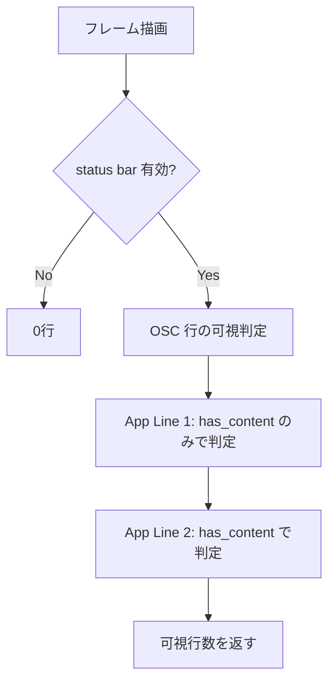

# ステータスバーのエージェント状態サマリ撤去 - 要件定義書

## 1. 概要

### 1.1 背景

mux で AI エージェントの状態（idle / working / blocked / done）を可視化する仕組み
（feature `mux-agent-status-api`）を導入した際、その task0006
（commit `c0a20fa`「task0006: add agent-status tab/window badges, status-bar summary,
pane-ID copy」）でステータスバーの App Line 1 にエージェント状態サマリ
（blocked / working / done / idle のドット＋件数）が追加された。

この追加によってステータスバーの状態がおかしくなった。具体的には、App Line 1 は
本来「解決済みコンテンツがあるときだけ表示する」自動非表示ルール
（feature `statusbar-app-line1-auto-hide`, commit `44113f4`）で制御されていたが、
task0006 がその条件に「エージェント状態サマリが存在するか」を OR で足したため、
ユーザーが App Line 1 のテンプレートを設定していなくてもエージェント状態が
報告された時点で行が出現するようになった。

### 1.2 目的

ステータスバーを、エージェント状態の仕組み導入前（commit `c0a20fa` の直前）と
同じ挙動・見た目に戻す。ステータスバーにはエージェント状態を一切表示しない。

### 1.3 スコープ

**対象**:

- `src-tauri/src/ui/status_bar.rs` — エージェント状態サマリの描画・型・
  ヘルパー・関連ユニットテスト、および App Line 1 の可視条件
- `src-tauri/src/render/mod.rs` — サマリ生成と `status_bar::draw` への引き渡し
- `src-tauri/src/window_host.rs` — `panel_height_logical` へのサマリ有無の引き渡し
- `src-tauri/src/app.rs` — サマリ専用のクエリ面 `App::agent_status_counts()`
- `doc/AGENT-STATUS.md` — ステータスバーサマリに言及している記述

**対象外**:

- タブバーのエージェント状態バッジ（`src-tauri/src/ui/tab_bar.rs`）
- mux サイドバーのエージェント状態バッジ・ペイン ID コピー
  （`src-tauri/src/ui/mux_sidebar.rs`）
- エージェント状態モデル本体（`agent_status.rs` / `agent_status_model.rs`）、
  OSC 777 受信経路、デスクトップ通知、mux CLI の read/send/wait API
- ステータスバーのその他の機能（OSC 行、App Line 2、テンプレート、自動非表示ルール
  そのもの）

## 2. ビジネス要件

### 2.1 ビジネス目標

エージェント状態可視化の導入によって生じたステータスバーのリグレッションを解消し、
ステータスバーをユーザーが設定したテンプレートだけで制御される状態に戻す。

### 2.2 対象ユーザー

| ユーザータイプ | 説明 |
|----------------|------|
| eMterm 利用者 | ステータスバーを使う全ユーザー |
| AI エージェント利用者 | mux 上で Claude Code 等を動かし、エージェント状態表示を使うユーザー |

### 2.3 期待される効果

- ステータスバーの表示行数・内容が、ユーザーの設定したテンプレートのみで決まる
- エージェント状態が報告されても、ステータスバーのレイアウトが勝手に変化しない
- タブバー・サイドバーのバッジは残るため、エージェント状態の可視性自体は失われない

## 3. ユースケース

### 3.1 ユースケース一覧

| ID | ユースケース名 | アクター | 優先度 |
|----|----------------|----------|--------|
| UC01 | App Line 1 未設定の状態でエージェントが状態を報告する | eMterm 利用者 | 高 |
| UC02 | App Line 1 設定済みの状態でエージェントが状態を報告する | eMterm 利用者 | 高 |

### 3.2 ユースケース詳細

#### UC01: App Line 1 未設定の状態でエージェントが状態を報告する

**アクター**: eMterm 利用者

**事前条件**:

- ステータスバーが有効
- App Line 1 のテンプレートが未設定（または解決結果が空）
- mux 上のエージェントが OSC 777 `agent-status` で状態を報告する

**基本フロー**:

1. エージェントが working / blocked / done などの状態を報告する
2. eMterm はタブバー・サイドバーのバッジを更新する
3. ステータスバーは何も変化しない（App Line 1 は非表示のまま）

**事後条件**:

- ステータスバーの表示行数が状態報告の前後で変わらない

#### UC02: App Line 1 設定済みの状態でエージェントが状態を報告する

**アクター**: eMterm 利用者

**事前条件**:

- ステータスバーが有効
- App Line 1 のテンプレートが設定済みで解決結果が空でない

**基本フロー**:

1. エージェントが状態を報告する
2. App Line 1 にはテンプレートの左セクション・右セクションのみが描画される
3. ドット＋件数のサマリは描画されない

**事後条件**:

- App Line 1 の右セクションが、サマリに場所を譲らず従来どおり右端まで使える

## 4. 機能要件

### 4.1 機能一覧

| ID | 機能名 | 説明 | 優先度 |
|----|--------|------|--------|
| F01 | サマリ描画の撤去 | ステータスバーからエージェント状態サマリの描画を取り除く | 高 |
| F02 | App Line 1 可視条件の復旧 | 可視条件を「解決済みコンテンツの有無」のみに戻す | 高 |
| F03 | API シグネチャの復旧 | `visible_row_count` / `panel_height_logical` / `draw` を導入前の引数に戻す | 高 |
| F04 | サマリ専用コードの削除 | サマリのためだけに追加された型・ヘルパー・クエリ面・テストを削除する | 中 |
| F05 | ドキュメント更新 | `doc/AGENT-STATUS.md` からステータスバーサマリの記述を除く | 中 |

### 4.2 機能詳細

#### F01: サマリ描画の撤去

**説明**: `status_bar.rs` の `draw_agent_summary` と、App 行描画からのその呼び出しを
削除する。App 行はテンプレート由来の左右セクションのみを描画する。

**ビジネスルール**:

- ステータスバーにエージェント状態を示す要素（ドット・件数・色）を一切残さない

#### F02: App Line 1 可視条件の復旧

**説明**: App Line 1 の可視条件を `view_model.app_line1.has_content()` のみに戻す
（`|| has_agent_summary` を除去）。

**処理フロー**:

#### F03: API シグネチャの復旧

**説明**: 次の関数を導入前のシグネチャに戻す。

| 関数 | 現在 | 復旧後 |
|------|------|--------|
| `visible_row_count` | `(&StatusBarViewModel, bool) -> u32` | `(&StatusBarViewModel) -> u32` |
| `panel_height_logical` | `(&StatusBarViewModel, bool) -> f32` | `(&StatusBarViewModel) -> f32` |
| `draw` | `(ctx, &vm, Option<&EmojiResources>, &[AgentSummarySegment])` | `(ctx, &vm, Option<&EmojiResources>)` |

**エラーケース**:

| エラー | 条件 | 対応 |
|--------|------|------|
| 呼び出し側のコンパイルエラー | `render/mod.rs` / `window_host.rs` が旧引数のまま | 同一タスク内で呼び出し側も更新する |

#### F04: サマリ専用コードの削除

**説明**: サマリのためだけに task0006 が追加した以下を削除する。

- `AgentSummarySegment` 構造体
- `agent_summary_segments()` ヘルパー
- `AGENT_SUMMARY_*` 定数群
- `Counts` / `tab_bar::agent_state_color` / `Rect` のサマリ専用 import
- サマリ関連ユニットテスト（`agent_summary_segments_*`,
  `visible_row_count_agent_summary_*`, `draw_*agent_summary*`）
- `App::agent_status_counts()` とその passthrough テスト

**ビジネスルール**:

- 未使用のまま残さない（dead code を残さない）
- タブバー／サイドバーが使っているクエリ面（`agent_status_badge_for` /
  `agent_status_pane_badge` 等）は削除しない

#### F05: ドキュメント更新

**説明**: `doc/AGENT-STATUS.md` の「status-bar summary」への言及（概要・
セキュリティ考慮の記述）を、ステータスバーを含まない表現に改める。

## 5. 非機能要件

### 5.1 パフォーマンス要件

- 毎フレームのサマリ集計（`agent_status_counts()`）が無くなるため、描画コストは
  導入前と同等以下になること

### 5.2 セキュリティ要件

- 本タスクで新たな入力経路・権限は追加しない

### 5.4 保守性要件

- ビルドは警告（未使用 import / dead code）を新たに増やさないこと
- 既存のユニットテストは、サマリ専用のもの以外は削除・弱体化しないこと

### 5.5 互換性要件

- ステータスバーの設定スキーマ（`settings.json`）に変更を加えないこと
- エージェント状態の OSC プロトコル・mux IPC プロトコルに変更を加えないこと

## 6. UI/UX要件

### 6.1 画面設計要件

ステータスバーの見た目を `c0a20fa` 導入前と同一にする。3 層（OSC 行 / App Line 1 /
App Line 2）の構成、行高、自動非表示ルールはいずれも変更しない。

## 9. 制約条件

### 9.1 技術的制約

- ネイティブ描画（wgpu + egui）のため、UI の自動 E2E 検証手段が無い。検証は
  ユニットテストとコード確認、および必要に応じたユーザーの目視確認による
- Rust の GUI 機能は `gui` feature 配下。`--no-default-features` ビルドも壊さないこと

## 10. 想定される課題とリスク

### 10.1 技術的課題

| 課題 | 影響度 | 対応策 |
|------|--------|--------|
| サマリ削除で `tab_bar::agent_state_color` が status_bar からのみ参照されていた場合の未使用化 | 低 | tab_bar 自身のバッジ描画が使用しているため未使用にはならない。ビルド警告で確認する |
| `App::agent_status_counts()` を他所が使っていた場合の破壊 | 低 | 呼び出し元は `render/mod.rs` と `window_host.rs` のサマリ経路のみであることを確認済み |

## 11. 成功基準

### 11.1 受け入れ基準

- [ ] ステータスバーが仕組み導入前と同じ状態に戻っている
- [ ] ステータスバーにエージェント状態が表示されない
- [ ] App Line 1 未設定時、エージェント状態が報告されてもステータスバーの行数が増えない
- [ ] タブバー・サイドバーのエージェント状態バッジは従来どおり動作する
- [ ] `cargo check`（default / `--no-default-features`）と `cargo test --lib` が通る

## 12. テストシナリオ

### 12.1 テスト観点

- [ ] 正常系: App Line 1 テンプレート設定済み → 従来どおり左右セクションのみ描画
- [ ] 正常系: App Line 1 未設定 + エージェント状態あり → App Line 1 は非表示
- [ ] 境界値: 全行非表示 → `visible_row_count` が 0、`panel_height_logical` が 0.0
- [ ] 回帰: OSC 行・App Line 2 の既存テストが変更なく通る

## 13. 用語定義

| 用語 | 定義 |
|------|------|
| App Line 1 / App Line 2 | ステータスバーのアプリ側テンプレート行（上から 2 段目・3 段目） |
| OSC 行 | OSC シーケンス由来の行（最上段） |
| エージェント状態サマリ | task0006 が App Line 1 右端に追加した blocked/working/done/idle のドット＋件数 |

## 14. 確認事項

### 14.1 確認済み事項

Notion タスク本文（`3a93509ec8ee818cb58ec9cfdab64a49`）およびコード調査により確定した事項:

- [x] 何を戻すか: エージェント状態の仕組み導入でおかしくなったステータスバー
- [x] どこまで戻すか: ステータスバーには何も表示しなくてよい（エージェント状態を出さない）
- [x] 原因箇所: commit `c0a20fa` の `status_bar.rs` 変更と、その呼び出し側
- [x] 導入前の基準点: `status_bar.rs` は `c0a20fa` の直前 `44113f4` が最後の変更

### 14.2 未確認・保留事項（batch モードのため自己判断／SPEC.md の Assumptions に記録）

- [ ] タブバー・サイドバーのバッジを残すか → 残す（タスク文はステータスバーのみを指す）
- [ ] 設定で ON/OFF できるようにするか → しない（「表示しなくて良い」の指示に従い撤去）
- [ ] サマリ専用コードを残すか削除するか → 削除する（dead code を残さない）

## 15. 参考資料

- Notion タスク: https://www.notion.so/3a93509ec8ee818cb58ec9cfdab64a49
- 導入コミット: `c0a20fa` task0006: add agent-status tab/window badges, status-bar summary, pane-ID copy
- 導入前の基準コミット: `44113f4` task0001: auto-hide App Line 1 on resolved content
- doc/AGENT-STATUS.md
