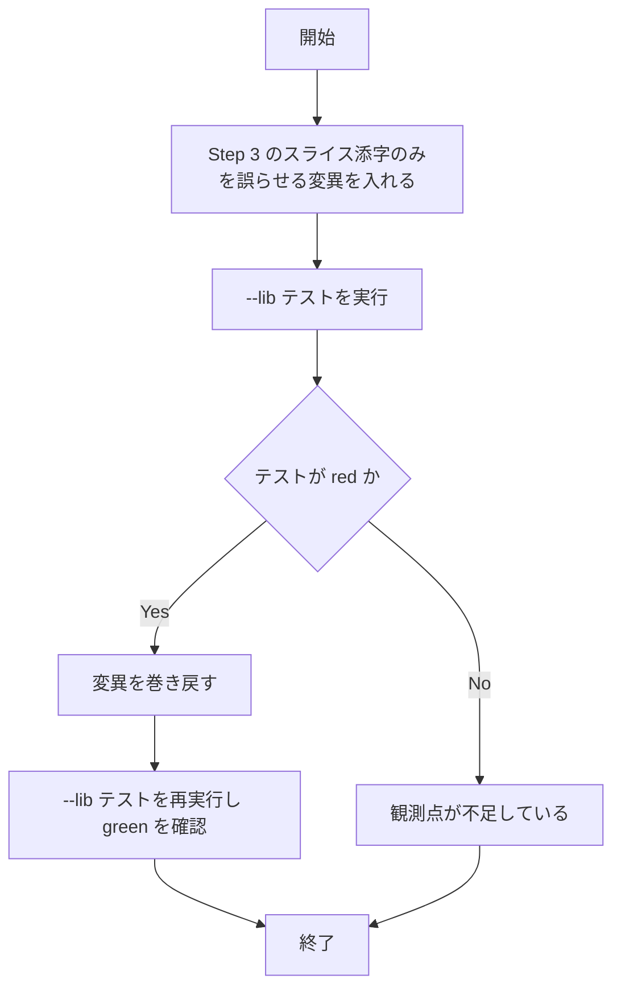

# survivor-assert-key-stability - 要件定義書

## 1. 概要

### 1.1 背景

`test_ring_push_blank_clears_recycled_row_overflow_entries` の survivor アサートが、テストのコメントが主張している「ビューポート位置がずれてもキーが安定である」という設計上の主張を、実際には観測していない。

### 1.2 目的

- survivor アサートが、テストのコメントが主張している「ビューポート位置がずれてもキーが安定である」という設計上の主張を実際に観測するようにする。
- overflow 側テーブルの寿命・スコープ固定という本テスト唯一の目的に対し、over-clear の裏返しである孤児エントリ残留（リーク）を合格扱いしない状態にする。
- `ring_push_blank` Step 3 の塗り潰し先だけが壊れる退行を、行スコープ観測を目的としたこのテストが検出できるようにする。

### 1.3 スコープ

恒久的な変更は `crates/term_core/src/ring_buffer/tests.rs` に限定する。プロダクションコード（`crates/term_core/src/ring_buffer.rs` を含む）の振る舞いは変更しない。変異注入（FR4）はローカル検証専用であり、コミットしない。

## 2. ビジネス要件

### 2.1 ビジネス目標

| ID | 目標 |
|----|------|
| BO1 | survivor アサートが「ビューポート位置がずれてもキーが安定である」という設計上の主張を実際に観測する |
| BO2 | over-clear の裏返しである孤児エントリ残留（リーク）を合格扱いしない |
| BO3 | `ring_push_blank` Step 3 の塗り潰し先だけが壊れる退行を検出できる |

### 2.2 対象ユーザー

| ユーザータイプ | 説明 |
|----------------|------|
| `term_core` の開発者 | `ring_push_blank` および overflow テーブルの寿命・スコープに関わる変更を行い、`term_core` の `--lib` テストスイートでその退行を検出する |

### 2.3 期待される効果

- 塗り潰し先のスライス添字だけが壊れる退行が、`term_core` の `--lib` スイートで red として現れる。
- テストのコメントが主張する内容とアサートが実際に観測する内容が一致する。

## 3. ユースケース

### 3.1 ユースケース一覧

| ID | ユースケース名 | アクター | 優先度 |
|----|----------------|----------|--------|
| UC01 | 塗り潰し先の退行を単体テストで検出する | `term_core` の開発者 | 高 |

### 3.2 ユースケース詳細

#### UC01: 塗り潰し先の退行を単体テストで検出する

**アクター**: `term_core` の開発者

**事前条件**:
- 変異なしの状態で `term_core` の `--lib` スイートが green である。

**基本フロー**:
1. `ring_push_blank` Step 3 の塗り潰し対象スライス添字のみを誤らせる変異を入れる。
2. `CARGO_TARGET_DIR=src-tauri/target cargo test --manifest-path crates/term_core/Cargo.toml --lib` を実行する。
3. `test_ring_push_blank_clears_recycled_row_overflow_entries` が fail する。
4. 変異を巻き戻し、同じコマンドを再実行して green を確認する。

**代替フロー**:
- 変異下でもテストが pass する場合、survivor 行の内容アサートが観測点として機能していない。

**事後条件**:
- 変異が作業ツリーに残っていない。

## 4. 機能要件

### 4.1 機能一覧

| ID | 機能名 | 説明 | 優先度 |
|----|--------|------|--------|
| FR1 | survivor キーの安定性を観測するアサートを追加する | スクロール前に捕捉した survivor 行のリングスロットキーがスクロール後もビューポート行 0 に対応することを観測する | 高 |
| FR2 | survivor 行の内容が生存していることを観測するアサートを追加する | survivor 行の内容自体が残っていることを `get_cell_char(0, 0)` により観測する | 高 |
| FR3 | 既存のアサートを保持する | 事前アサート・removal 事後アサート・既存 survivor 存在アサートを削除せず残す | 高 |
| FR4 | 変異注入でテストが red になることを確認する | Step 3 の塗り潰し添字のみを誤らせる変異でテストが red になることを確認し、変異を巻き戻す | 高 |
| FR5 | 変更範囲をテストファイルに限定する | 恒久的な変更を `crates/term_core/src/ring_buffer/tests.rs` に限定する | 高 |

### 4.2 機能詳細

#### FR1: survivor キーの安定性を観測するアサートを追加する

**説明**: `crates/term_core/src/ring_buffer/tests.rs` の `test_ring_push_blank_clears_recycled_row_overflow_entries` の LF 実行後 survival ブロックに `assert_eq!(core.viewport_abs(0) as u32, abs1);` を追加し、スクロール前に捕捉した survivor 行のリングスロットキー `abs1` がスクロール後もビューポート行 0 に対応していることを観測する。

**入力**:
- `abs1`: リングスロットキー - スクロール前に捕捉した survivor 行のキー

**出力**:
- アサート結果: 成否 - `core.viewport_abs(0) as u32` が `abs1` に一致するか

**ビジネスルール**:
- ビューポート位置がずれてもキーが安定であるという設計上の主張を、アサートとして観測する。

#### FR2: survivor 行の内容が生存していることを観測するアサートを追加する

**説明**: 同 survival ブロックで、survivor 行の内容自体が残っていることを `core.get_cell_char(0, 0)` により観測する。fixture が印字した 'g' + U+0301..U+0308 の結合マーク列に一致することを確認し、行が blank 化された場合に検出できるようにする。参照スタイルは同ファイルの `test_scroll_up_internal_full_screen_no_scrollback_capacity` の `get_cell_char(col, row)` の使い方に合わせる。

**入力**:
- `core.get_cell_char(0, 0)`: 文字列 - survivor 行先頭セルの grapheme

**出力**:
- アサート結果: 成否 - fixture が印字した grapheme に一致するか

**ビジネスルール**:
- 行が blank 化された場合（`Cell::EMPTY` になり `is_overflow()` が偽になるため `get_cell_char` は半角スペースを返す）に検出できること。

**エラーケース**:
| エラー | 条件 | 対応 |
|--------|------|------|
| 内容アサート fail | survivor 行が blank 化されている | テストを red とする |

#### FR3: 既存のアサートを保持する

**説明**: スクロール前の anti-vacuity 事前アサート、recycled 行の removal 事後アサート、および既存の survivor overflow / overflow_ridx 存在アサートはいずれも削除せずそのまま残し、新規アサートを追加する形にする。

#### FR4: 変異注入でテストが red になることを確認する

**説明**: `crates/term_core/src/ring_buffer.rs` の `ring_push_blank` Step 3 で塗り潰し対象のスライス添字のみを誤らせる変異（例: `new_base` を回転後の `ring_head` から算出し、`overflow_clear_row` / `overflow_ridx_clear_row` に渡す `new_bottom_abs` は正しいまま残す）を一時的に入れ、`test_ring_push_blank_clears_recycled_row_overflow_entries` が red になることを確認したうえで変異を巻き戻す。

**処理フロー**:

#### FR5: 変更範囲をテストファイルに限定する

**説明**: 恒久的な変更は `crates/term_core/src/ring_buffer/tests.rs` に限定し、プロダクションコード（`crates/term_core/src/ring_buffer.rs` を含む）の振る舞いは変更しない。FR4 の変異はローカル検証専用であり、コミットしない。

## 5. 非機能要件

### 5.1 パフォーマンス要件

- NFR3（テスト実行時間への影響なし）: 追加はアサート数行のみで、`term_core` の `--lib` スイートの実行時間に実質的な増加を与えない。新規プロセス起動・I/O・スリープを伴わない。

### 5.2 セキュリティ要件

該当なし。

### 5.3 可用性要件

該当なし。

### 5.4 保守性要件

- NFR1（既存テストスタイルへの追従）: `test/README.md` の規約（inline `#[cfg(test)] mod tests`、テストごとに `TerminalCore` を明示構築、共有フィクスチャを持たない、observable contract に対してアサートする）に従う。新規のテスト用クレート／依存は追加しない。
- NFR2（フォーマット整合）: `cargo fmt --manifest-path crates/term_core/Cargo.toml --check` が clean であること（rustfmt style_edition 2024）。
- NFR4（決定性）: 追加アサートは並列実行下でも決定的であること。テストは自前の `TerminalCore` のみを触り、グローバル状態・ファイルシステム・時刻に依存しない。

### 5.5 互換性要件

該当なし。

## 6. UI/UX要件

該当なし。変更対象は `crates/term_core/src/ring_buffer/tests.rs` の Rust 単体テストのアサートのみで、UI サーフェスにも公開 API にも触れない。デザイントークンに影響する変更点が存在せず、視覚的な成果物も生じないため、デザインステップは skip とする。

### 6.1 画面設計要件

該当なし。

### 6.2 画面遷移

該当なし。

### 6.3 レスポンシブ対応

該当なし。

## 7. データ要件

### 7.1 データモデル概要

該当なし。

### 7.2 データ項目

| エンティティ | 項目名 | 型 | 必須 | 説明 |
|--------------|--------|-----|------|------|
| survivor 行 | `abs1` | リングスロットキー | ○ | スクロール前に捕捉した survivor 行のキー |
| survivor 行 | 先頭セルの grapheme | 文字列 | ○ | fixture が印字した 'g' (0x67) + U+0301..U+0308 |

### 7.3 データ保持期間

該当なし。

## 8. 外部連携

### 8.1 連携システム

該当なし。

### 8.2 API仕様要件

該当なし。

## 9. 制約条件

### 9.1 技術的制約

- 恒久的な変更は `crates/term_core/src/ring_buffer/tests.rs` に限定する（FR5）。
- 新規のテスト用クレート／依存は追加しない（NFR1）。
- `viewport_abs` は `pub(crate)` だが、テストが同一クレート内にあるため追加の可視性変更を必要としない（A3）。

### 9.2 ビジネス上の制約

- FR4 の変異はローカル検証専用であり、リポジトリには残さない。

### 9.3 スケジュール制約

該当なし。

### 9.4 宣言された変更集合

このフィーチャー固有のパスは手動で列挙せず、create-plan で `workflow.yaml` の各タスクの `files` から導出する（`references/phases/create-plan-phase.md`）。

**デフォルトメンバー**（SPEC作成者が明示的に除外しない限り、常に宣言に含まれる）:
- `feature-docs/survivor-assert-key-stability/**`
- `test-docs/survivor-assert-key-stability/**`

`feature-docs/{feature}/**` に含まれるもの: `REQUIREMENTS.md`、`SPEC.md`、`IMPLEMENTATION.md`、`workflow.yaml`、`phase-state/`、`tasks/`、`reviews/roundN.yaml`、`VERIFICATION.md`、`retrospect.yaml`、およびデザインステップが生成するデザイン成果物。生成主体は各フェーズドキュメントおよび `references/phase-state.md` を参照。

`test-docs/{feature}/**` に含まれるもの: `{T}.tests.yaml`（パス形式: `test-docs/{feature}/{T}.tests.yaml`）。生成主体は `implement-phase.md` を参照。

**意味論**:
- デフォルトのメンバーは、SPEC作成者が明示的に除外しない限り宣言に含まれる。除外は意図的な絞り込みであり、記載漏れによる省略ではない。
- この宣言はスーパーセット（superset）の主張であり、実際の変更集合は宣言に含まれる（CONTAINED IN）必要がある。実際には生成されないパスが宣言されていても違反にはならない。

## 10. 想定される課題とリスク

### 10.1 技術的課題

| 課題 | 影響度 | 対応策 |
|------|--------|--------|
| 変異は overflow クリア側の行キーを正しいまま残すため、FR1 も既存アサートも変異下で素通りする | 中 | task_description で「（任意）」とされている survivor 行の内容アサート（FR2）を必須として扱う（A1） |

### 10.2 ビジネスリスク

該当なし。

## 11. 成功基準

### 11.1 受け入れ基準

- [ ] AC1: LF 後の survival ブロックに `assert_eq!(core.viewport_abs(0) as u32, abs1);` が存在する。
- [ ] AC2: survival ブロックで survivor 行の内容が `get_cell_char(0, 0)` により観測され、fixture が印字した grapheme と一致することがアサートされている。
- [ ] AC3: 既存の removal 事後アサートと既存の survivor 存在アサートが残っている。
- [ ] AC4: `ring_push_blank` Step 3 のスライス添字のみを誤らせる変異を入れると `test_ring_push_blank_clears_recycled_row_overflow_entries` が fail し、変異を戻すと pass する。
- [ ] AC5: `CARGO_TARGET_DIR=src-tauri/target cargo test --manifest-path crates/term_core/Cargo.toml --lib` が green。
- [ ] AC6: `cargo fmt --manifest-path crates/term_core/Cargo.toml --check` が clean。
- [ ] AC7: 恒久的な差分が `crates/term_core/src/ring_buffer/tests.rs` に限定されている。

### 11.2 KPI

該当なし。

## 12. テストシナリオ

### 12.1 テスト観点

| ID | シナリオ名 | 手順 | 期待結果 | 対応要件 |
|----|------------|------|----------|----------|
| TS1 | ベースライン green | 変異なしの状態で `CARGO_TARGET_DIR=src-tauri/target cargo test --manifest-path crates/term_core/Cargo.toml --lib` を実行する。 | `test_ring_push_blank_clears_recycled_row_overflow_entries` を含む全テストが pass する。 | FR1, FR2, FR3, NFR1, NFR3, NFR4 |
| TS2 | 塗り潰し添字変異で red | `ring_buffer.rs` の Step 3 でスライス添字だけを誤らせ（overflow クリア側は正しいまま）、同じ `--lib` コマンドを実行する。 | survivor 行が blank 化されるため FR2 の内容アサートが fail し、テストが red になる。 | FR2, FR4 |
| TS3 | 変異巻き戻し後の green | TS2 の変異を巻き戻し、再度 `--lib` を実行する。 | 全テストが pass し、作業ツリーに変異が残っていない。 | FR4, FR5 |
| TS4 | フォーマット検査 | `cargo fmt --manifest-path crates/term_core/Cargo.toml --check` を実行する。 | 差分なしで終了する。 | NFR2 |

- [ ] 正常系: TS1（ベースライン green）、TS3（変異巻き戻し後の green）
- [ ] 異常系: TS2（塗り潰し添字変異で red）
- [ ] 境界値: 該当なし
- [ ] セキュリティ: 該当なし
- [ ] パフォーマンス: 該当なし（NFR3 は追加アサートのみで実行時間への実質的増加なし）

## 13. 用語定義

| 用語 | 定義 |
|------|------|
| survivor 行 | スクロール後も生存し、ビューポート行 0 に対応する行 |
| recycled 行 | `ring_push_blank` により塗り潰され、overflow エントリが除去される対象の行 |
| over-clear | 必要以上に overflow エントリを消してしまう不具合 |
| 孤児エントリ残留（リーク） | over-clear の裏返しで、消すべき overflow エントリが残る不具合 |
| 変異注入 | プロダクションコードを一時的に壊してテストが red になることを確認する検証手法 |

## 14. 確認事項

### 14.1 確認済み事項

前提として確定した事項（requirements-analyst が確定）:

- [x] A1: task_description で「（任意）」とされている survivor 行の内容アサート（FR2）を必須として扱う。
  - 理由: 完了の定義にある「再現手順の変異でテストが red になる」を満たす観測はこれだけである。変異は overflow クリア側の行キーを正しいまま残すため、FR1 も既存アサートも変異下で素通りする。
  - 影響度: 中 / 可逆: はい
- [x] A2: survivor セルの期待文字列は fixture が印字した 'g' (0x67) に続く 8 個の結合マーク U+0301..U+0308 を連結した grapheme である。
  - 理由: テスト内の marks 配列と `handle_print(0x67)` の並びから決まる。行が blank 化されると `get_cell_char` は半角スペースを返すため両者を区別できる。
  - 影響度: 低 / 可逆: はい
- [x] A3: FR1 が使う `viewport_abs` は `pub(crate)` だが、テストが同一クレート内にあるため追加の可視性変更を必要としない。
  - 理由: 同テストが既に `core.viewport_abs(0)` / `core.viewport_abs(1)` を呼んでいる。
  - 影響度: 低 / 可逆: はい
- [x] A4: FR4 の変異検証はローカルでの一時的な改変として行い、リポジトリには残さない。
  - 理由: 再現手順はプロダクションコードを意図的に壊す操作であり、成果物としてコミットする対象ではない。
  - 影響度: 低 / 可逆: はい

### 14.2 未確認・保留事項

なし。`status: tbd` の要件は存在しない。

## 15. 参考資料

- `crates/term_core/src/ring_buffer/tests.rs`: 変更対象のテストファイル
- `crates/term_core/src/ring_buffer.rs`: `ring_push_blank` Step 3 を含むプロダクションコード（変更しない）
- `test/README.md`: テスト規約（NFR1 の根拠）
