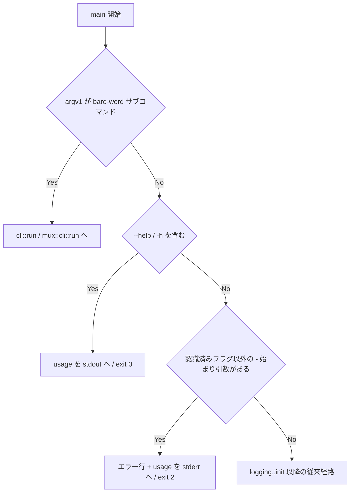

# 未知のフラグを usage エラーにする - 要件定義書

## 1. 概要

### 1.1 背景

`emterm` のコマンドライン引数ディスパッチは、`-` で始まる引数を
サブコマンド判定の対象にしていない。

- `src-tauri/src/main.rs:69-84` — dispatch は bare-word の
  `markdown` / `json` / `yaml` / `image` / `html` / `agent-status` / `mux`
  のみを見る
- `src-tauri/src/main.rs:112-146` — `run_gui` が見るフラグは
  `--viewer` / `--image-viewer` / `--data-viewer` / `--html-viewer` /
  `--settings` の 5 つ。それ以外は素通りして `window_host::run` に到達する

このため `emterm --version` / `emterm --help` / `emterm --typo` を打つと、
エラーにならずターミナル GUI が起動する。

### 1.2 目的

認識できない `-` 始まりの引数を受け取ったとき、usage を stderr に出力して
非ゼロ終了する。あわせてトップレベルの `--help` を提供する。

### 1.3 スコープ

対象:

- 認識できない `-` 始まりの引数の拒否（GUI ビルド / CLI-only ビルドの両方）
- トップレベル `--help` / `-h` の追加（usage を stdout に出して 0 終了）
- usage テキストの整備（ビルド種別ごとに認識するフラグ・サブコマンドを列挙）

スコープ外:

- `--version` フラグの実装（別 feature `version-flag` が担当。当該ブランチは
  main に未マージのため、本 feature の実装後・`version-flag` のマージ前は
  `emterm --version` も未知フラグとして usage + 終了コード 2 になる）
- サブコマンド（`markdown` 等）が自分で解釈する引数の検証
- `mux` サブコマンド配下の引数の検証

## 2. ビジネス要件

### 2.1 ビジネス目標

CLI としての基本的な作法を満たし、バイナリの疎通確認や誤入力で意図しない
ウィンドウが開かないようにする。

### 2.2 対象ユーザー

| ユーザータイプ | 説明 |
|----------------|------|
| eMterm 利用者 | 端末から `emterm` を直接起動する |
| スクリプト / CI | バイナリの存在確認・疎通確認に引数付きで起動する |

### 2.3 期待される効果

- 誤入力時にターミナルウィンドウが開いて残ることがなくなる
- `emterm --help` で利用可能なサブコマンド・フラグが分かる
- 非ゼロ終了により、スクリプトから誤りを検知できる

## 3. ユースケース

### 3.1 ユースケース一覧

| ID | ユースケース名 | アクター | 優先度 |
|----|----------------|----------|--------|
| UC01 | 未知のフラグでエラー終了する | 利用者 / スクリプト | 高 |
| UC02 | usage を確認する | 利用者 | 高 |
| UC03 | 既存のフラグ・サブコマンドが従来どおり動く | 利用者 / eMterm 自身 | 高 |

### 3.2 ユースケース詳細

#### UC01: 未知のフラグでエラー終了する

**アクター**: 利用者 / スクリプト

**事前条件**:
- `emterm` バイナリが存在する

**基本フロー**:
1. 利用者が `emterm --typo` を実行する
2. eMterm は `--typo` を認識できない `-` 始まりの引数と判定する
3. eMterm は「認識できない引数」の 1 行と usage を stderr に出力する
4. eMterm は終了コード 2 で終了する

**代替フロー**:
- 認識できない引数が複数ある場合も、最初の 1 つを報告して同様に終了する

**事後条件**:
- ウィンドウは一切開かない
- ログファイルへの初期化・書き込みは発生しない

#### UC02: usage を確認する

**アクター**: 利用者

**基本フロー**:
1. 利用者が `emterm --help`（または `-h`）を実行する
2. eMterm は usage を stdout に出力する
3. eMterm は終了コード 0 で終了する

**事後条件**:
- ウィンドウは一切開かない

#### UC03: 既存のフラグ・サブコマンドが従来どおり動く

**アクター**: 利用者 / eMterm 自身（子ウィンドウの自己起動）

**基本フロー**:
1. `emterm`（引数なし）で従来どおりターミナル GUI が起動する
2. `emterm --viewer <path>` / `--image-viewer` / `--data-viewer` /
   `--html-viewer` / `--settings` が従来どおり子ウィンドウを起動する
3. `emterm markdown <file>` などのサブコマンドが従来どおり動く
4. `emterm mux …` が従来どおり動く

## 4. 機能要件

### 4.1 機能一覧

| ID | 機能名 | 説明 | 優先度 |
|----|--------|------|--------|
| F01 | 未知フラグの拒否 | 認識できない `-` 始まりの引数で usage を stderr に出し、終了コード 2 で終了する | 高 |
| F02 | トップレベル `--help` | `--help` / `-h` で usage を stdout に出し、終了コード 0 で終了する | 高 |
| F03 | usage テキスト | ビルド種別（GUI / CLI-only）ごとに、認識するサブコマンドとフラグを列挙する | 高 |

### 4.2 機能詳細

#### F01: 未知フラグの拒否

**説明**: サブコマンドディスパッチで一致しなかった引数列に、認識済みフラグ
以外の `-` 始まりの引数が含まれる場合、usage を stderr に出力して終了
コード 2 で終了する。

**入力**:
- `argv[1..]`: コマンドライン引数列

**出力**:
- stderr: `emterm: unrecognized argument '<arg>'` の 1 行 + usage
- 終了コード: 2

**処理フロー**:

**ビジネスルール**:
- 判定はロギング初期化・GUI 初期化より前に行う
- 認識済みフラグの集合はビルド種別に依存する
  - GUI ビルド: `--viewer` / `--image-viewer` / `--data-viewer` /
    `--html-viewer` / `--settings`
  - CLI-only ビルド: なし
- 認識済みフラグの直後の引数（payload パス）は、`-` 始まりであっても
  当該フラグの値として扱い、未知フラグ判定の対象にしない
- `-` 単独・`--` 単独も認識できない引数として扱う

**エラーケース**:

| エラー | 条件 | 対応 |
|--------|------|------|
| 未知フラグ | 認識済みフラグ以外の `-` 始まり引数 | エラー行 + usage を stderr、exit 2 |

#### F02: トップレベル `--help`

**説明**: `--help` または `-h` が引数列に含まれる場合、usage を stdout に
出力して終了コード 0 で終了する。未知フラグ判定より優先する。

**入力**: `argv[1..]`

**出力**:
- stdout: usage
- 終了コード: 0

**ビジネスルール**:
- bare-word サブコマンドのディスパッチ（`emterm markdown --help` 等）を
  横取りしない。トップレベル判定はサブコマンドが一致しなかった場合のみ行う

#### F03: usage テキスト

**説明**: サブコマンドと、そのビルドが認識するフラグを列挙する。

**ビジネスルール**:
- CLI-only ビルドの usage は現行の文言
  （`src-tauri/src/main.rs:97-102`）を土台にする
- GUI ビルドの usage は、サブコマンドに加えて子ウィンドウ用フラグを含める
- 現行 CLI-only usage が案内している `emterm <subcommand> --help` は
  維持する

## 5. 非機能要件

### 5.1 パフォーマンス要件

引数判定は文字列比較のみで、起動時間に体感できる影響を与えない。

### 5.2 セキュリティ要件

- 入力検証: 引数文字列をそのままシェルに渡す処理は追加しない
- エラーメッセージに出力する引数文字列は、受け取った値をそのまま 1 行で
  出力する（整形・解釈をしない）

### 5.3 可用性要件

該当なし。

### 5.4 保守性要件

- 判定ロジックはライブラリクレート側に置き、`cargo test --lib` で
  ユニットテストできるようにする（バイナリターゲットはテストハーネスを
  持たない — `src-tauri/src/main.rs:20-23` のコメント参照）
- 認識済みフラグの集合は 1 箇所で定義し、`run_gui` の分岐と二重管理に
  ならないようにする

### 5.5 互換性要件

- GUI ビルド / CLI-only ビルド（`--no-default-features`）の双方で動作する
- Linux / Windows の双方で同じ判定になる
- eMterm 自身が子ウィンドウを自己起動する経路
  （`--viewer` / `--image-viewer` / `--data-viewer` / `--html-viewer` /
  `--settings`）を壊さない

## 6. UI/UX要件

可視 UI の変更は無い。出力は stdout / stderr のテキストのみ。

## 7. データ要件

該当なし。

## 8. 外部連携

該当なし。

## 9. 制約条件

### 9.1 技術的制約

- `src-tauri/src/main.rs` のバイナリターゲットはテストハーネスを持たない
- ロギングは `logging::init()` がグローバルロガーを設置するため、
  判定はその前に完了させる

### 9.2 ビジネス上の制約

該当なし。

## 10. 想定される課題とリスク

### 10.1 技術的課題

| 課題 | 影響度 | 対応策 |
|------|--------|--------|
| 未マージの `version-flag` ブランチが同じ dispatch 箇所を触る | 中 | 認識済みフラグ集合を 1 箇所に定義し、`--version` の追加が 1 行で済む形にする |
| 認識済みフラグの payload パスを未知フラグと誤判定する | 中 | フラグ直後の 1 引数を値として消費する走査にする |

## 11. 成功基準

### 11.1 受け入れ基準

- [ ] `emterm --typo` が usage を stderr に出して終了コード 2 で終わる
- [ ] `emterm --help` / `emterm -h` が usage を stdout に出して 0 で終わる
- [ ] `emterm`（引数なし）が従来どおり GUI を起動する
- [ ] `emterm --viewer <path>` 等の既存フラグが従来どおり動く
- [ ] `emterm markdown <file>` 等のサブコマンドが従来どおり動く
- [ ] CLI-only ビルドでも同じ判定になる

## 12. テストシナリオ

### 12.1 テスト観点

- [ ] 正常系: `--help` / `-h` で usage + exit 0
- [ ] 正常系: 引数なし・既存フラグ・既存サブコマンドが従来どおり
- [ ] 異常系: `--typo` / `--version`（未実装時）で usage + exit 2
- [ ] 境界値: `-` 単独 / `--` 単独 / 認識済みフラグの payload が `-` 始まり
- [ ] 境界値: 認識済みフラグと未知フラグが混在する引数列

## 13. 用語定義

| 用語 | 定義 |
|------|------|
| bare-word サブコマンド | `-` で始まらない第 1 引数によるディスパッチ（`markdown` 等） |
| 認識済みフラグ | `run_gui` が明示的に分岐している `-` 始まりの引数 |
| CLI-only ビルド | `cargo build --no-default-features` によるビルド |

## 14. 確認事項

### 14.1 確認済み事項

タスク記述に明記されていた事項:

- [x] 現象: `-` 始まりの引数はサブコマンド判定を通らず GUI が起動する
- [x] 該当箇所: `src-tauri/src/main.rs:69-84` と `:112-145`
- [x] 実害: 疎通確認の `--version` で意図しないウィンドウが開いて残る
- [x] 実害: CLI-only の usage が案内する `emterm <subcommand> --help` に
      対してトップレベル `--help` が存在しない
- [x] 期待する挙動: 認識できない `-` 始まりの引数は usage を stderr に
      出して非ゼロ終了する

batch モードのため、以下はエージェントが判断した（SPEC.md の Assumptions
に記録）:

- [x] トップレベル `--help` / `-h` を本 feature の対象に含める
- [x] `--version` は別 feature の担当のため実装しない
- [x] 非ゼロ終了コードは 2 とする
- [x] 認識済みフラグの payload 引数は未知フラグ判定の対象外にする

### 14.2 未確認・保留事項

なし。

## 15. 参考資料

- Notion タスク: [https://www.notion.so/3a83509ec8ee81e2a193ee062c99ab65](https://www.notion.so/3a83509ec8ee81e2a193ee062c99ab65)
- 既存 feature `version-flag`（`--version` 担当・main 未マージ）:
  `feature-docs/version-flag/REQUIREMENTS.md`
