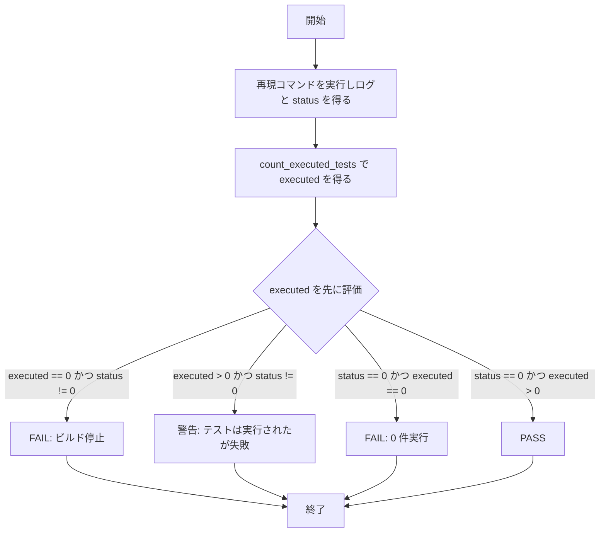

# verify-font-bootstrap-classification - 要件定義書

## 1. 概要

### 1.1 背景

`scripts/verify-font-bootstrap.sh` の un-fetched シナリオは、`cargo test` の終了ステータスだけで合否を決めている。そのため「ビルドがテスト実行前に停止した」場合と「ライブラリのテストスイートが実行され、一部のテストが失敗した」場合が区別されず、報告される判定が実際に起きたことを表さない。

また un-fetched シナリオの PASS 条件が、worktree-font-bootstrap の AC1 / FR6 が定める「実行されたテスト数が 0 でないこと」より厳しく、「すべてのテストが成功すること」まで要求している。

### 1.2 目的

- un-fetched シナリオが「ビルド停止」と「テストは実行されたが失敗」を区別して報告する。
- un-fetched シナリオの PASS 条件を worktree-font-bootstrap AC1 / FR6 と一致させる。
- verify-font-bootstrap の CI ジョブが、フォントブートストラップと無関係な理由（本プロジェクトの既知の並列実行依存のテスト揺れ）で red にならないようにする。
- 新しい分類の挙動を自動リグレッションテストで固定し、記録を `test-docs/` 配下に残す。

### 1.3 スコープ

対象は `scenario_unfetched` の判定分類、CI ジョブの既存配線の維持、および新規リグレッションテストに限られる。

対象外（変更しない）:

- fetch-failure シナリオ、already-fetched シナリオ
- クリーンアップ trap
- `count_executed_tests` の計数ルール
- `feature-docs/worktree-font-bootstrap/SPEC.md`
- `.github/workflows/release.yml`

## 2. ビジネス要件

### 2.1 ビジネス目標

- `scripts/verify-font-bootstrap.sh` の un-fetched シナリオが、「ビルドがテスト実行前に停止した」ことと「ライブラリのテストスイートが実行され一部のテストが失敗した」ことを区別し、報告される判定が実際に起きたことを述べる。
- un-fetched シナリオの PASS 条件が worktree-font-bootstrap AC1 / FR6 と厳密に一致する。すなわち「実行されたテスト数が 0 でないこと」であり、それに加えて「すべてのテストが成功すること」を要求しない。
- verify-font-bootstrap の CI ジョブが、フォントブートストラップと無関係な理由、とりわけ本プロジェクトの既知の並列実行依存のテスト揺れによって red になることをやめる。
- 新しい分類の挙動が自動リグレッションテストで固定され、`test-docs/` 配下に記録される。

### 2.2 対象ユーザー

| ユーザータイプ | 説明 |
|----------------|------|
| 本リポジトリの開発者 | CI の verify-font-bootstrap ジョブの結果を読み、失敗の原因を判断する |

### 2.3 期待される効果

- 判定メッセージから、ビルド停止とテスト失敗のどちらが起きたか判別できる。
- 既知のテスト揺れが verify-font-bootstrap ジョブを red にしない。

## 3. ユースケース

### 3.1 ユースケース一覧

| ID | ユースケース名 | アクター | 優先度 |
|----|----------------|----------|--------|
| UC01 | un-fetched シナリオの判定を読む | 本リポジトリの開発者 | 高 |

### 3.2 ユースケース詳細

#### UC01: un-fetched シナリオの判定を読む

**アクター**: 本リポジトリの開発者

**事前条件**:
- CI の verify-font-bootstrap ジョブが `bash scripts/verify-font-bootstrap.sh` を実行し終えている。

**基本フロー**:
1. un-fetched シナリオが再現コマンドを実行し、ログと終了ステータスを得る。
2. スクリプトがログから実行されたテスト数を数える。
3. スクリプトは終了ステータスより先に実行テスト数を評価し、報告する分岐を選ぶ。
4. 開発者が出力された判定行を読み、何が起きたかを判断する。

**代替フロー**:
- 実行テスト数が 0 かつ終了ステータスが 0 以外のとき、ビルド停止として FAIL を報告する。
- 実行テスト数が 1 以上かつ終了ステータスが 0 以外のとき、警告を出し FAIL は報告しない。
- 終了ステータスが 0 かつ実行テスト数が 0 のとき、従来どおり FAIL を報告する。

**事後条件**:
- 判定行に、観測された終了ステータスと、ログから導出された実行テスト数が示されている。

## 4. 機能要件

### 4.1 機能一覧

| ID | 機能名 | 説明 | 優先度 |
|----|--------|------|--------|
| FR1 | 実行テスト数を先に評価する | 終了ステータスより先に実行テスト数を評価する | 高 |
| FR2 | ビルド停止の分類 | 実行数 0 かつ非ゼロステータスを FAIL として報告する | 高 |
| FR3 | テスト失敗の分類 | 実行数 1 以上かつ非ゼロステータスを警告として報告する | 高 |
| FR4 | 実行数 0 かつ成功は従来どおり失敗 | ステータス 0 かつ実行数 0 は FAIL のまま | 高 |
| FR5 | メッセージにテスト数をハードコードしない | 観測していないテスト数を判定メッセージに書かない | 高 |
| FR6 | 警告付きシナリオの集計上の扱い | 警告付き un-fetched シナリオは RESULTS_PASS に数える | 高 |
| FR7 | 再現コマンドのリテラル維持 | un-fetched シナリオの `cargo test` 呼び出しを変更しない | 高 |
| FR8 | CI 呼び出し箇所の不変 | verify-font-bootstrap ジョブの配線を変更しない | 高 |
| FR9 | 自動リグレッションテスト | 両分岐を自動テストで固定し記録を残す | 高 |
| FR10 | スコープ境界 | 変更範囲を限定する | 高 |

### 4.2 機能詳細

#### FR1: 実行テスト数を先に評価する

**説明**: `scenario_unfetched` は終了ステータスより先に実行されたテスト数を評価する。報告する分岐を選ぶのは終了ステータスではなく実行テスト数である。

**入力**:
- 実行テスト数: 整数 - `count_executed_tests` がキャプチャしたログから導出した値
- 終了ステータス: 整数 - 再現コマンドの終了ステータス

**出力**:
- 判定分岐: ビルド停止 / テスト失敗 / 実行数 0 かつ成功 のいずれか

**処理フロー**:

**ビジネスルール**:
- 分岐の選択は実行テスト数で行う。

#### FR2: ビルド停止の分類

**説明**: 実行テスト数が 0 かつ終了ステータスが 0 以外のとき、シナリオはビルド停止を名指しし、観測された終了ステータスを示す文言で FAIL を報告する。

**エラーケース**:

| エラー | 条件 | 対応 |
|--------|------|------|
| ビルド停止 | executed == 0 かつ status != 0 | ビルド停止と観測ステータスを示して FAIL を報告する |

#### FR3: テスト失敗の分類

**説明**: 実行テスト数が 1 以上かつ終了ステータスが 0 以外のとき、シナリオは AC1 の「実行テスト数が 0 でない」条件を満たすものとして扱い、FAIL を報告しない。`verify_font_bootstrap.` 接頭辞を持つ独立した行に警告を出力する。警告の文言は FR2 の文言と区別でき、終了ステータスと観測された実行テスト数の両方を示す。

**出力**:
- 警告行: 文字列 - `verify_font_bootstrap.` 接頭辞を持つ独立行

**ビジネスルール**:
- FR2 の文言と重複しない。
- 終了ステータスと実行テスト数の両方を含む。

#### FR4: 実行数 0 かつ成功は従来どおり失敗

**説明**: 終了ステータスが 0 かつ実行テスト数が 0 のとき、シナリオは従来どおり FAIL（"command exited 0 but 0 tests executed"）を報告する。挙動は変更しない。

#### FR5: メッセージにテスト数をハードコードしない

**説明**: いかなる判定メッセージも、観測していないテスト数を述べない。ビルド停止メッセージ内の既存のリテラル "0 tests executed" は、`count_executed_tests` が返した値に置き換える。

#### FR6: 警告付きシナリオの集計上の扱い

**説明**: 警告付きの un-fetched シナリオは RESULTS_PASS に数える。他の 2 シナリオが PASS する場合、スクリプトの集計終了ステータスは 0 になる。

#### FR7: 再現コマンドのリテラル維持

**説明**: un-fetched シナリオは、worktree-font-bootstrap の FR6 / AC1 が固定するリテラルな再現コマンド `CARGO_TARGET_DIR=src-tauri/target cargo test --manifest-path src-tauri/Cargo.toml --lib` を、cargo フラグもテストハーネスのフラグも追加せずに呼び出し続ける。とくに `-- --test-threads=1` は追加しない。テスト揺れの吸収はコマンドの変更ではなく FR3 の分類によって達成する。

#### FR8: CI 呼び出し箇所の不変

**説明**: `.github/workflows/ci.yml` の verify-font-bootstrap ジョブは、引数なしの `bash scripts/verify-font-bootstrap.sh` を呼び出し続ける。`actions/cache` ステップ、`fetch-fonts.sh` への参照、`EMTERM_SKIP_FONT_FETCH` はいずれも追加しない。

#### FR9: 自動リグレッションテスト

**説明**: 自動テストが両方の分類分岐（実行数 0 かつ非ゼロステータス、実行数 1 以上かつ非ゼロステータス）を固定する。その記録は `test-docs/verify-font-bootstrap-classification/` 配下に置く。

#### FR10: スコープ境界

**説明**: 変更は `scenario_unfetched` の分類、CI ジョブの配線の維持、新規リグレッションテストに限る。fetch-failure シナリオ、already-fetched シナリオ、クリーンアップ trap、`count_executed_tests` の計数ルール、`feature-docs/worktree-font-bootstrap/SPEC.md`、`.github/workflows/release.yml` は変更しない。

## 5. 非機能要件

### 5.1 パフォーマンス要件

該当なし。

### 5.2 セキュリティ要件

- NFR1: リグレッションテストは既存の `bun test` スイート内で、ネットワークアクセスなし、実際の cargo ビルドなしで動作する。bun の CI ジョブは Rust ツールチェーンをインストールしない。

### 5.3 可用性要件

- NFR2: スクリプトは `set -e` なしの `set -uo pipefail` を維持する。あるシナリオの失敗が他のシナリオの実行と報告を妨げない。
- NFR3: クリーンアップ保証を維持する。成功時も失敗時も、シナリオ用 worktree、古い `.git/worktrees` エントリ、スクラッチディレクトリのいずれも実行後に残らない。

### 5.4 保守性要件

- NFR4: `ci-workflows.test.ts` の既存のアサーションはすべて通り続ける。固定された `release.yml` の sha256 と CI の run 文字列の完全一致を含む。
- NFR5: 警告付きで PASS した実行は、CI ログ上でクリーンな PASS と見分けられる。実際に失敗しているテストが黙って正常化されない。

### 5.5 互換性要件

該当なし。

## 6. UI/UX要件

該当なし。本フィーチャーは UI 表面を持たない。

## 7. データ要件

該当なし。

## 8. 外部連携

該当なし。

## 9. 制約条件

### 9.1 技術的制約

- un-fetched シナリオの `cargo test` 呼び出しにフラグを追加できない（FR7）。
- リグレッションテストはネットワークにも Rust ツールチェーンにも依存できない（NFR1）。
- スクリプトは `set -e` を使わない（NFR2）。

### 9.2 ビジネス上の制約

該当なし。

### 9.3 スケジュール制約

該当なし。

### 9.4 宣言された変更集合

このフィーチャー固有のパスは手動で列挙せず、create-plan で `workflow.yaml` の各タスクの `files` から導出する（`references/phases/create-plan-phase.md`）。

**デフォルトメンバー**（SPEC作成者が明示的に除外しない限り、常に宣言に含まれる）:
- `feature-docs/verify-font-bootstrap-classification/**`
- `test-docs/verify-font-bootstrap-classification/**`

`feature-docs/{feature}/**` に含まれるもの: `REQUIREMENTS.md`、`SPEC.md`、`IMPLEMENTATION.md`、`workflow.yaml`、`phase-state/`、`tasks/`、`reviews/roundN.yaml`、`VERIFICATION.md`、`retrospect.yaml`、およびデザインステップが生成するデザイン成果物。生成主体は各フェーズドキュメントおよび `references/phase-state.md` を参照（引用のみ、ルールは再掲しない）。

`test-docs/{feature}/**` に含まれるもの: `{T}.tests.yaml`（パス形式: `test-docs/{feature}/{T}.tests.yaml`）。生成主体は `implement-phase.md` を参照（引用のみ、ルールは再掲しない）。

**意味論**:
- デフォルトのメンバーは、SPEC作成者が明示的に除外しない限り宣言に含まれる。除外は意図的な絞り込みであり、記載漏れによる省略ではない。
- この宣言はスーパーセット（superset）の主張であり、実際の変更集合は宣言に含まれる（CONTAINED IN）必要がある。実際には生成されないパスが宣言されていても違反にはならない。implementタスクを1つも生成しないフィーチャーは `test-docs/{feature}/` ディレクトリを生成しないが、宣言された `test-docs/{feature}/**` は依然として正しい。

## 10. 想定される課題とリスク

### 10.1 技術的課題

| 課題 | 影響度 | 対応策 |
|------|--------|--------|
| 実際に失敗しているテストが警告として黙って正常化される | 中 | NFR5: 警告付き PASS を CI ログ上でクリーンな PASS と見分けられるようにする |

### 10.2 ビジネスリスク

該当なし。

## 11. 成功基準

### 11.1 受け入れ基準

- [ ] AC1: cargo がテストを実行し、少なくとも 1 件が失敗した実行（status != 0、executed > 0）において、un-fetched シナリオはテスト失敗を名指しする文言の警告を報告し、"the build script stopped the build" を報告しない。
- [ ] AC2: ビルドがテスト実行前に停止した実行（status != 0、executed == 0）において、un-fetched シナリオはビルド停止と観測された終了ステータスを名指しする文言で FAIL を報告する。
- [ ] AC3: いかなる判定メッセージもハードコードされたテスト数を含まない。表示される数はキャプチャしたログから導出した値である。
- [ ] AC4: AC1 の状況で他の 2 シナリオが PASS する場合、スクリプトのサマリは全シナリオを passed として報告し、スクリプトは 0 で終了する。
- [ ] AC5: status == 0 かつ executed == 0 の場合、シナリオは依然として FAIL を報告する。
- [ ] AC6: un-fetched シナリオの cargo 呼び出しはリテラルな再現コマンドとバイト単位で一致し、追加フラグを持たない。CI ステップのコマンド文字列は変更されない。
- [ ] AC7: AC1、AC2、AC3、AC5 を覆う自動リグレッションテストが存在し、既定の `bun test` スイートに含まれ、その記録が `test-docs/verify-font-bootstrap-classification/` 配下に存在する。

### 11.2 KPI

該当なし。

## 12. テストシナリオ

### 12.1 テスト観点

- [ ] 正常系: TS3 — `test result:` 行がないログと終了ステータス 0 を与え、既存の FAIL 文言 "command exited 0 but 0 tests executed" を得る（FR4）。
- [ ] 異常系: TS1 — 失敗件数が 0 でない `test result:` 行を含む合成 cargo ログと終了ステータス 101 を分類ロジックに与え、警告文言、メッセージ中の観測実行数、ビルド停止文言が出ないことを確認する（FR1、FR3、FR5）。
- [ ] 異常系: TS2 — `test result:` 行がない合成ログと終了ステータス 101 を与え、終了ステータス 101 を名指しするビルド停止 FAIL 文言と、ハードコードではなくログから導出された実行数 0 を確認する（FR1、FR2、FR5）。
- [ ] 境界値: TS4 — TS1 の状況で、シナリオが RESULTS_PASS に数えられ、他のシナリオが PASS するとき集計終了ステータスが 0 であることを確認する（FR6）。
- [ ] 境界値: TS5 — スクリプトの un-fetched の cargo 呼び出しに `--test-threads` が含まれず、リテラルな再現コマンドと一致すること、および `ci-workflows.test.ts` の CI ステップ文字列に関する既存アサーションが通り続けることを確認する（FR7、FR8）。
- [ ] セキュリティ: 該当なし。
- [ ] パフォーマンス: 該当なし。

## 13. 用語定義

| 用語 | 定義 |
|------|------|
| un-fetched シナリオ | `scripts/verify-font-bootstrap.sh` の `scenario_unfetched`。3 シナリオのうち唯一 `cargo test` を実行する |
| 実行テスト数 | `count_executed_tests` がキャプチャしたログから導出したテスト実行件数 |
| リテラルな再現コマンド | `CARGO_TARGET_DIR=src-tauri/target cargo test --manifest-path src-tauri/Cargo.toml --lib` |
| RESULTS_PASS | スクリプトが PASS したシナリオを数える集計 |

## 14. 確認事項

### 14.1 確認済み事項

- [x] `-- --test-threads=1` を追加するか、リテラルな再現コマンドを維持するか: リテラルな再現コマンドを維持する。`-- --test-threads=1` は追加しない。テスト揺れの吸収は分類の変更（executed > 0 かつ非ゼロステータス = 警告 + PASS）で行い、コマンドの変更では行わない。
- [x] 先行 SPEC を修正するか: `feature-docs/worktree-font-bootstrap/SPEC.md` は編集しない。AC1 / FR6 の解釈は本フィーチャー自身の SPEC とスクリプトのコメントに記録する。
- [x] デザインステップの扱い: スキップする。変更は bash スクリプトの判定分類、CI ジョブ、bun リグレッションテストに限られ、UI・ビジュアル・デザイントークンの表面がなく、デザインシステム成果物の読み書きもない。

### 14.2 未確認・保留事項

なし。すべての要件が resolved である。

## 15. 参考資料

- `scripts/verify-font-bootstrap.sh`: 本フィーチャーが変更する検証スクリプト
- `.github/workflows/ci.yml`: verify-font-bootstrap ジョブの呼び出し箇所
- `feature-docs/worktree-font-bootstrap/SPEC.md`: AC1 / FR6 の出典（本フィーチャーでは編集しない）
- `plugins/emterm/hooks/scripts/notify-status.test.ts`: `Bun.spawnSync` によるサブプロセス駆動テストの先例
