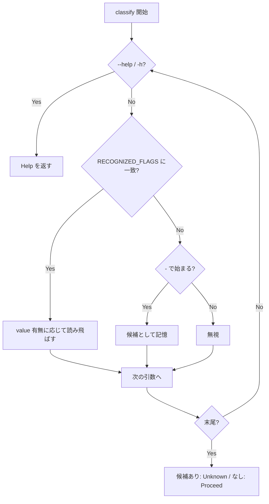

# --version フラグの分類登録と usage 掲載 - 要件定義書

## 1. 概要

### 1.1 背景

`--version` を追加した version-flag（PR #1）と、未知フラグを usage エラーにする
unknown-flag-usage（PR #2）が、それぞれ単体では正しいまま main で合流した結果、
`--version` が新しいフラグ分類の枠組み（`RECOGNIZED_FLAGS`）に登録されないまま
残った。合流点だけで生まれた齟齬で、どちらの PR のレビューでも検出されていない。

実挙動は 2 つ:

1. `emterm --help` の Options に `--version` が出ない。ユーザーがフラグの存在を
   知る手段がない
2. `classify()` は `RECOGNIZED_FLAGS` を参照するが `--version` が無いため、
   第 1 引数以外の位置にある `--version` は Unknown 判定になり、
   `emterm: unrecognized argument '--version'` を stderr に出して exit 2 する
   （例: `emterm --settings --version`）

`main.rs` の早期処理は `args[1]` のみを見る仕様なので、`emterm --version` そのものは
正常に動く（統合テスト 5 件も通っている）。壊れているのは help 表示と、
第 1 引数以外の位置での分類。

### 1.2 目的

`emterm --help` の Options に `--version` を掲載し、`--version` が引数のどの位置に
あっても unrecognized 扱いにならないようにする。

### 1.3 スコープ

対象:

- `src-tauri/src/arg_dispatch.rs` の `RECOGNIZED_FLAGS`（gui / CLI-only 両方）
- `src-tauri/src/arg_dispatch.rs` の `usage_text()`（gui / CLI-only 両方）
- 上記変更に伴う `run_gui()`（`src-tauri/src/main.rs`）のディスパッチ安全性

対象外:

- `--version` の出力フォーマットの変更
- `tabs::tests` の既知 flaky 7 件（本件より前から落ちている timing-sensitive な
  失敗。本件と無関係）

## 2. ビジネス要件

### 2.1 ビジネス目標

CLI としての一貫性を回復する。フラグが help に載り、位置に依らず受理される状態を
`RECOGNIZED_FLAGS` の SSOT 構造を壊さずに達成する。

### 2.2 対象ユーザー

| ユーザータイプ | 説明 |
|----------------|------|
| eMterm 利用者 | `emterm --help` でフラグ一覧を確認し、`--version` でバージョンを調べる |
| パッケージャ / スクリプト作成者 | インストール検証で `emterm --version` を他フラグと併用しうる |

### 2.3 期待される効果

- `--version` の存在が help から発見できる
- 引数の並び順に依存した予期しない exit 2 が消える
- 将来「分類は通すがウィンドウは開かない」フラグを追加する際の型が定まる

## 3. ユースケース

### 3.1 ユースケース一覧

| ID | ユースケース名 | アクター | 優先度 |
|----|----------------|----------|--------|
| UC01 | help でフラグ一覧を確認する | eMterm 利用者 | 高 |
| UC02 | 他フラグと併記した `--version` が拒否されない | eMterm 利用者 | 高 |
| UC03 | 単体の `--version` でバージョンを取得する | パッケージャ / スクリプト | 高 |

### 3.2 ユースケース詳細

#### UC01: help でフラグ一覧を確認する

**アクター**: eMterm 利用者

**事前条件**:
- emterm がインストールされている（gui / CLI-only いずれのビルドでも）

**基本フロー**:
1. `emterm --help` を実行する
2. usage テキストが stdout に出力される
3. Options セクションに `--version` の行が含まれる
4. exit 0 で終了する

**事後条件**:
- 利用者が `--version` の存在を知れる

#### UC02: 他フラグと併記した `--version` が拒否されない

**アクター**: eMterm 利用者

**事前条件**:
- gui ビルドの emterm

**基本フロー**:
1. `emterm --settings --version` を実行する
2. `classify()` が `--version` を recognized として扱う
3. `unrecognized argument` は出力されず、exit 2 にもならない

**代替フロー**:
- CLI-only ビルドでも `--version` は recognized として扱われる

**事後条件**:
- 引数位置に依存した誤検出が起きない

#### UC03: 単体の `--version` でバージョンを取得する

**アクター**: パッケージャ / スクリプト

**基本フロー**:
1. `emterm --version` を実行する
2. crate version が stdout に 1 行出力される
3. exit 0 で終了する

**事後条件**:
- `logging::init()` は呼ばれず、アプリのログディレクトリは作られない

## 4. 機能要件

### 4.1 機能一覧

| ID | 機能名 | 説明 | 優先度 |
|----|--------|------|--------|
| F01 | `--version` の分類登録 | `RECOGNIZED_FLAGS`（gui / CLI-only 両方）に `--version` を追加する | 高 |
| F02 | 非ディスパッチフラグの表現 | 「分類は通すがウィンドウは開かない」フラグを型で表現し、`run_gui()` が誤ってディスパッチしないようにする | 高 |
| F03 | usage への掲載 | `usage_text()`（gui / CLI-only 両方）の Options に `--version` の行を追加する | 高 |

### 4.2 機能詳細

#### F01: `--version` の分類登録

**説明**: `classify()` が参照する `RECOGNIZED_FLAGS` に `--version`
（`takes_value: false`）を追加する。gui ビルドと CLI-only ビルドの双方に追加する
（`--version` は feature gate の外で処理されるため、両ビルドで受理される必要がある）。

**入力**:
- `args: &[String]` — プログラム名を除いた引数列

**出力**:
- `Classification` — `--version` を含むだけでは `Unknown` にならない

**処理フロー**:

**ビジネスルール**:
- `RECOGNIZED_FLAGS` は `classify()` が受け付けるフラグと `run_gui()` が
  ディスパッチするフラグの単一 SSOT である。この構造を保つ

#### F02: 非ディスパッチフラグの表現

**説明**: `RecognizedFlag` の `target` を「ディスパッチ先を持たない」ことを表せる形に
変更し、`run_gui()` はディスパッチ先を持つエントリのみを対象にする。`--version` は
子ウィンドウを開かないフラグとしてこの形で登録する。

**エラーケース**:

| エラー | 条件 | 対応 |
|--------|------|------|
| `--version` が誤ってウィンドウを開く | `run_gui()` が `target` の有無を見ずにループする | `target` を持たないエントリは `run_gui()` のループでスキップする |

#### F03: usage への掲載

**説明**: `usage_text()` の Options セクションに `--version` の説明行を追加する。
gui ビルドと CLI-only ビルドの双方に追加する。既存の
`Run \`emterm <subcommand> --help\` for details.` の案内行は維持する。

**出力**:
- `String` — Options に `--version` の行を含む usage テキスト

## 5. 非機能要件

### 5.1 パフォーマンス要件

該当なし（起動時の定数リスト走査のみ）。

### 5.2 セキュリティ要件

該当なし（引数の分類のみで、外部入力の永続化・実行はない）。

### 5.3 可用性要件

該当なし。

### 5.4 保守性要件

- `RECOGNIZED_FLAGS` の SSOT 構造を維持し、`classify()` と `run_gui()` が
  参照するフラグ集合が二重定義にならないこと
- `--version` が `logging::init()` より前に処理される性質を壊さないこと

### 5.5 互換性要件

- gui ビルド（デフォルト）と CLI-only ビルド（`--no-default-features`）の双方で
  ビルドが通り、テストが通ること
- 既存の統合テスト `cli_subcommands` の `--version` 系 5 件が通り続けること
- 既存の `arg_dispatch` ユニットテストが通ること（表の内容を固定している
  `recognized_flag_table_matches_the_five_gui_child_window_flags` /
  `recognized_flag_table_is_empty_without_gui` は仕様変更に合わせて更新する）

## 6. UI/UX要件

該当なし（CLI の stdout / stderr 出力のみ。GUI 画面の変更はない）。

## 7. データ要件

該当なし（永続データなし）。

## 8. 外部連携

該当なし。

## 9. 制約条件

### 9.1 技術的制約

- `RECOGNIZED_FLAGS` は「`classify()` が受け付けるフラグ」と「`run_gui()` が
  ディスパッチするフラグ」の単一 SSOT として設計されている
  （`src-tauri/src/arg_dispatch.rs:14` のコメント、unknown-flag-usage の D2 / NFR3）。
  `--version` は子ウィンドウを開くフラグではないので、`GuiTarget` を持つ既存
  エントリと同じ形で足すと `run_gui()` のループが誤ってディスパッチしうる
- `--version` は `logging::init()` より前に処理される必要がある
  （version-flag の D1。`version_flag_does_not_create_log_directory` テストが担保）
- `RecognizedFlag.target` は `#[cfg(feature = "gui")]` で gate されており、
  CLI-only ビルドではフィールドごと存在しない

### 9.2 ビジネス上の制約

なし。

### 9.3 スケジュール制約

なし。

## 10. 想定される課題とリスク

### 10.1 技術的課題

| 課題 | 影響度 | 対応策 |
|------|--------|--------|
| `target` の型変更が `run_gui()` の match を壊す | 中 | `Option<GuiTarget>` 化し、`None` は `run_gui()` のループでスキップする |
| 表の内容を固定している既存ユニットテストが落ちる | 低 | 新しい表の内容に合わせてテストを更新する（削除・弱体化はしない） |
| CLI-only ビルドで `target` フィールドが無く構造体リテラルが分岐する | 低 | 既存の `#[cfg]` gate の書き方を踏襲する |

### 10.2 ビジネスリスク

なし。

## 11. 成功基準

### 11.1 受け入れ基準

- [ ] `emterm --help` の Options に `--version` の行が出る（gui / CLI-only の両ビルド）
- [ ] `emterm --settings --version` のように第 1 引数以外に `--version` があっても
      `unrecognized argument` にならない
- [ ] `emterm --version` が従来どおり crate version を stdout に出して exit 0 する
- [ ] 既存の統合テスト `cli_subcommands` の `--version` 系 5 件が通り続ける
- [ ] `arg_dispatch` の既存ユニットテストが通る
- [ ] `run_gui()` が `--version` を子ウィンドウフラグとして誤ディスパッチしない

### 11.2 KPI

該当なし。

## 12. テストシナリオ

### 12.1 テスト観点

- [ ] 正常系: `classify(["--version"])` が `Proceed` を返す
- [ ] 正常系: `classify(["--settings", "--version"])` が `Proceed` を返す（gui）
- [ ] 正常系: `classify(["--version"])` が CLI-only ビルドでも `Proceed` を返す
- [ ] 正常系: `usage_text()` が `--version` の行を含む（gui / CLI-only 両方）
- [ ] 正常系: `emterm --version` が crate version を stdout に出して exit 0
- [ ] 境界値: `--version` の直後の引数が値として消費されない（`takes_value: false`）
- [ ] 異常系: `--typo` は従来どおり `Unknown("--typo")`
- [ ] 異常系: `--help` は `--version` と併記されても `Help` が勝つ

## 13. 用語定義

| 用語 | 定義 |
|------|------|
| `RECOGNIZED_FLAGS` | このビルドが受理するトップレベルフラグの表。`classify()` と `run_gui()` の SSOT |
| `classify()` | プログラム名を除く引数列を `Help` / `Unknown` / `Proceed` に分類する純関数 |
| 非ディスパッチフラグ | 分類上は recognized だが、子ウィンドウを開かないフラグ |
| gui ビルド | デフォルト feature `gui` 有効のビルド |
| CLI-only ビルド | `--no-default-features` のビルド |

## 14. 確認事項

### 14.1 確認済み事項

batch モードのため、ユーザーとの対話は行っていない。タスク記述（Notion）と
既存コードから確定した事項を以下に記録する。

- [x] 修正対象: `src-tauri/src/arg_dispatch.rs` の `RECOGNIZED_FLAGS` / `usage_text()`
      （gui / CLI-only 両方）
- [x] `--version` は値を取らないフラグ（`takes_value: false`）
- [x] `--version` の出力フォーマットは変更しない（タスクのスコープ外指定）
- [x] `tabs::tests` の既知 flaky 7 件は本件と無関係（タスクのスコープ外指定）

### 14.2 未確認・保留事項

以下は batch モードで自律決定した。SPEC.md の Assumptions に記録している。

- [ ] 第 1 引数以外の位置にある `--version` の「動作」: バージョン出力まで行うか、
      分類を通すだけにするか。受け入れ条件は「unrecognized にならないこと」しか
      要求していないため、`main.rs` の `args[1]` のみを見る早期処理は変更せず、
      分類上 recognized にするだけとする決定を置いた
- [ ] 非ディスパッチフラグの表現方法: `target: Option<GuiTarget>` 化を第一候補と
      したが、SSOT を保てる別表現でも受け入れ条件は満たせる。実装時の裁量とする

## 15. 参考資料

- Notion タスク: https://app.notion.com/p/3aa3509ec8ee817fb246d1ea56e3c57a
- 先行 feature: `feature-docs/version-flag/`（`--version` の追加、D1）
- 先行 feature: `feature-docs/unknown-flag-usage/`（フラグ分類の枠組み、D2 / NFR3）
