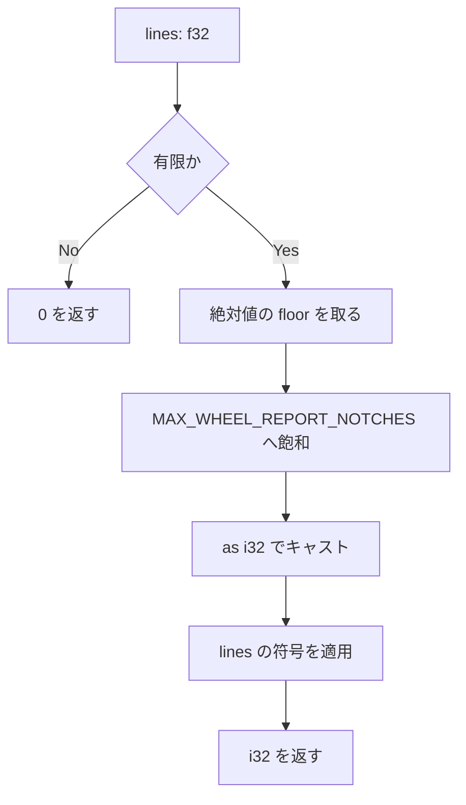

# wheel-report-notch-clamp - 要件定義書

## 1. 概要

### 1.1 背景

PR #69 で導入されたマウスレポート経路には、ホイールレポートの複製回数に上限が無い。
そのため 1 回のホイールイベントで数ギガバイト規模のアロケーションを要求し、PTY を
レポートバイトで溢れさせることができる。

この欠陥はレビュー round 3 のセキュリティ所見 7063d53b08e160d8 として記録され、
round 2 の ef02afd34f1da70f から未解決のまま持ち越されている。3 名のレビュアーが
独立に同じ指摘を報告したが、修正が 2 ファイルにまたがるため、単一ファイルのみを
扱う自動修正経路では対応できなかった。

### 1.2 目的

- 1 回のホイールイベントが要求できるアロケーションと PTY 書き込み量を、呼び出し側の
  規律ではなく構造として上限づける。
- 慣性スクロールや合成されたピクセルバーストが winit イベントループを停止させない
  ようにする。
- 持ち越されているセキュリティ所見 7063d53b08e160d8 を解消する。

### 1.3 スコープ

**対象**

- `src-tauri/src/window_host/input_translate.rs`: レポート経路専用の上限定数の追加と、
  `wheel_report_notches`（input_translate.rs:452）のクランプ。
- `src-tauri/src/window_host/pointer_routing.rs`: 複製処理（pointer_routing.rs:917-921）の
  純粋関数への切り出しと、呼び出し側（pointer_routing.rs:913-924）の付け替え。
- `src-tauri/src/window_host/tests.rs`: 変換関数と複製ヘルパーのユニットテスト追加。

**対象外**

- alternate scroll 経路（`MAX_ALT_SCROLL_NOTCHES`、`alternate_scroll_wheel_bytes`、
  input_translate.rs:332 および 361-384）。既に同等の上限を持つため、そのまま据え置く。
- UI 表現。本タスクは UI 面を持たず、レンダリング結果・Material Design 3 トークン・
  egui ウィジェット・子 WebView の CSS のいずれにも変更を与えない。外部から観測できる
  効果は PTY バイト数の上限のみである。

## 2. ビジネス要件

### 2.1 ビジネス目標

- 1 回のホイールイベントで数ギガバイト規模のアロケーションを要求し PTY を溢れさせられる、
  上限の無いホイールレポート複製を取り除き、PR #69 で導入されたマウスレポート経路の
  ローカル DoS 耐性を回復する。
- 1 回のホイールイベントが子プロセスへ書き込めるバイト数の最悪値を、呼び出し側の規律ではなく
  構造として上限づけ、慣性スクロールや合成されたピクセルバーストが winit イベントループを
  停止させられないようにする。
- レビュー round 3 で持ち越し（deferred）となったセキュリティ所見 7063d53b08e160d8
  （round 2 の ef02afd34f1da70f から未解決で継続）を解消する。この所見は 3 名の
  レビュアーが独立に報告したもので、修正が 2 ファイルにまたがるため単一ファイルの
  自動修正経路では対応できなかった。

### 2.2 対象ユーザー

| ユーザータイプ | 説明 |
|----------------|------|
| eMterm 利用者（マウストラッキング対応 TUI を実行中） | ホイール入力がレポート経路を通る利用者。到達条件はホスト上でのホイール入力であり、リモートやクロスユーザーの攻撃経路は本件の対象ではない |
| PTY 上の子プロセス | ホイールレポートバイトの書き込み先。上限の無い複製によって溢れさせられる側 |

### 2.3 期待される効果

- 1 回のホイールイベントが要求しうるアロケーションが、現状の約 21 GB から
  「シングルノッチの SGR ペイロード長 × 100」（キロバイト規模）に抑えられる。
- 1 回のホイールイベントの PTY 書き込み量が 100 ノッチ相当以下に抑えられる。
- 通常のホイール入力（100 ノッチをはるかに下回る大きさ）では PTY 出力がバイト単位で
  現行実装と一致し、体感の変化が生じない。

## 3. ユースケース

### 3.1 ユースケース一覧

| ID | ユースケース名 | アクター | 優先度 |
|----|----------------|----------|--------|
| UC01 | 通常のホイールスクロールのレポート送出 | eMterm 利用者 | 高 |
| UC02 | 病的・合成された巨大デルタのクランプ | eMterm 利用者 | 高 |
| UC03 | ノッチ数ゼロのホイールイベント | eMterm 利用者 | 中 |

### 3.2 ユースケース詳細

#### UC01: 通常のホイールスクロールのレポート送出

**アクター**: eMterm 利用者

**事前条件**:
- マウストラッキング対応の TUI が動作しており、ホイール入力がレポート経路に入る。

**基本フロー**:
1. ホイール入力から f32 のライン差分が得られる。
2. `wheel_report_notches` が符号付きノッチ数へ変換する。大きさが上限未満のため値は変化しない。
3. シングルノッチのレポートバイトがノッチ数ぶん複製される。
4. `tab.write_input` が複製済みバッファ全体を 1 回で書き込む。

**代替フロー**:
- 大きさが 1.0 未満の場合はゼロ方向へ切り捨てられて 0 となり、UC03 に合流する。

**事後条件**:
- PTY 出力が現行実装とバイト単位で一致している。

#### UC02: 病的・合成された巨大デルタのクランプ

**アクター**: eMterm 利用者

**事前条件**:
- 慣性スクロールや合成されたピクセルバーストにより、極端に大きい f32 差分が渡される。

**基本フロー**:
1. `wheel_report_notches` が `as i32` キャストの前に大きさを `MAX_WHEEL_REPORT_NOTCHES`
   へ飽和させる。
2. 返り値の絶対値は `MAX_WHEEL_REPORT_NOTCHES` 以下になる。
3. 複製ヘルパーが要求複製回数を同じ定数で再度クランプし、クランプ後の値を
   `Vec::with_capacity` の引数と複製ループの上限の双方に用いる。
4. `tab.write_input` が上限内のバッファを 1 回で書き込む。

**代替フロー**:
- 入力が NaN / +INFINITY / -INFINITY の場合は 0 が返り、何も書き込まれない。

**事後条件**:
- アロケーション量が「ペイロード長 × `MAX_WHEEL_REPORT_NOTCHES`」以下に収まっている。
- ノッチ数が `i32::MAX` に飽和する攻撃シナリオが到達不能になっている。

#### UC03: ノッチ数ゼロのホイールイベント

**アクター**: eMterm 利用者

**事前条件**:
- ノッチ数が 0 と算出される入力（サブノッチ、非有限値、ゼロ）である。

**基本フロー**:
1. `wheel_report_notches` が 0 を返す。
2. PTY へは何も書き込まれない。

**事後条件**:
- 現行実装と同じく、書き込みが発生しない。

## 4. 機能要件

### 4.1 機能一覧

| ID | 機能名 | 説明 | 優先度 |
|----|--------|------|--------|
| FR1 | レポート経路専用のノッチ上限定数 | `MAX_WHEEL_REPORT_NOTCHES = 100` を独立した定数として追加する | 高 |
| FR2 | `as i32` キャスト前の大きさ飽和 | `wheel_report_notches` がキャスト前に大きさを上限へ飽和させる | 高 |
| FR3 | 上限未満での既存セマンティクス保持 | クランプが効かない入力では現行挙動を厳密に維持する | 高 |
| FR4 | 複製処理の純粋関数への切り出し | 複製処理をホスト状態に依存しないテスト可能な関数へ抽出する | 高 |
| FR5 | 呼び出し側での第 2 のクランプ層 | 抽出関数が要求回数を同じ定数で再クランプする（多層防御） | 高 |
| FR6 | 呼び出し側の付け替え | レポート分岐がインライン処理をやめ、FR4 のヘルパーを呼ぶ | 高 |
| FR7 | 変換関数の境界値・病的入力テスト | 境界値と病的入力、および不変条件をユニットテストで押さえる | 高 |
| FR8 | 複製ヘルパーのユニットテスト | 退化ケース・上限前後・長さ不変条件をユニットテストで押さえる | 高 |

### 4.2 機能詳細

#### FR1: レポート経路専用のノッチ上限定数

**説明**: `src-tauri/src/window_host/input_translate.rs` に、レポート経路専用の定数
`MAX_WHEEL_REPORT_NOTCHES = 100` を導入する。既存の `MAX_ALT_SCROLL_NOTCHES = 100`
（input_translate.rs:332）とは併存するが独立である。既存の alternate scroll 用定数は
再利用せず、変更もしない。2 つの経路は異なる理由でチューニングされており、1 つの定数を
共有すると alternate scroll 側の操作感の調整がレポート経路の安全上の上限を暗黙に
変えてしまうためである。

**ビジネスルール**:
- 値は 100 とする。
- `MAX_ALT_SCROLL_NOTCHES` は現在値のまま残し、変更しない。

#### FR2: `as i32` キャスト前の大きさ飽和

**説明**: `wheel_report_notches`（input_translate.rs:452）は、`as i32` キャストを
行う**前**にホイール差分の大きさを `MAX_WHEEL_REPORT_NOTCHES` へ飽和させる。これにより、
大きい有限の f32 がキャストの `i32::MAX` への飽和挙動に到達することがなくなる。

**入力**:
- `lines`: `f32` - ホイール差分のライン数

**出力**:
- 戻り値: `i32` - 符号付きノッチ数

**ビジネスルール**:
- 関数の契約は「任意の f32 入力に対し、戻り値の絶対値は `MAX_WHEEL_REPORT_NOTCHES`
  以下である」となる。

**処理フロー**:

#### FR3: 上限未満での `wheel_report_notches` 既存セマンティクス保持

**説明**: クランプ後の大きさが変化しない入力については、`wheel_report_notches` は
現行の挙動をそのまま保つ。

**ビジネスルール**:
- 非有限入力（NaN、±INFINITY）は 0 を返す。
- サブノッチの大きさ（`|lines| < 1.0`）はゼロ方向へ切り捨てられ 0 を返す。
- 非ゼロの戻り値の符号は `lines` の符号に従う（`lines >= 0.0` なら正、それ以外は負）。
- 大きさは絶対値の floor である。
- 公開シグネチャは `pub(super) fn wheel_report_notches(lines: f32) -> i32` のまま。

#### FR4: 複製処理の純粋関数への切り出し

**説明**: 現在 `src-tauri/src/window_host/pointer_routing.rs:917-921` にインラインで
書かれているレポートバイトの複製処理を、シングルノッチのペイロードバイトと要求複製回数を
受け取り複製済みバッファを返す純粋関数として切り出す。

**入力**:
- シングルノッチのペイロードバイト
- 要求複製回数

**出力**:
- 複製済みバッファ

**ビジネスルール**:
- `app`・`tabs`・その他のホスト状態のいずれにも依存しないため、単体で
  ユニットテスト可能である。

#### FR5: 呼び出し側での第 2 のクランプ層（多層防御）

**説明**: FR4 の抽出関数は、要求複製回数を FR2 と同じ定数 `MAX_WHEEL_REPORT_NOTCHES`
で再度クランプし、クランプ後の値を `Vec::with_capacity` の引数と複製ループの上限の
**双方**に用いる。

**ビジネスルール**:
- クランプは独立した 2 層で適用される。変換側が契約を保証し、消費側は呼び出し元を
  信頼せずに同じ上限を再度適用する。

#### FR6: 呼び出し側のヘルパー経由への付け替え

**説明**: pointer_routing.rs のホイールレポート分岐（lines 913-924 の
`if let Some((tab_id, bytes)) = dest.into_iter().next()` ブロック）は、インラインの
アロケーションとループをやめ、FR4 のヘルパーを呼ぶ。

**ビジネスルール**:
- それ以外の観測可能な挙動は変えない。ノッチ数 0 では引き続き何も書き込まず、非ゼロの
  ノッチ数では引き続き複製済みバッファ全体を運ぶ `tab.write_input(buf)` 呼び出しが
  ちょうど 1 回発生する。

#### FR7: 変換関数の境界値・病的入力ユニットテスト

**説明**: `wheel_report_notches` について次を網羅するユニットテストを置く。

- 境界値 99.999、100.0、100.999、101.0 と、それぞれの負の対応値
- NaN、+INFINITY、-INFINITY、`f32::MAX`、`f32::MIN`、+0.0、-0.0、±0.999、±1.999
- 任意の有限入力に対して戻り値の絶対値が `MAX_WHEEL_REPORT_NOTCHES` 以下であることを
  主張する不変条件テスト

#### FR8: 複製ヘルパーのユニットテスト

**説明**: FR4 のヘルパーについて次を網羅するユニットテストを置く。

- 要求回数 0 で空バッファになること
- 要求回数 1 で入力ペイロードとバイト単位で同一のバッファになること
- 要求回数 100 でちょうど 100 個連結されること
- 要求回数 101 および `u32::MAX` がいずれも 100 個に制限されること
- 出力長が「ペイロード長 × `MAX_WHEEL_REPORT_NOTCHES`」を超えないという不変条件

## 5. 非機能要件

### 5.1 パフォーマンス要件

- **NFR1 — 最悪アロケーションの上限化**: レポート経路で 1 回のホイールイベントが要求
  しうるアロケーションは「シングルノッチの SGR ペイロード長 × `MAX_WHEEL_REPORT_NOTCHES`」
  を上限とする。これはキロバイト規模であり、現状で可能な約 21 GB の要求に対する上限となる。
  クランプされていないノッチ数から容量を計算するコード経路があってはならない。
- **NFR2 — イベントあたりの PTY 書き込み量の上限化**: 1 回のホイールイベントが PTY へ
  書き込むレポートバイトは最大で `MAX_WHEEL_REPORT_NOTCHES` ノッチ相当とする。これにより
  慣性スクロールや合成されたピクセルバーストが子プロセスを溢れさせたり winit イベント
  ループを停止させたりできない。
- **NFR3 — 通常スクロールへの体感変化なし**: 通常のホイール入力（100 ノッチをはるかに
  下回る大きさ）は、現行実装とバイト単位で同一の PTY 出力を生成する。クランプに到達
  できるのは病的または合成されたデルタのみである。

### 5.2 セキュリティ要件

- 入力検証: クランプは f32 の大きさに対して `as i32` キャストの**前**に適用する。Rust の
  浮動小数点から整数への `as` キャストは飽和するため、大きい有限の f32 は `i32::MAX` に
  なる。キャスト後にのみクランプすると、`i32::MAX` という値が将来の他の呼び出し元から
  観測可能なまま残り、本修正が掲げる契約が成立しなくなる。
- 入力検証: ホイールレポート経路の `Vec::with_capacity` の引数を、検証されていない
  ノッチ数から計算してはならない。容量の式とループ上限は、いずれもクランプ後の値から
  導出し、両者が乖離しないようにする。
- データ保護: この上限は UX のチューニングつまみではなくセキュリティ特性である。将来
  alternate scroll 経路の操作感が再調整されても暗黙に緩まないよう、独立した定数として
  表現する。

### 5.3 可用性要件

- 到達可能性: 本欠陥はローカルからのみ到達可能であり、マウストラッキング対応の TUI が
  すでに動作しているホスト上でのホイール入力を必要とする。リモートまたはクロスユーザーの
  攻撃経路は対象外である。

### 5.4 保守性要件

- **NFR6 — テストスタイルを既存スイートに合わせる**: 新規テストは test/README.md に従う。
  対象関数の既存の置き場所（`src-tauri/src/window_host/tests.rs`）でのインライン
  `#[cfg(test)]` スタイル、`<subject>_<scenario>_<expected>` の命名、標準ライブラリの
  アサーションのみ、新たなテストフレームワーククレートを追加しない（proptest なし、
  criterion なし）。

### 5.5 互換性要件

- **NFR4 — 新規依存なし・可視性の拡大なし**: 本修正はクレート依存を追加せず、
  `window_host` モジュールツリー内で `pub(super)` を超える可視性の項目を導入しない。
- **NFR5 — alternate scroll 経路は不変**: `MAX_ALT_SCROLL_NOTCHES` と
  `alternate_scroll_wheel_bytes`（input_translate.rs:332、361-384）はそのまま残す。
  alternate scroll 経路は既に同等の上限を自前で持っており、対象外である。

## 6. UI/UX要件

### 6.1 画面設計要件

該当なし。本機能は Rust のホイール入力変換と PTY 書き込み配線（
`src-tauri/src/window_host/input_translate.rs` と `pointer_routing.rs`）に閉じた
バックエンドのセキュリティ欠陥修正であり、UI 面を追加せず、レンダリング出力を変えず、
Material Design 3 トークン・egui ウィジェット・子 WebView の CSS のいずれにも触れない。
外部から観測できる効果は PTY バイト数の数値的な上限のみである。

### 6.2 画面遷移

該当なし。

### 6.3 レスポンシブ対応

該当なし。

## 7. データ要件

### 7.1 データモデル概要

該当なし。永続データモデルを持たない。

### 7.2 データ項目

該当なし。

### 7.3 データ保持期間

該当なし。

## 8. 外部連携

### 8.1 連携システム

該当なし。

### 8.2 API仕様要件

該当なし。PTY への書き込み以外の外部インタフェースを持たない。

## 9. 制約条件

### 9.1 技術的制約

- クランプは `as i32` キャストの前に適用する（Rust の float → int `as` キャストは飽和する）。
- ホイールレポート経路の `Vec::with_capacity` の引数とループ上限は、同一のクランプ済みの
  値から導出する。
- 上限はセキュリティ特性であり、alternate scroll 用の定数と共有しない。
- `wheel_report_notches` の公開シグネチャは `pub(super) fn wheel_report_notches(lines: f32) -> i32`
  のまま変えない。
- クレート依存を追加せず、`pub(super)` を超える可視性を導入しない。
- 新たなテストフレームワーククレート（proptest、criterion）を追加しない。

### 9.2 ビジネス上の制約

- alternate scroll 経路はタスクのスコープ外として明示されており、バイト単位でそのままとする。

### 9.3 スケジュール制約

- 記載なし。

### 9.4 宣言された変更集合

このフィーチャー固有のパスは手動で列挙せず、create-plan で `workflow.yaml` の各タスクの `files` から導出する（`references/phases/create-plan-phase.md`）。

**デフォルトメンバー**（SPEC作成者が明示的に除外しない限り、常に宣言に含まれる）:
- `feature-docs/{feature}/**`
- `test-docs/{feature}/**`

`feature-docs/{feature}/**` に含まれるもの: `REQUIREMENTS.md`、`SPEC.md`、`IMPLEMENTATION.md`、`workflow.yaml`、`phase-state/`、`tasks/`、`reviews/roundN.yaml`、`VERIFICATION.md`、`retrospect.yaml`、およびデザインステップが生成するデザイン成果物。生成主体は各フェーズドキュメントおよび `references/phase-state.md` を参照（引用のみ、ルールは再掲しない）。

`test-docs/{feature}/**` に含まれるもの: `{T}.tests.yaml`（パス形式: `test-docs/{feature}/{T}.tests.yaml`）。生成主体は `implement-phase.md` を参照（引用のみ、ルールは再掲しない）。

**意味論**:
- デフォルトのメンバーは、SPEC作成者が明示的に除外しない限り宣言に含まれる。除外は意図的な絞り込みであり、記載漏れによる省略ではない。
- この宣言はスーパーセット（superset）の主張であり、実際の変更集合は宣言に含まれる（CONTAINED IN）必要がある。実際には生成されないパスが宣言されていても違反にはならない。implementタスクを1つも生成しないフィーチャーは `test-docs/{feature}/` ディレクトリを生成しないが、宣言された `test-docs/{feature}/**` は依然として正しい。

## 10. 想定される課題とリスク

### 10.1 技術的課題

| 課題 | 影響度 | 対応策 |
|------|--------|--------|
| キャスト後にクランプすると `i32::MAX` が将来の呼び出し元から観測可能なまま残り、契約が破れる | 高 | `as i32` キャストの前に大きさを飽和させる（FR2） |
| 容量の式とループ上限が別々の値から導出されると乖離しうる | 高 | 双方をクランプ後の同一の値から導出する（FR5） |
| 上限を alternate scroll 用定数と共有すると、操作感の再調整で安全上の上限が暗黙に緩む | 中 | 独立した定数として表現する（FR1） |
| 上限未満の挙動を変えると既存テストの前提が崩れる | 高 | 非有限→0、サブノッチ→0、符号は `lines` に従う、大きさは floor(abs) を維持する（FR3） |

### 10.2 ビジネスリスク

| リスク | 発生確率 | 影響度 | 対応策 |
|--------|----------|--------|--------|
| 未解消のままだと、マウスレポート経路のローカル DoS が残存する | 記載なし | 記載なし | 本要件一式の実装（FR1〜FR8） |

## 11. 成功基準

### 11.1 受け入れ基準

- [ ] AC1: `f32::MAX`、`f32::MIN`、±INFINITY、NaN を含む任意の f32 入力に対し、
      `wheel_report_notches` は絶対値が `MAX_WHEEL_REPORT_NOTCHES` 以下の値を返し、
      所見に書かれた攻撃シナリオ（ノッチ数が `i32::MAX` に飽和する）が到達不能になっている。
- [ ] AC2: 複製ヘルパーは、`u32::MAX` までの任意の要求複製回数に対して
      `payload_len * MAX_WHEEL_REPORT_NOTCHES` バイトを超えるアロケーションも返却も行わない。
- [ ] AC3: `MAX_WHEEL_REPORT_NOTCHES` が独立した定数として存在して 100 に等しく、
      `MAX_ALT_SCROLL_NOTCHES` が現在値のまま残っている。
- [ ] AC4: 既存の 3 テスト `wheel_report_notches_signed_whole_counts`、
      `wheel_report_notches_sub_notch_delta_is_zero`、`wheel_report_notches_non_finite_is_zero`
      が、アサーションを編集せずに引き続き通る。
- [ ] AC5: `f32::INFINITY`、`f32::NAN`、非常に大きい有限値をクランプに対して実行する
      ユニットテストが存在し、タスクの定める完了条件を満たしている。
- [ ] AC6: `CARGO_TARGET_DIR=src-tauri/target cargo test --manifest-path src-tauri/Cargo.toml --lib`
      が通り、`CARGO_TARGET_DIR=src-tauri/target cargo check --manifest-path src-tauri/Cargo.toml --no-default-features`
      が引き続き成功する。
- [ ] AC7: ノッチ数が 0 のホイールイベントは引き続き PTY へ何も書き込まず、非ゼロの
      ノッチ数では引き続きホイールイベント 1 回につき `tab.write_input` 呼び出しが
      ちょうど 1 回発生する。

### 11.2 KPI

| 指標 | 目標値 | 測定方法 |
|------|--------|----------|
| 1 ホイールイベントあたりの最大アロケーション | ペイロード長 × `MAX_WHEEL_REPORT_NOTCHES` 以下 | TS7（長さ不変条件テスト） |
| `wheel_report_notches` の戻り値の絶対値 | `MAX_WHEEL_REPORT_NOTCHES` 以下 | TS4（クランプ不変条件テスト） |

## 12. テストシナリオ

### 12.1 テスト観点

- [ ] 境界値（TS1）: `wheel_report_notches` は 99.999 → 99、100.0 → 100、100.999 → 100、
      101.0 → 100 を返し、対応する各負入力に対してその符号反転値を返す
      （-99.999 → -99、-100.0 → -100、-100.999 → -100、-101.0 → -100）。
- [ ] 異常系（TS2）: `wheel_report_notches` は NaN で 0、+INFINITY で 0、-INFINITY で 0 を返し、
      `f32::MAX` で `MAX_WHEEL_REPORT_NOTCHES`、`f32::MIN` で `-MAX_WHEEL_REPORT_NOTCHES` を返す。
- [ ] 正常系（TS3）: `wheel_report_notches` は +0.0、-0.0、+0.999、-0.999 で 0 を返し、
      1.999 で 1、-1.999 で -1 を返す。
- [ ] セキュリティ（TS4）: 小さい値・境界値・大きい値・極端な値を両符号で掃引した有限入力の
      集合に対し、すべての結果が `result.unsigned_abs() <= MAX_WHEEL_REPORT_NOTCHES` を満たす。
- [ ] 正常系（TS5）: ヘルパーは要求回数 0 で空バッファを返し、要求回数 1 でペイロードと
      バイト単位で同一のバッファを返す。
- [ ] 境界値（TS6）: 要求回数 100 でペイロードがちょうど 100 個連結され、要求回数 101 と
      `u32::MAX` はいずれもちょうど 100 個になる。
- [ ] パフォーマンス（TS7）: 代表的なペイロード（空ペイロードと現実的な SGR ホイール
      レポートを含む）と要求回数（0、1、99、100、101、`u32::MAX`）の組み合わせで、返される
      バッファ長が `payload.len() * MAX_WHEEL_REPORT_NOTCHES` を超えない。
- [ ] 回帰（TS8）: `src-tauri/src/window_host/tests.rs:1498`、`:1505`、`:1511` の既存 3 テストが
      無修正で通り続ける。
- [ ] 回帰（TS9）: 既存の alternate scroll クランプテスト（tests.rs:2691-2697、
      `MAX_ALT_SCROLL_NOTCHES` に対してバイト長を主張する）が通り続け、alternate scroll の
      上限が再調整も共有もされていないことを確認する。
- [ ] ビルド（TS10）: 変更後もデフォルトフィーチャのテストビルドと `--no-default-features` の
      check ビルドの双方が成功する。

## 13. 用語定義

| 用語 | 定義 |
|------|------|
| ノッチ（notch） | ホイール差分を整数化した 1 目盛り。レポート経路ではノッチ数ぶんシングルノッチのレポートバイトが複製される |
| レポート経路 | マウストラッキング対応 TUI 向けにホイール操作を SGR レポートバイトとして PTY へ書き込む経路 |
| alternate scroll 経路 | `alternate_scroll_wheel_bytes`（input_translate.rs:361-384）が担う別経路。既に `MAX_ALT_SCROLL_NOTCHES` による上限を持つ |
| 飽和キャスト | Rust の浮動小数点から整数への `as` キャストの挙動。範囲外の値は型の最大値・最小値に丸められ、大きい有限の f32 は `i32::MAX` になる |

## 14. 確認事項

### 14.1 確認済み事項

- [x] A1: `MAX_WHEEL_REPORT_NOTCHES` は 100 に固定し、既存の alternate scroll の上限と
      数値的に一致させつつ、別定数のままとする — 依頼者のタスク記述の設計判断セクションで
      確定事項として与えられた。`MAX_ALT_SCROLL_NOTCHES` と数値が一致するのは意図的であり、
      1 つの定数を共有することは意図的に退けられている。（影響度: 中 / 可逆）
- [x] A2: クランプは 1 箇所ではなく 2 層に置く — 変換側はキャスト前、消費側は
      `with_capacity` とループの周辺。タスク記述の確定事項であり、どちらの側も相手の規律を
      信頼しなくて済むようにする多層防御である。（影響度: 中 / 可逆）
- [x] A3: 上限未満での `wheel_report_notches` の現行セマンティクスは維持すべき制約である
      （非有限 → 0、サブノッチ → 0、符号は `lines` に従う、大きさは floor(abs)）—
      `src-tauri/src/window_host/tests.rs:1498-1513` の既存 3 テストで固定されており、
      本変更はこれらを無修正で通し続ける必要がある。（影響度: 高 / 可逆）
- [x] A4: ホイールレポートの呼び出し側は、ノッチごとに 1 回書くのではなく、引き続き
      ホイールイベント 1 回につき複製済みバッファ全体を運ぶ `tab.write_input` を
      ちょうど 1 回発行する — 既存の pointer_routing.rs:913-924 分岐で保たれている不変条件であり、
      本修正はバッファサイズを上限づけるだけで書き込みの粒度を再構成しない。（影響度: 中 / 可逆）
- [x] A5: alternate scroll の変換経路（`MAX_ALT_SCROLL_NOTCHES`、`alternate_scroll_wheel_bytes`）は
      スコープ外であり、バイト単位でそのままとする — 既に同等の上限（input_translate.rs:373）を
      持ち、タスクは修正対象をレポート経路に明示的に限定している。（影響度: 低 / 可逆）
- [x] A6: `wheel_report_notches` を参照している箇所は
      `src-tauri/src/window_host/pointer_routing.rs`（import は line 17、呼び出しは line 914）と
      `src-tauri/src/window_host/tests.rs`（import は line 14、アサーションは lines 1498-1513）が
      すべてで、他のモジュールからは参照されていない — エンベロープが供給した 3 つの
      reference_scan_targets を走査して確認した。関数は削除も改名もされないため、これらの箇所に
      改名作業は不要で、必要なのは FR7 / FR8 による tests.rs への追加のみである。（影響度: 低 / 可逆）
- [x] A7: 本脆弱性はローカルからのみ到達可能であり、マウストラッキング対応 TUI がすでに
      動作しているホスト上でのホイール入力を必要とする。リモートまたはクロスユーザーの
      攻撃経路は対象外である — タスクの影響セクションで攻撃面として述べられており、到達経路は
      ホイール入力そのものである。（影響度: 低 / 可逆）

### 14.2 未確認・保留事項

- 保留事項なし。全ての機能要件・非機能要件が resolved 状態である。

## 15. 参考資料

- `src-tauri/src/window_host/input_translate.rs`: `MAX_ALT_SCROLL_NOTCHES`（:332）、
  `alternate_scroll_wheel_bytes`（:361-384、上限は :373）、`wheel_report_notches`（:452）
- `src-tauri/src/window_host/pointer_routing.rs`: `wheel_report_notches` の import（:17）、
  呼び出し（:914）、ホイールレポート分岐（:913-924）、インラインの複製処理（:917-921）
- `src-tauri/src/window_host/tests.rs`: import（:14）、既存の変換テスト（:1498-1513）、
  alternate scroll クランプテスト（:2691-2697）
- test/README.md: テストスタイル・命名規約
- レビュー所見 7063d53b08e160d8（round 3、round 2 の ef02afd34f1da70f から持ち越し）
- PR #69: マウスレポート経路の導入元
