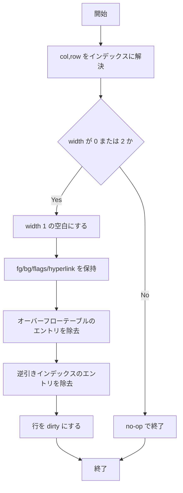

# wide-pair-blank-primitive-unification - 要件定義書

## 1. 概要

### 1.1 背景

ワイド文字ペアの相方セルを空白化する処理が、`csi_edit.rs` の `blank_wide_pair_split`
と `print_handler.rs` の `blank_wide_pair_partner` の 2 箇所に重複実装されている
(レビュー指摘 b8a62feaf016ef08)。

加えて、el-ed-wide-pair-cleanup のマージ後、範囲消去のエッジ修復が ECH / EL 0 /
EL 1 / ED 0 / ED 1 の 5 つの呼び出し箇所にコピーペーストされた状態になっている
(レビュー指摘 931abe859e23fa5d)。

### 1.2 目的

- 重複したワイドペア相方空白化の実装を解消し、D2 不変条件の修復を単一の実装に集約する。
  これにより print 経路と CSI edit/erase 経路の間で挙動が乖離しない状態にする。
- 5 箇所に複製された範囲消去エッジ修復を 1 つのチョークポイントに集約し、今後グリッドを
  変更するハンドラが同じ境界条件を再導出しなくて済むようにする。

### 1.3 スコープ

`term_core` クレート内部のリファクタリング。対象ファイルは `terminal_cells.rs`、
`print_handler.rs`、`csi_edit.rs`、`csi_screen.rs`。ユーザーに見える挙動の変更は無く、
UI・視覚・インタラクションの変更も無い（このためデザイン工程はスキップ）。

## 2. ビジネス要件

### 2.1 ビジネス目標

- 重複したワイドペア相方空白化の実装 (`csi_edit.rs` の `blank_wide_pair_split` と
  `print_handler.rs` の `blank_wide_pair_partner`) を解消し、D2 不変条件の修復を
  single source of truth にして print 経路と CSI edit/erase 経路で乖離しないようにする
  (レビュー指摘 b8a62feaf016ef08)。
- el-ed-wide-pair-cleanup のマージ後に 5 箇所 (ECH / EL 0 / EL 1 / ED 0 / ED 1) へ
  コピーペーストされた範囲消去エッジ修復を 1 つのチョークポイントに集約し、今後
  グリッドを変更するハンドラが同じ境界条件を再導出しないようにする
  (レビュー指摘 931abe859e23fa5d)。

### 2.2 対象ユーザー

| ユーザータイプ | 説明 |
|----------------|------|
| term_core メンテナ | グリッド変更ハンドラを追加・修正する開発者。境界条件の再導出を避けたい |

### 2.3 期待される効果

- D2 不変条件の修復ロジックが 1 箇所になり、print 経路と CSI 経路の乖離が発生しなくなる
- 範囲消去のエッジ修復が 1 箇所になり、新規ハンドラが同じ境界条件を書き直さずに済む

## 3. ユースケース

### 3.1 ユースケース一覧

| ID | ユースケース名 | アクター | 優先度 |
|----|----------------|----------|--------|
| UC01 | グリッド変更ハンドラからワイドペア相方を空白化する | term_core メンテナ | 高 |
| UC02 | 範囲消去ハンドラからエッジ修復を行う | term_core メンテナ | 高 |

### 3.2 ユースケース詳細

#### UC01: グリッド変更ハンドラからワイドペア相方を空白化する

**アクター**: term_core メンテナ

**事前条件**:
- ワイドペアの片割れ (width 0 または width 2 のセル) を潰す操作を行おうとしている

**基本フロー**:
1. ハンドラがセル変更を行う直前・直後に、統一プリミティブ (`blank_wide_pair_half(col, row)`) を呼ぶ
2. プリミティブが対象セルの width が 0 または 2 であること、および (col, row) が有効な
   インデックスに解決されることを自己検査する
3. 対象セルを width 1 の空白にし、fg/bg/flags/hyperlink を保持する
4. オーバーフローテーブルのエントリと逆引きインデックスのエントリを除去する
5. 該当行を dirty にする

**代替フロー**:
- 対象セルが width 1、または (col, row) が無効な場合はプリミティブが no-op として返る

**事後条件**:
- D2 不変条件が修復された状態になる

#### UC02: 範囲消去ハンドラからエッジ修復を行う

**アクター**: term_core メンテナ

**事前条件**:
- 行内の範囲消去 (ECH / EL 0 / EL 1 / ED 0 / ED 1) を行おうとしている

**基本フロー**:
1. 消去前に範囲の先頭がスペーサか (start_is_spacer)、末尾がベースか (last_is_base) を捕捉する
2. `clear_line_range` で範囲を消去する
3. 共有化されたエッジ修復関数を呼び、捕捉した境界情報に基づいて相方を空白化する

**代替フロー**:
- 行全体の消去 (clear_line / EL 2 / ED 2) はこの経路を通らず、相方空白化は行われない

**事後条件**:
- 範囲の両端でワイドペアが割れていた場合のみ修復されている

## 4. 機能要件

### 4.1 機能一覧

| ID | 機能名 | 説明 | 優先度 | ステータス |
|----|--------|------|--------|-----------|
| FR1 | セル変更基盤レイヤ上の単一の相方空白化プリミティブ | 2 つの実装を 1 つの pub(crate) プリミティブに統合する | 高 | resolved |
| FR2 | プリミティブ内部の自己ガード事前条件 | width 0/2 と有効インデックスの検査をプリミティブ自身が持つ | 高 | resolved |
| FR3 | print 経路と CSI 経路のプリミティブへの収束 | 両経路が同一プリミティブを呼ぶ | 高 | resolved |
| FR4 | 範囲消去エッジ修復のチョークポイント | 5 箇所の複製を 1 つの共有関数に集約する | 高 | resolved |
| FR5 | 行全体消去経路には相方挙動を持たせない | clear_line_range / clear_line / EL 2 / ED 2 は不変条件非対応のまま | 高 | resolved |

### 4.2 機能詳細

#### FR1: セル変更基盤レイヤ上の単一の相方空白化プリミティブ

**説明**: 1 つの `pub(crate)` プリミティブ (推奨名 `blank_wide_pair_half(col, row)`) を
グリッドセル変更の基盤モジュール (`terminal_cells.rs`) に置き、`blank_wide_pair_split`
(`csi_edit.rs:161`) と `blank_wide_pair_partner` (`print_handler.rs:74`) の双方を置き換える。

**入力**:
- `col`: 列インデックス - 空白化対象セルの列
- `row`: 行インデックス - 空白化対象セルの行

**出力**:
- グリッド上の対象セル: ワイドペアの片割れを width 1 の空白にしたもの

**処理フロー**:

**ビジネスルール**:
- fg/bg/flags/hyperlink を保持する
- オーバーフローテーブルのエントリとその逆引きインデックスのエントリを除去する
- 該当行を dirty にする

**バリデーション**:
| 項目 | ルール | エラーメッセージ |
|------|--------|------------------|
| 対象セルの width | 0 または 2 であること | (なし。条件を満たさない場合は no-op) |
| (col, row) | 有効なインデックスに解決されること | (なし。解決できない場合は no-op) |

**エラーケース**:
| エラー | 条件 | 対応 |
|--------|------|------|
| 対象が width 1 | 呼び出し側が width 1 のセルを渡した | no-op |
| インデックス解決不能 | (col, row) が範囲外 | no-op |

#### FR2: プリミティブ内部の自己ガード事前条件

**説明**: 統一プリミティブ自身が、対象セルの width が現在 0 または 2 であること
（および (col, row) が有効なインデックスに解決されること）を検査し、そうでなければ
no-op となる。これは `blank_wide_pair_split` が既に持っていたセマンティクスである。

**ビジネスルール**:
- 呼び出し側の width 検査は「呼び出し回避のための最適化」としてのみ残り、
  正しさの要件にはならない

#### FR3: print 経路と CSI 経路のプリミティブへの収束

**説明**: `print_handler.rs` の `blank_wide_pair_partner` を削除する。
`blank_orphaned_neighbor_before_overwrite` (`print_handler.rs:105`) と
`blank_orphaned_base_before_placeholder` (`print_handler.rs:129`) は統一プリミティブを呼ぶ。
`csi_edit.rs` の ICH/DCH 修復と `csi_screen.rs` の ED/EL/ECH 修復も同じプリミティブを
（直接、または FR4 のチョークポイント経由で）呼ぶ。

**ビジネスルール**:
- ICH/DCH がプリミティブを直接呼ぶか FR4 のチョークポイント経由で呼ぶかは実装計画上の判断
  （境界条件が範囲消去パターンと異なるため、`repair_range_edges` に無理に寄せる必要はない）

#### FR4: 範囲消去エッジ修復のチョークポイント

**説明**: 同一の「捕捉してから修復する」パターン（`clear_line_range` の前に
start_is_spacer / last_is_base を捕捉し、後に空白化を呼ぶ）を 1 つの共有関数
（推奨形: `repair_range_edges(row, start, end, start_was_spacer, last_was_base)`、
あるいは erase-range のラッパー）に抽出する。

**移行対象（既存 5 箇所すべて）**:
- `handle_erase_characters` (ECH)
- `handle_erase_in_line` mode 0
- `handle_erase_in_line` mode 1
- `handle_erase_in_display` mode 0
- `handle_erase_in_display` mode 1

いずれも `csi_screen.rs` にある。

#### FR5: 行全体消去経路には相方挙動を持たせない

**説明**: `clear_line_range` と `clear_line` 自体は不変条件非対応 (invariant-unaware) の
ままとし、行全体の呼び出し側 (`clear_line`、EL 2、ED 2) は相方空白化の挙動を獲得しない。
この制約は `handle_erase_characters` のコメント (`csi_screen.rs:140-146`) に既に
記述されており、リファクタリング後も維持する。

## 5. 非機能要件

### 5.1 パフォーマンス要件

- **NFR1 - ASCII ファストパスの性能を変えない**: `old_width != 1` のゲートは呼び出し側
  (`handle_print_ascii` = `print_handler.rs:249-252`、`write_grapheme_to_grid` = `:174`、
  `relocate_widened_base_via_wrap` = `:477`) に残す。width 1 の一般ケースでは、既に
  触れているキャッシュラインへの単一の width 読み出し以上の処理を行わない。

### 5.2 セキュリティ要件

該当なし（`term_core` クレート内部のリファクタリングであり、認証・認可・データ保護・
入力検証の対象領域を持たない）。

### 5.3 可用性要件

該当なし。

### 5.4 保守性要件

- **NFR2 - 挙動を保つリファクタリング**: 既存の `term_core` テストおよびワークスペースの
  テストが、アサーションを一切変更せずに通ること。

### 5.5 互換性要件

- **NFR3 - 公開 API を変えない**: 可視性の変更はクレート内 (`pub(crate)`) に留める。
  `term_core` の公開表面 (`lib.rs` の re-export) は変更しない。

## 6. UI/UX要件

### 6.1 画面設計要件

該当なし。`term_core` クレート内部の純粋なリファクタリングであり、ユーザーに見える UI・
視覚・インタラクションの表面を持たない（このためデザイン工程はスキップと判定）。

### 6.2 画面遷移

該当なし。

### 6.3 レスポンシブ対応

該当なし。

## 7. データ要件

### 7.1 データモデル概要

新規のデータモデルは無い。既存のグリッドセル、オーバーフローテーブル、およびその
逆引きインデックスを対象とする。

### 7.2 データ項目

| エンティティ | 項目名 | 型 | 必須 | 説明 |
|--------------|--------|-----|------|------|
| グリッドセル | width | セル幅 | ○ | 0 / 1 / 2。プリミティブは 0 または 2 のときのみ動作し、1 の空白に書き換える |
| グリッドセル | fg / bg / flags / hyperlink | セル属性 | ○ | 空白化の際に保持する |
| オーバーフローテーブル | エントリ | - | ○ | 空白化の際に対象エントリを除去する |
| 逆引きインデックス | エントリ | - | ○ | 空白化の際に対応するエントリを除去する |

### 7.3 データ保持期間

該当なし。

## 8. 外部連携

### 8.1 連携システム

該当なし。

### 8.2 API仕様要件

外部 API の連携は無い。クレート内部の `pub(crate)` プリミティブのみを追加する
（NFR3 のとおり公開表面は不変）。

## 9. 制約条件

### 9.1 技術的制約

- `old_width != 1` のゲートは print 側の呼び出し箇所に残す（NFR1）
- 可視性変更はクレート内 (`pub(crate)`) に留め、`lib.rs` の re-export は変えない（NFR3）
- `clear_line_range` / `clear_line` は不変条件非対応のままとする（FR5）

### 9.2 ビジネス上の制約

- 既存テストのアサーションを変更しない、挙動を保つリファクタリングであること（NFR2）

### 9.3 スケジュール制約

- el-ed-wide-pair-cleanup（EL/ED の姉妹タスク）が既にマージ済みであることを前提とし、
  その上に積み上げる。

## 10. 想定される課題とリスク

### 10.1 技術的課題

| 課題 | 影響度 | 対応策 |
|------|--------|--------|
| ICH/DCH の境界条件が範囲消去パターンと異なる | 中 | チョークポイント経由か直接呼び出しかは実装計画で判断し、`repair_range_edges` に無理に寄せない |
| 統一によって ASCII ファストパスに処理が増える | 中 | `old_width != 1` ゲートを呼び出し側に残す（NFR1 / AC5） |

### 10.2 ビジネスリスク

| リスク | 発生確率 | 影響度 | 対応策 |
|--------|----------|--------|--------|
| リファクタリングで既存挙動が変わる | 中 | 高 | 既存テストをアサーション無変更のまま全て通す（NFR2 / AC6 / TS1） |

## 11. 成功基準

### 11.1 受け入れ基準

- [ ] AC1: 相方空白化プリミティブがちょうど 1 つ存在し、グリッドセル変更の基盤レイヤ
      (`terminal_cells.rs` または同等) にあり、width 0/2 の自己ガードを内部に持つ
- [ ] AC2: `print_handler.rs` が `blank_wide_pair_partner` を定義しておらず、print 経路と
      CSI edit/erase 経路が同一プリミティブを呼ぶ
- [ ] AC3: `csi_edit.rs` が `blank_wide_pair_split` を独立実装として定義していない
      （削除済み、または削除予定の薄い転送シムになっている）
- [ ] AC4: `csi_screen.rs` の 5 つの範囲消去呼び出し箇所 (ECH, EL 0/1, ED 0/1) が
      5 つのインラインコピーではなく 1 つのエッジ修復関数を共有している。行全体経路
      (`clear_line`、EL 2、ED 2) は影響を受けない
- [ ] AC5: `old_width != 1` ゲートが print 側の呼び出し箇所に残っており、width 1 の
      ASCII ファストパスに新たなメモリアクセスや分岐が追加されていない
- [ ] AC6: `term_core` のテストスイート全体とワークスペースのテストが通る

### 11.2 KPI

該当なし（内部リファクタリングのため、計測指標を設定しない）。

## 12. テストシナリオ

### 12.1 テスト観点

- [ ] TS1 正常系: `csi_edit.rs`・`csi_screen.rs` の既存ワイドペアクリーンアップテストおよび
      print-handler のテストが、統一後も変更なしで全て通る (FR1 / FR3 / FR4 / NFR2)
- [ ] TS2 正常系: パリティテスト（または既存の属性保持テスト）で、統一プリミティブが
      fg/bg/flags/hyperlink を保持し、オーバーフローと逆引きインデックスのエントリを
      除去することを確認する (FR1)
- [ ] TS3 境界値: プリミティブが width 1 のセルおよび範囲外の列に対して no-op であること
      （自己ガード）を確認する (FR2)
- [ ] TS4 正常系: ワイドペアを含む行に対する行全体消去 (EL 2、ED 2) が、属性保持の
      空白化を伴わないプレーンな BCE fill を生成し続けることを確認する (FR5)
- [ ] TS5 パフォーマンス: オプトインのベンチ (`snapshot_replay_bench_2mib_seq`) を NFR1 の
      手動スポットチェック手段として利用可能なまま残す。自動の性能アサーションは追加しない (NFR1)
- [ ] セキュリティ: 該当なし

## 13. 用語定義

| 用語 | 定義 |
|------|------|
| ワイドペア (wide pair) | 全角文字が占める width 2 のベースセルと、それに続く width 0 のスペーサセルの組 |
| D2 不変条件 | ワイドペアのベースとスペーサの整合性に関するグリッド不変条件。片割れが潰されたときに修復が必要になる |
| 相方空白化 (partner blanking) | ワイドペアの片割れが失われたときに、残った側を width 1 の空白へ書き換える修復操作 |
| チョークポイント | 同一処理を通す唯一の集約点となる共有関数 |
| BCE fill | Background Color Erase による消去時の塗り |
| ECH / EL / ED | それぞれ Erase Character / Erase in Line / Erase in Display の CSI シーケンス |

## 14. 確認事項

### 14.1 確認済み事項

- [x] el-ed-wide-pair-cleanup が本ワークツリーへ既にマージ済みであること: `csi_screen.rs` で
      確認済み。したがって FR4 は 2 箇所ではなく既存 5 箇所の呼び出し箇所を移行する。
      タスク記述の行参照 `csi_screen.rs:65` は古いが、名前で挙げられた関数はすべて記述どおり存在する
- [x] 既存 2 実装の等価性: 指摘 b8a62feaf016ef08 のとおり出力等価であり、統一プリミティブは
      `blank_wide_pair_split` の自己ガード契約を採用する
- [x] 「785 件の term_core テスト」という件数: タスク記述から引用したもので、実行による
      検証は行っていない。拘束力を持つ要件は「現在ツリーにあるスイートが通ること」である
- [x] `feature-docs/wide-pair-overwrite-cleanup/` の不在: 統合ワークツリーに存在しないため、
      要件はソースファイルに対して直接検証した
- [x] ICH/DCH の呼び出し方法: プリミティブを直接呼ぶか FR4 のチョークポイント経由かは
      実装計画上の判断。境界条件が範囲消去パターンと異なるため `repair_range_edges` に
      無理に寄せる必要はない
- [x] EL/ED の姉妹タスクが既に着地済みであり、本機能はその上に積み上げる

### 14.2 未確認・保留事項

- なし（全要件が resolved）

## 15. 参考資料

- レビュー指摘 b8a62feaf016ef08: ワイドペア相方空白化の重複実装
- レビュー指摘 931abe859e23fa5d: 範囲消去エッジ修復の 5 箇所複製
- SPEC.md: 本要件定義書に対応する実装向け仕様
